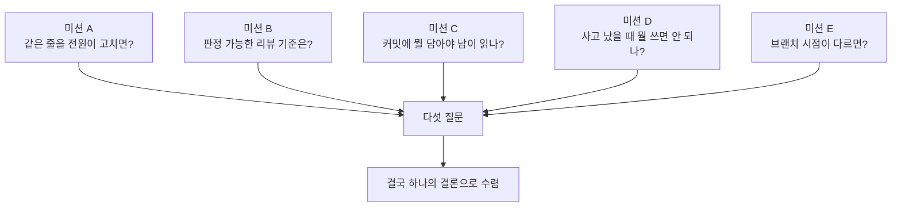
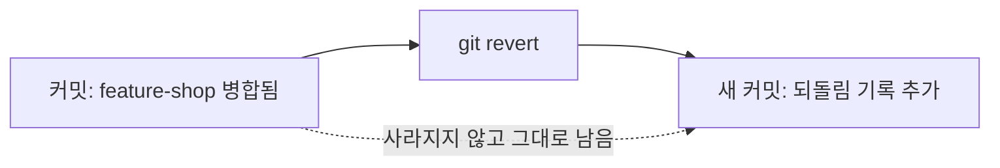

## 들어가며 (Situation)

브랜치 · Pull Request · 병합 · 충돌 해결을 팀으로 몸으로 부딪히며 배우는 미션 다섯 개를 돌았다. 이론으로만 알던 "충돌(CONFLICT)"이 실제로 화면에 뜨는 걸 오늘 처음 봤다.

## 문제 상황 (Task)

우리 팀은 5명이었는데, 미션지 자체는 더 적은 인원을 기준으로 짜인 느낌이라 "한 명씩 순서대로", "옆 사람 걸 리뷰" 처럼 인원 수만큼 반복되는 단계들이 대략 두 배 가까이 돌아갔다. 그만큼 반복해서 부딪힌 만큼 체감도 컸다. 미션별로 알아내야 했던 질문은 다섯 개였다.



## 해결 과정 (Action)

### 미션 A. 같은 줄을 전원이 고치면 무슨 일이 생기는가

**알아낼 것**: 일을 어떻게 나누면 충돌이 줄어드는가

1라운드에서는 `about.txt`의 한 줄 소개를 팀원 전원이 각자 브랜치에서 동시에 고쳐서 PR을 열었다. 한 명씩 순서대로 병합하는 단계라 5명이면 병합이 그대로 5번 돌아간다 — 인원이 적은 팀 기준으로 짜인 미션지보다 두 배 가까이 되는 횟수였다. 두 번째 사람부터 PR 화면에 충돌 안내가 뜨기 시작했고, 뒤로 갈수록(네 번째, 다섯 번째) 정리해야 할 충돌이 줄어들기는커녕 오히려 더 여러 사람 몫이 겹쳐서 쌓였다. 막힌 사람은 로컬에서

```
git switch main
git pull
git switch 내브랜치
git merge main
(파일을 열어 충돌 기호를 지우고 정리)
git add about.txt
git commit -m "..."
git push
```

순서로 직접 정리해야 했다.

2라운드에서는 아예 방법을 바꿨다. 문단을 통째로 나눠 고치는 대신, 팀이 먼저 "누가 몇 번째 줄을 담당할지", "어떤 순서로 올릴지"를 미리 정하고 시작했다. 결과는 확실히 갈렸다.

**배운 것**: 충돌은 Git이 못해서 나는 게 아니라 같은 자리를 동시에 건드려서 나는 거다. 그래서 코드로 푸는 문제가 아니라 **일을 어떻게 쪼개서 나눌지를 사람이 먼저 정해야 하는 문제**다. 담당 범위(줄/파일/기능 단위)를 미리 나누고 올리는 순서를 정해두는 것만으로 충돌 빈도가 확 줄어드는 걸 숫자로 직접 봤다.

### 미션 B. 판정할 수 있는 리뷰 기준은 어떻게 생겼는가

**알아낼 것**: 판정할 수 있는 리뷰 기준은 어떻게 생겼는가

먼저 팀이 기획서 승인 기준 3가지를 정해 `review-rule.txt`에 적었다. 이때 "잘 쓴다" 같은 기준은 안 되고, "첫 줄에 담당자 이름이 있다"처럼 참/거짓으로 바로 판정되는 문장이어야 했다.

그다음 각자 새 기능 기획서를 하나씩 만들면서 기준 중 하나를 일부러 어기고, 옆 사람 PR을 리뷰하는 식으로 한 바퀴를 돌았다. 5명이 원을 그리며 리뷰하다 보니 리뷰 사이클 자체도 미션지가 상정한 것보다 두 배 가까이 돌았고, 그만큼 "반려 → 수정 → 승인" 패턴을 여러 번 반복해서 볼 수 있었다. 어긴 부분을 찾아 Request changes로 반려하면서 **무엇이 왜 기준에 안 맞는지**를 코멘트에 적었고, 고쳐서 다시 올리면 Approve하고 병합했다.

**배운 것**: 좋은 리뷰 기준은 "좋다/나쁘다"가 아니라 **누가 봐도 같은 결론이 나오는 문장**이어야 한다는 걸 몸으로 배웠다. 리뷰 코멘트도 마찬가지다. "고쳐주세요"만 남기면 반려당한 사람은 뭘 고쳐야 할지 모른다 — 어떤 기준에, 왜 안 맞는지까지 적어야 리뷰가 된다.

### 미션 C. 커밋 하나에 무엇을 담아야 남이 읽을 수 있는가

**알아낼 것**: 커밋 하나에 무엇을 담아야 남이 읽을 수 있는가

팀을 두 조로 나눠 완전히 똑같은 작업(파일 만들기 → 제목 적기 → 요소 3개 적기 → 오타 고치기 → 줄 하나 지우기)을 했는데, 커밋을 쪼개는 방식만 달리했다. 한 조는 커밋을 최대한 잘게 쪼갰고, 다른 조는 다 끝내고 한 번에 몰아서 커밋했다.

끝난 뒤 `git log --oneline`으로 서로의 커밋 메시지만 보고, 파일은 열지 않은 채로 상대 조가 뭘 어떤 순서로 했는지 맞혀봤다.

**배운 것**: 잘게 쪼갠 조의 로그는 그 자체로 "무슨 일이 있었는지"를 설명하는 문서가 됐고, 한 번에 몰아 커밋한 조의 로그는 결과만 있고 과정이 안 보였다. 커밋 메시지는 나를 위해 쓰는 게 아니라 **나중에 로그만 보고도 무슨 일이 있었는지 알아야 하는 남(미래의 나 포함)을 위해 쓰는 것**이라는 걸 이번에 제대로 느꼈다.

### 미션 D. 사고가 났을 때 무엇을 쓰고 무엇을 쓰면 안 되는가

**알아낼 것**: 팀 저장소에서 사고가 났을 때 무엇을 쓰고 무엇을 쓰면 안 되는가

한 명이 블로그와 상관없는 기능(`feature-shop.txt`)을 담은 PR을 열고, 나머지가 일부러 그냥 승인해서 병합해 사고 상황을 만들었다. 전원이 `git pull`로 그 파일이 자기 컴퓨터에 들어온 걸 눈으로 확인한 다음,

```
git revert <해시>
git push
```

로 되돌렸다. `git log --oneline`을 다시 찍어보니 잘못된 커밋이 사라진 게 아니라 **그대로 남아있고, 되돌리는 커밋이 새로 하나 늘어나 있었다.**



**배운 것**: `revert`는 기록을 지우는 게 아니라 "이걸 취소한다"는 새 커밋을 쌓는 방식이라는 걸 로그로 직접 확인했다. 그래서 팀 저장소에서는 `git reset --hard`를 절대 쓰면 안 된다 — 그건 남의 작업까지 통째로 날려버릴 수 있다. 사고가 났을 때 팀 저장소에서 안전한 선택은 "지우기"가 아니라 "취소 기록을 남기기"라는 걸 배웠다.

### 미션 E. 브랜치를 딴 시점이 다르면 무슨 일이 생기는가

**알아낼 것**: 브랜치를 따는 시점이 다르면 무슨 일이 생기는가

같은 지점에서 두 조가 브랜치를 갈라 나갔다. 먼저조가 `roadmap.txt`의 같은 줄을 먼저 고쳐 병합했고, 나중조는 `git pull`을 하지 않은 채로 같은 줄을 다른 내용으로 고쳐 PR을 열었다. PR 화면은 그냥 병합할 수 없다는 안내를 보여줬다.

나중조는

```
git switch main
git pull
git switch 내브랜치
git merge main
(파일을 열어 충돌 기호를 지우고 정리)
git add roadmap.txt
git commit -m "..."
git push
```

로 직접 정리한 뒤에야 병합할 수 있었다.

**배운 것**: 충돌은 "누가 잘못해서" 나는 게 아니라, **내가 브랜치를 딴 시점 이후로 main이 앞서나가 있으면 자연스럽게 나는 것**이라는 걸 알게 됐다. 그래서 브랜치를 만들기 전에는 먼저 `git pull`로 최신 상태를 받아두는 습관이 중요하다.

## 결과 (Result)

| 미션 | 반복 횟수(5인 기준) | 알아낸 것 |
|---|---|---|
| A. 동시 수정 | 병합 5회 | 담당 범위를 미리 나누면 충돌이 확 줄어듦 |
| B. 리뷰 기준 | 리뷰 사이클 5회(원형) | 판정 기준은 참/거짓으로 갈리는 문장이어야 함 |
| C. 커밋 단위 | 조별 비교 1회 | 잘게 쪼갠 로그만 과정을 설명하는 문서가 됨 |
| D. 사고 복구 | revert 1회 | 지우지 않고 취소 기록을 남기는 게 안전함 |
| E. 브랜치 시점 | 충돌 정리 1회 | 브랜치 따기 전 `pull`이 충돌을 예방함 |

다섯 미션을 관통하는 건 결국 하나다 — **Git 자체보다 "일을 어떻게 나누고, 어떻게 기록하고, 어떻게 되돌릴지"를 팀이 미리 정해두는 게 더 중요하다.** 명령어는 몇 개 안 되는데, 그걸 언제 어떻게 쓰기로 팀이 합의하느냐가 실제로 충돌과 사고를 줄이는 걸 오늘 직접 봤다.

## 더 학습하면 좋은 개념

- **`git rebase` vs `git merge`** — 오늘은 merge만 써봤는데, 히스토리를 한 줄로 깔끔하게 정리하고 싶을 때는 rebase라는 대안이 있다는 것도 다음에 비교해볼 만하다.
- **Conventional Commits** — 미션 C에서 배운 "커밋 메시지는 남을 위해 쓰는 것"을 팀 단위로 규격화한 컨벤션. 팀 전체가 같은 규칙을 쓰면 리뷰(미션 B)도 더 쉬워진다.
- **CODEOWNERS / 브랜치 보호 규칙** — 미션 D처럼 범위 밖 PR이 그냥 승인되는 사고를 애초에 막는 GitHub 저장소 설정.
- **`git reflog`** — 미션 D에서 "지우지 말고 되돌리자"고 배웠는데, 혹시 정말 되돌릴 커밋 자체를 못 찾는 상황이 오면 reflog가 한 단계 더 깊은 안전망이 되어준다.

## 참고 자료
- [Git 공식 문서 - git-merge](https://git-scm.com/docs/git-merge)
- [Git 공식 문서 - git-revert](https://git-scm.com/docs/git-revert)
- [GitHub Docs - Pull Requests](https://docs.github.com/en/pull-requests)
