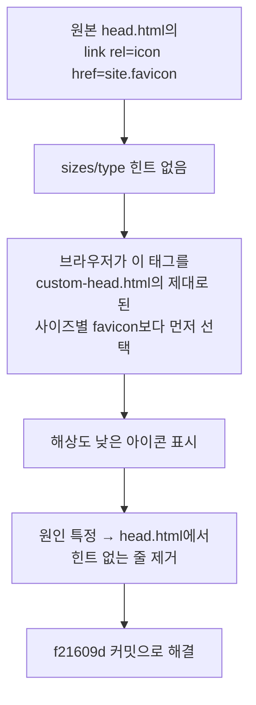
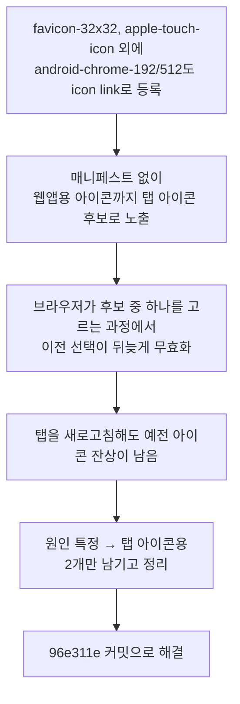
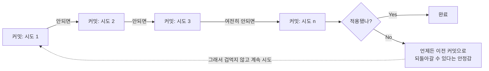

## 들어가며 (Situation)

이번 주에 Git과 GitHub를 처음 배우고, 그걸로 이 블로그를 직접 만들어 배포까지 했다. 그런데 정작 "커밋을 왜 이렇게 나눠서 남기라는 건가", "버전관리가 실전에서 나를 뭘로부터 지켜주는가"는 배운 명령어만큼 몸으로 와닿지는 않았다.

그러다 이 블로그 저장소의 `git log`를 처음부터 쭉 훑어봤다. 놀랍게도 지난 주말 하루치 커밋 안에 이미 좋은 교재가 들어있었다 — 같은 날, 같은 사람이, 완전히 다른 방식으로 삽질한 두 구간이 나란히 있었다.

## 문제 상황 (Task)

`git log --stat`으로 커밋을 시간순으로 읽다가 눈에 띄는 대비를 발견했다.

**구간 A. 테마 설정 삽질** — `_config.yml` 하나를 붙잡고 9개 커밋을 연달아 찍었다.

```
b6284e9 11:10:13  컨픽 업로드 추가
6b11349 11:11:56  컨픽 테마 변경
90b1135 11:16:17  테마 재변경 2차
654b10a 11:18:38  테마 변경 미적용 해결시도 1차
3a5d01f 11:20:24  테마 미적용 해결시도 2차
99052b5 11:22:08  atempt 3
352662f 11:24:08  atempt 4
c56ba01 11:27:45  atempt 5
2173bfc 11:30:55  적용은 되었으나 테마 변경시도
```

**구간 B. 파비콘 버그 잡기** — 같은 날 오후, 3개 커밋으로 끝났다.

```
871f2e9 17:00:55  파비콘 적용
f21609d 17:07:56  파비콘 해상도 이슈 해결
96e311e 17:13:19  파비콘 잔상 이슈 해결
```

궁금했던 건 이거였다. **이 둘의 차이가 "버전관리를 잘 썼다/못 썼다"의 차이인가, 아니면 그냥 문제 난이도 차이일 뿐인가?**

## 해결 과정 (Action)

### 1. 두 구간을 시간 축에 나란히 놓고 비교하기

`git log --format="%h %ad %s" --date=format:"%H:%M:%S"`로 각 구간의 커밋 사이 간격을 재보니, 밀도 자체가 확연히 달랐다.

```mermaid
gantt
    title 같은 날, 두 번의 반복 수정 — 걸린 시간 비교
    dateFormat HH:mm:ss
    axisFormat %H:%M
    section 테마 설정 삽질 (9커밋 / 약 21분)
    컨픽 업로드 추가 :a1, 11:10:13, 11:11:56
    컨픽 테마 변경 :a2, 11:11:56, 11:16:17
    테마 재변경 2차 :a3, 11:16:17, 11:18:38
    해결시도 1차 :a4, 11:18:38, 11:20:24
    해결시도 2차 :a5, 11:20:24, 11:22:08
    atempt 3 :a6, 11:22:08, 11:24:08
    atempt 4 :a7, 11:24:08, 11:27:45
    atempt 5 :a8, 11:27:45, 11:30:55
    section 파비콘 버그 잡기 (3커밋 / 약 12분)
    파비콘 적용 :b1, 17:00:55, 17:07:56
    해상도 이슈 해결 :b2, 17:07:56, 17:13:19
```



구간 A는 21분 동안 같은 파일을 9번 고쳤는데, 커밋 메시지만 봐서는 매번 뭐가 왜 바뀌었는지 전혀 알 수 없다. `atempt 3` 다음에 `atempt 4`가 뭘 고친 건지는 diff를 직접 열어봐야만 알 수 있었다.

### 2. 구간 B는 왜 메시지만 봐도 이해가 됐는가 — 실제 diff 확인

구간 B는 커밋마다 원인이 코드 주석에 그대로 남아있었다. `head.html`에는 이런 설명이 있다.

> 원본 테마의 `<link rel="icon" href="{{ site.favicon }}">` 줄을 여기서 뺐습니다. sizes/type 힌트가 없는 태그라 브라우저가 이걸 custom-head.html의 제대로 된 사이즈별 favicon 태그들보다 먼저 골라버려서 흐릿하게/깨져 보이는 원인이었어요.



그다음 `custom-head.html`에는 잔상 문제의 원인도 남아있었다.

> android-chrome 192/512는 원래 웹앱 매니페스트에서 참조하는 용도라, 매니페스트 없이 icon link로만 여러 개 던져두면 브라우저가 어떤 걸 탭 아이콘으로 쓸지 고르는 과정에서 뒤늦게 무효화되는 경우가 있어 정리했어요.



즉 구간 B는 매 커밋이 "하나의 원인을 없앤 기록"이라 로그만 읽어도 문제 해결 과정이 그대로 복기됐다.

### 3. 그런데 두 구간의 진짜 공통점

여기서 처음 질문으로 돌아왔다. 구간 A는 분명 메시지도 엉망이고(`atempt 3`, `마지막 시도`), 같은 파일을 계속 되돌리듯 고쳤다. 그런데도 **9번이나 계속 시도할 수 있었던 이유**는, 실패해도 지금 상태가 그대로 커밋으로 남아있어서 언제든 이전 시점으로 되짚어갈 수 있다는 걸 알고 있었기 때문이다.



구간 A와 B는 **문제 난이도**와 **메시지 품질**은 완전히 다르지만, 둘 다 "이 시도가 틀려도 이전 상태는 커밋으로 안전하게 남아있다"는 전제 위에서 계속 앞으로 나아갈 수 있었다는 점은 똑같았다.

## 결과 (Result)

| 구분 | 테마 설정 삽질 | 파비콘 버그 잡기 |
|---|---|---|
| 커밋 수 | 9개 | 3개 |
| 소요 시간 | 약 21분 | 약 12분 |
| 커밋 메시지로 원인 파악 | 불가능 (diff를 직접 봐야 함) | 가능 (메시지만 봐도 뭘 고쳤는지 앎) |
| 되돌릴 수 있는 지점 | 매 커밋마다 존재 | 매 커밋마다 존재 |

이번에 얻은 결론은, **버전관리가 주는 안정감은 "완벽한 커밋을 남기는 것"에서 오는 게 아니라 "실패한 시도까지도 되돌아갈 수 있는 기록으로 남는 것"에서 온다**는 것이다. `atempt 5`처럼 못생긴 커밋 메시지여도, 그 커밋이 존재하는 한 나는 겁 없이 `atempt 6`을 시도할 수 있었다. 다만 그 안정감과 별개로, 메시지 자체를 원인 중심으로 남겨야(구간 B처럼) 나중에 diff를 다시 열어보지 않고도 로그만으로 무슨 일이 있었는지 알 수 있다는 것도 함께 배웠다.

## 더 학습하면 좋은 개념

- **`git reflog`** — 커밋조차 안 남았거나 브랜치를 잘못 지웠을 때도 되돌아갈 수 있는, 커밋 로그보다 한 단계 더 아래의 안전망. "진짜 마지막"보다 훨씬 믿을 수 있는 되돌리기 수단이라 알아두면 좋다.
- **`git bisect`** — 구간 A처럼 여러 커밋을 거치며 문제를 고친 경우, 반대로 "어느 커밋에서 버그가 생겼는지"를 이분 탐색으로 자동으로 찾아준다. 원인을 감으로 찾는 대신 기계적으로 좁혀갈 수 있다.
- **Conventional Commits** — `atempt 3` 같은 메시지 대신 `fix: 파비콘 해상도 이슈 해결`처럼 규격화된 커밋 메시지 컨벤션. 로그 자체가 변경 이력 문서가 된다.
- **`git commit --amend` / interactive rebase** — 아직 푸시하지 않은 지저분한 커밋들을 합치거나 메시지를 다듬어서, 로그를 남에게 보여줄 만한 상태로 정리하는 방법.
- **CI (GitHub Actions)** — 커밋마다 빌드/테스트를 자동으로 돌려서, "되돌릴 수 있다"는 안정감을 사람의 기억이 아니라 기계적인 검증으로 한 단계 더 보강하는 방법.

## 참고 자료
- [Git 공식 문서 - git-log](https://git-scm.com/docs/git-log)
- [Git 공식 문서 - git-bisect](https://git-scm.com/docs/git-bisect)
- [Git 공식 문서 - git-reflog](https://git-scm.com/docs/git-reflog)
- [Conventional Commits](https://www.conventionalcommits.org/)
