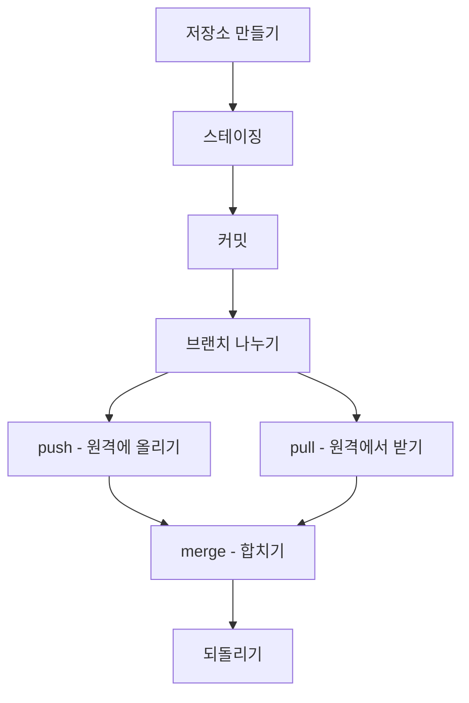
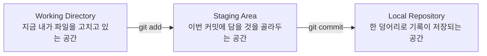
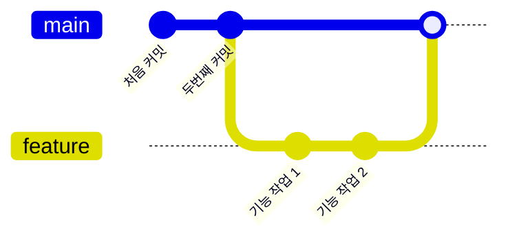
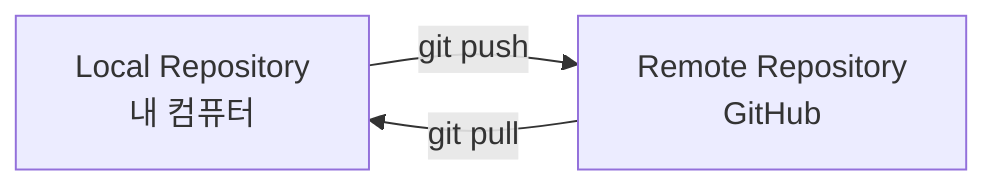
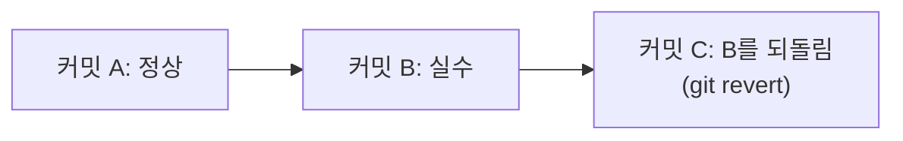

## 들어가며 (Situation)

이번 주에 Git과 GitHub를 처음 배웠다. 저장소 만들기, 스테이징, 커밋, 브랜치, push, pull, merge, 되돌리기까지 하나씩은 배웠는데, 막상 "이 순서가 왜 이렇게 되는지"를 통째로 설명하라면 막힐 것 같았다.

## 문제 상황 (Task)

명령어를 개별로는 외웠는데, **전체 흐름 속에서 각 명령어가 어떤 역할을 하는지**가 연결이 안 됐다. 특히 Working Directory / Staging Area / Local Repository, 이 세 공간의 차이가 제일 헷갈렸다. 그래서 이번 주에 배운 8개 명령어를 시간 순서대로 다시 따라가면서, 각각이 **왜 필요한지 / 언제 쓰는지**를 정리해보기로 했다.

## 해결 과정 (Action)

### 1. 저장소 만들기 - Local Repository

Git으로 뭔가를 관리하려면 먼저 "여기서부터 기록을 남길 거야"라고 선언하는 폴더가 있어야 한다. 그게 바로 **Local Repository(로컬 저장소)**다. 내 컴퓨터 안에 있는, Git이 기록을 쌓아두는 창고라고 생각하면 된다.

| 명령어 | 언제 쓰나 |
|---|---|
| `git init` | 지금 이 폴더를 Git으로 관리하기 시작하고 싶을 때 (Local Repository 생성) |

### 2. 파일이 저장되는 세 개의 방

여기서부터가 이번 주에 제일 헷갈렸던 부분이었다. 파일을 고치고 나서 바로 저장(커밋)되는 게 아니라, 중간에 **스테이징**이라는 방을 하나 더 거친다.

| 공간 | 지금 상태 |
|---|---|
| Working Directory | 내가 방금 파일을 고쳤다 (아직 아무 표시 없음) |
| Staging Area | 이번 커밋에 넣을 파일로 "선택"된 상태 |
| Local Repository | 선택된 것들이 하나의 기록(커밋)으로 저장된 상태 |

### 3. 스테이징 - git add

파일을 두 개 고쳤는데 그중 하나만 커밋하고 싶은 경우가 있다. 그래서 "이번 기록에 담을 걸 먼저 고르는" 단계가 따로 있는 것이다.

| 명령어 | 언제 쓰나 |
|---|---|
| `git add 파일명` | 고친 파일 중에서 이번 커밋에 담을 것을 고를 때 |

### 4. 커밋 - git commit

스테이징에 골라둔 것들을 하나의 기록으로 남기는 단계다. 나중에 "이 시점으로 돌아가고 싶다"고 할 때, 그 시점 하나하나가 바로 커밋이다.

| 명령어 | 언제 쓰나 |
|---|---|
| `git commit -m "메시지"` | 스테이징에 골라둔 것을 한 덩어리 기록으로 남기고 싶을 때 |

### 5. 브랜치 - 나눠서 작업하기

**브랜치**는 원본(main)을 건드리지 않고 나만의 작업 공간을 하나 더 만드는 것이다. 실험하다가 잘 안되면 그냥 브랜치를 버리면 되니까 안전하게 작업할 수 있다.

| 명령어 | 언제 쓰나 |
|---|---|
| `git branch 브랜치명` | main을 안 건드리고 새로 갈라져서 작업하고 싶을 때 |

### 6. push & pull - 로컬과 원격(GitHub) 주고받기

지금까지는 전부 내 컴퓨터(Local Repository) 안에서 일어난 일이다. 이걸 GitHub(원격 저장소)로 올리거나, 반대로 GitHub에 있는 걸 내 컴퓨터로 받아오는 게 push와 pull이다.

| 명령어 | 언제 쓰나 |
|---|---|
| `git push` | 내 컴퓨터에 쌓인 커밋을 GitHub로 올릴 때 |
| `git pull` | GitHub에 있는 최신 내용을 내 컴퓨터로 받아올 때 |

여러 명이 같이 작업할 때는, 내가 브랜치를 새로 만들기 전에 먼저 `git pull`로 최신 상태를 받아두는 게 중요하다. 안 그러면 나중에 다른 사람이 고친 부분과 내가 고친 부분이 겹쳐서 충돌이 날 수 있다.

### 7. merge - 갈라진 걸 다시 합치기

브랜치에서 작업을 끝냈으면, 그 내용을 main으로 다시 합쳐야 한다. 그게 merge다. 위 5번 그림에서 `feature` 브랜치가 마지막에 `main`으로 합쳐지는 부분이 바로 merge다.

| 명령어 | 언제 쓰나 |
|---|---|
| `git merge 브랜치명` | 다른 브랜치에서 작업한 내용을 지금 브랜치(보통 main)로 합치고 싶을 때 |

### 8. 되돌리기 - 실수한 커밋 취소하기

잘못된 내용이 main에 합쳐졌을 때, 그 기록을 지워버리는 게 아니라 **"이걸 취소한다"는 새 커밋을 하나 더 쌓는 방식**으로 되돌린다. 그래서 되돌린 뒤에 로그를 보면 잘못된 커밋이 사라진 게 아니라 그대로 남아있고, 취소 기록이 새로 하나 늘어나 있다.

| 명령어 | 언제 쓰나 |
|---|---|
| `git revert 커밋해시` | 이미 올라간 커밋 하나를 취소하고 싶을 때 (기록은 남기고 효과만 취소) |

## 결과 (Result)

| 명령어 | 언제 쓰나 |
|---|---|
| `git init` | 지금 이 폴더를 Git으로 관리하기 시작하고 싶을 때 |
| `git add 파일명` | 고친 파일 중 이번 커밋에 담을 것을 고를 때 |
| `git commit -m "메시지"` | 골라둔 것을 한 덩어리 기록으로 남길 때 |
| `git branch 브랜치명` | main을 안 건드리고 새로 갈라져서 작업하고 싶을 때 |
| `git push` | 내 컴퓨터의 기록을 GitHub로 올릴 때 |
| `git pull` | GitHub의 최신 내용을 내 컴퓨터로 받아올 때 |
| `git merge 브랜치명` | 갈라졌던 브랜치를 다시 합칠 때 |
| `git revert 커밋해시` | 이미 올라간 커밋 하나를 취소하고 싶을 때 |

8개 명령어를 개별로 외우던 상태에서, "기록을 남기고(add·commit) → 나눠서 작업하고(branch) → 주고받고(push·pull) → 합치고(merge) → 실수하면 되돌리는(revert)" 하나의 파이프라인으로 설명할 수 있는 상태가 됐다. 다음 주에는 이 흐름 위에서 팀으로 부딪히며 배운 것들을 좀 더 다뤄볼 예정이다.

## 더 학습하면 좋은 개념

- **`git status`** — 지금 세 공간(Working Directory/Staging/Local Repository) 중 파일이 어디 있는지 매번 확인하는 습관. 이번 주 제일 헷갈렸던 개념을 눈으로 확인시켜준다.
- **`git log --oneline`, `git log --graph`** — 브랜치와 병합이 늘어나면 텍스트만으로는 흐름 파악이 어려워진다. 그래프로 보는 습관을 미리 들여두면 좋다.
- **`git rebase`** — merge와 다른 방식으로 브랜치를 합치는 대안. 히스토리를 한 줄로 정리하고 싶을 때 비교해서 배울 만하다.
- **`git stash`** — 브랜치를 급하게 바꿔야 하는데 커밋하기엔 애매한 작업 중 파일이 있을 때 임시로 치워두는 명령어.

## 참고 자료
- [Git 공식 문서 - git-init](https://git-scm.com/docs/git-init)
- [Git 공식 문서 - git-branch](https://git-scm.com/docs/git-branch)
- [Git 공식 문서 - git-push](https://git-scm.com/docs/git-push)
- [Git 공식 문서 - git-pull](https://git-scm.com/docs/git-pull)
