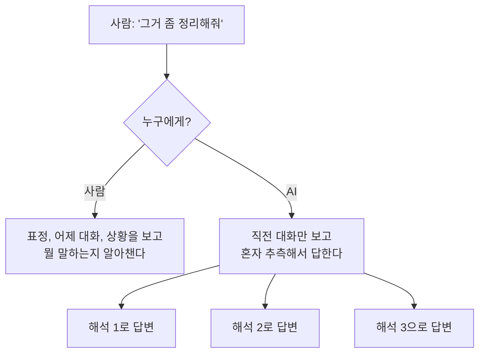
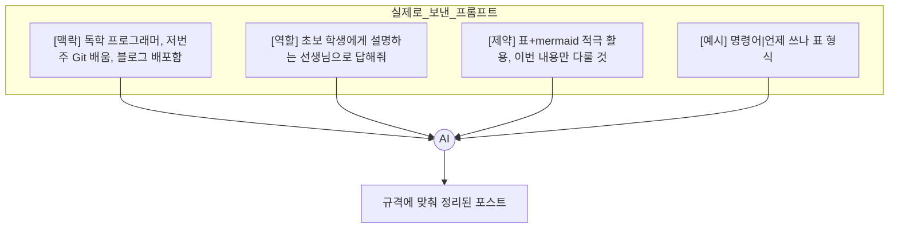
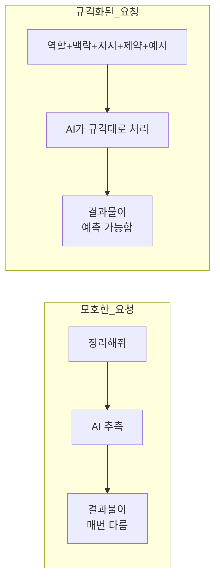

## 들어가며 (Situation)

Git을 배우면서 "컴퓨터한테 정확한 명령어로 말해야 한다"는 걸 배웠다. 오늘은 AI한테 요청할 때도 똑같은 원리가 적용된다는 걸 배웠다. 다만 상대가 터미널이 아니라 AI일 뿐이다.

## 문제 상황 (Task)

사람끼리는 "그거 정리해줘"처럼 대충 말해도 알아듣는데, AI한테 똑같이 말하면 매번 다른 결과가 나왔다. **왜 사람한테 통하는 말이 AI한테는 안 통하는지**, 그리고 **AI가 알아듣게 하려면 어떤 "규격"으로 요청을 잘라줘야 하는지**가 오늘의 질문이었다.

## 해결 과정 (Action)

### 1. 사람 언어와 AI 언어의 차이부터 확인하기

사람은 표정, 어제 나눈 대화, 회사 사정 같은 **말하지 않은 맥락**까지 같이 읽는다. AI는 그게 없다. 지금 이 대화창에 적힌 글자만 보고 판단한다. 그래서 사람끼리는 생략해도 되는 걸, AI한테는 **직접 적어줘야** 한다.

| 사람 언어 | AI에게 주는 언어 |
|---|---|
| 대명사("그거", "이거")로 퉁쳐도 통함 | 무엇을 가리키는지 구체적으로 적어야 함 |
| 문맥·표정·이전 기억으로 유추함 | 매번 필요한 맥락을 텍스트로 다시 줘야 함 |
| 결론만 말해도 뉘앙스로 통함 | 원하는 형식·분량·톤까지 정확히 지정해야 함 |
| 여러 요구를 한 문장에 뭉뚱그림 | 항목을 나눠서(리스트/번호) 구조화해야 함 |
| "알아서 잘"이 통함 | "알아서"는 AI 기준의 알아서라 결과가 매번 달라짐 |

### 2. 프롬프트를 어떤 "규격"으로 잘라야 할까

문장을 줄줄 쓰는 대신, 아래처럼 역할을 나눠서 블록으로 잘라주면 AI가 훨씬 잘 알아듣는다.

| 구성 요소 | 언제 쓰나 |
|---|---|
| 역할 (Role) | AI가 어떤 입장·전문성으로 답해야 할지 정해주고 싶을 때 |
| 맥락 (Context) | 내가 왜 이걸 물어보는지, 배경을 몰라서 엉뚱한 답이 나올 때 |
| 지시 (Instruction) | 정확히 뭘 해야 하는지 동사로 명확히 시키고 싶을 때 |
| 입력 데이터 (Input) | AI가 실제로 처리해야 할 원본 자료를 줄 때 |
| 제약 (Constraints) | 하지 말아야 할 것, 분량·범위 제한을 걸고 싶을 때 |
| 출력 형식 (Output Format) | 표·리스트·코드 등 원하는 모양으로 정확히 받고 싶을 때 |
| 예시 (Example) | 말로 설명하기 애매한 "이런 느낌"을 직접 보여주고 싶을 때 |

### 3. 실전으로 뜯어보기 - 오늘 내가 쓴 프롬프트

이 글을 만들 때 AI한테 보낸 요청 자체가 이 규격 그대로였다.

| 태그 | 정체 | 역할로 치면 |
|---|---|---|
| `[맥락]` | Context | AI가 상황을 오해하지 않도록 배경을 고정 |
| `[역할]` | Role | 어떤 톤·수준으로 답할지 고정 (선생님 → 초보자 눈높이) |
| `[제약]` | Constraints | 하지 말아야 할 것 + 반드시 써야 할 것 지정 |
| `[예시]` | Example | 원하는 출력 형식(표)을 말이 아니라 실물로 보여줌 |

이렇게 태그로 영역을 딱 나눠주면, AI 입장에서는 "이건 배경 설명이구나", "이건 지켜야 할 규칙이구나"를 헷갈리지 않고 구분할 수 있다. AI한테는 어디서부터 어디까지가 용건인지 **구분자(delimiter)**로 나눠줘야 한다.

### 4. 모호한 프롬프트 vs 규격화된 프롬프트 비교

같은 질문이어도 "정리해줘" 한 줄과, 역할·맥락·제약·예시를 나눠 적은 프롬프트는 결과물의 안정성이 완전히 달랐다.

## 결과 (Result)

| 기법 | 언제 쓰나 |
|---|---|
| Zero-shot (예시 없이 바로 지시) | 작업이 단순하고 AI가 이미 패턴을 잘 아는 경우 |
| Few-shot (예시 몇 개 보여주기) | 원하는 형식·톤을 말로 설명하기 어려울 때 |
| Chain-of-Thought (단계별로 생각시키기) | 계산이나 복잡한 추론이 필요한 문제일 때 |
| System Prompt (역할·규칙을 미리 고정) | 대화 내내 지켜야 할 규칙을 매번 다시 안 적고 싶을 때 |
| Delimiter (구분자로 영역 나누기) | 지시문과 실제 데이터를 AI가 헷갈리지 않게 하고 싶을 때 |
| Output Format 지정 | 결과를 표·JSON·리스트 등 정해진 모양으로 받고 싶을 때 |

`[맥락]/[역할]/[제약]/[예시]` 4개 태그로 나눈 프롬프트를 실제로 보내보니, 결과물이 규격 그대로(표+mermaid+이번 주 범위만) 나오는 걸 확인했다. 결국 프롬프트 엔지니어링은 "AI한테 잘 보이는 글쓰기"가 아니라, **내가 원하는 것을 애매함 없이 규격에 담아 넘겨주는 일**이었다. Git으로 치면, "대충 커밋해줘"가 아니라 "이 파일만 add하고, 이 메시지로 commit해줘"라고 정확히 명령어를 쓰는 것과 같은 원리다.

## 더 학습하면 좋은 개념

- **RAG (Retrieval-Augmented Generation)** — 프롬프트에 맥락을 매번 손으로 적는 대신, 외부 문서를 검색해서 자동으로 맥락을 채워주는 구조. 맥락(Context) 블록을 자동화하는 다음 단계.
- **구조화된 출력 (Structured Output / JSON mode)** — 출력 형식을 표나 글이 아니라 코드가 바로 파싱할 수 있는 형태로 강제하는 방법. Output Format 개념의 실전 버전.
- **프롬프트 인젝션 (Prompt Injection)** — 구분자(delimiter)로 지시문과 데이터를 나누는 이유가 바로 이 공격을 막기 위해서이기도 하다. 왜 구분이 중요한지 반대 사례로 이해하기 좋다.
- **시스템 프롬프트 vs 유저 프롬프트의 우선순위** — 오늘은 역할(Role)을 유저 메시지 안에 적었는데, 실제 API에서는 System/User 메시지가 분리되어 우선순위가 다르게 적용된다는 것도 다음에 다뤄볼 만하다.

## 참고 자료
- [Anthropic - Prompt Engineering Overview](https://docs.anthropic.com/en/docs/build-with-claude/prompt-engineering/overview)
- [OpenAI - Prompt Engineering Guide](https://platform.openai.com/docs/guides/prompt-engineering)
