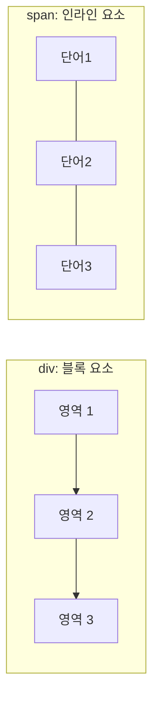
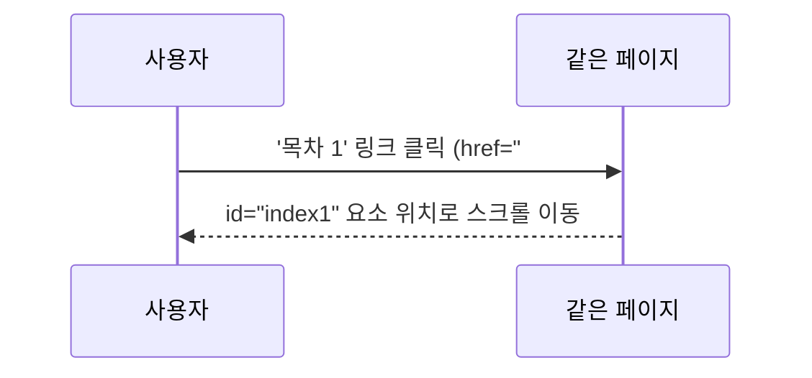

## 들어가며 (Situation)

오늘 수업의 마지막 파트는 영역을 나누는 태그(`div`, `span`), 이미지·미디어 태그, 그리고 하이퍼링크였다. 실습 마지막 예제가 "목차를 클릭하면 같은 페이지 안의 해당 위치로 이동하는" 기능이었는데, 링크인데 페이지 이동 없이 화면만 스크롤되는 게 신기했다.

## 문제 상황 (Task)

`<a>` 태그는 지금까지 "다른 페이지로 이동하는 태그"로만 알고 있었다. 그런데 예제 코드에는 `href="#index1"`처럼 **URL이 아니라 `#`으로 시작하는 값**이 들어 있었다. **같은 페이지 안에서 특정 위치로 이동하는 링크는 어떻게 동작하는지**, 그리고 그 전에 배운 `div`와 `span`은 뭐가 다른지를 오늘 정리해야 했다.

## 해결 과정 (Action)

### 1. div vs span - 블록 요소와 인라인 요소

```html
<div style="border: 1px solid black; background: red;">첫 번째 영역</div>
<div style="border: 1px solid black; background: blue;">두 번째 영역</div>

<span style="border: 1px solid black; background: red;">첫 번째 영역</span>
<span style="border: 1px solid black; background: blue;">두 번째 영역</span>
```

같은 스타일을 줬는데 `div`는 한 줄에 하나씩 세로로 쌓이고, `span`은 옆으로 나란히 붙었다. 이유는 **줄바꿈이 자동으로 들어가는지 아닌지**의 차이였다.

| 항목 | `div` | `span` |
|---|---|---|
| 분류 | 블록(block) 요소 | 인라인(inline) 요소 |
| 줄바꿈 | 앞뒤로 자동 줄바꿈 | 줄바꿈 없이 옆으로 이어짐 |
| 용도 | 문단, 카드처럼 하나의 "덩어리" 영역을 묶을 때 | 문장 중 일부 단어에만 스타일을 줄 때 |

`div`는 레이아웃을 큰 덩어리로 나눌 때, `span`은 글 속의 특정 단어만 색칠하거나 강조할 때 쓴다는 기준이 명확해졌다.



### 2. 이미지 태그 - src, alt, 고정 크기 vs 가변 크기

```html

```

| 속성 | 역할 |
|---|---|
| `src` | 불러올 이미지 파일 경로 |
| `alt` | 이미지를 못 불러올 때 대신 보여줄 텍스트, 스크린 리더가 읽어주는 설명 |
| `width`, `height` (px 값) | 고정 크기 — 화면이 커지거나 작아져도 크기 그대로 |
| `width` (%) | 가변 크기 — 부모 영역 비율에 맞춰 이미지 크기가 함께 변함 |

`px`로 고정하면 어떤 화면에서든 크기가 같지만, `%`로 주면 화면(또는 부모 요소) 크기에 비례해서 커지고 작아진다는 걸 실습 코드로 직접 비교하며 확인했다. `alt`는 단순히 "이미지 설명"이 아니라 **이미지가 안 보일 때를 대비한 대체 콘텐츠**라는 것도 이번에 알게 됐다.

### 3. 미디어 태그 - audio, video

```html
<audio src="assets/audio/bgm.mp3" controls loop></audio>
<video src="assets/video/sample.mp4" controls></video>
```

| 속성 | 역할 |
|---|---|
| `controls` | 재생/일시정지/볼륨 등 기본 재생 컨트롤 UI를 표시 |
| `loop` | 재생이 끝나면 처음부터 반복 재생 |

`controls` 속성이 없으면 재생 버튼조차 화면에 안 나온다는 점이 인상적이었다. 사용자가 직접 제어할 수 있는 UI를 붙일지 말지를 이 속성 하나로 결정한다.

### 4. 하이퍼링크 - a 태그와 href

```html
<a href="https://www.naver.com/" target="_self">네이버</a>
<a href="https://www.daum.net/" target="_blank">다음</a>
```

| target 값 | 동작 |
|---|---|
| `_self` (기본값) | 현재 탭에서 이동 |
| `_blank` | 새 탭에서 열기 |

`<a>`는 텍스트뿐 아니라 이미지도 감쌀 수 있어서, ``를 `<a>` 태그로 감싸면 "이미지를 클릭해서 이동"하는 링크도 만들 수 있었다.

```html
<a href="https://www.naver.com/" target="_blank">
  
</a>
```

### 5. 페이지 내부 앵커 - id와 #으로 점프하기

오늘 제일 궁금했던 부분. `href` 값이 URL이 아니라 `#id값`이면, **페이지 이동 없이 해당 `id`를 가진 요소 위치로 스크롤 이동**한다.

```html
<ul>
  <li><a href="#index1">목차 1</a></li>
  <li><a href="#index2">목차 2</a></li>
</ul>

<h4 id="index1">목차 1번 영역</h4>
<p>...내용...</p>

<h4 id="index2">목차 2번 영역</h4>
<p>...내용...</p>
```



`id`는 한 페이지 안에서 **고유해야 하는 값**이고, `href="#id값"`은 그 고유 값을 가진 태그를 찾아가는 방식이라는 걸 이해하니, "같은 페이지 안에서 이동하는 링크"가 전혀 신기한 게 아니라 `id`를 key처럼 활용하는 자연스러운 동작이라는 게 납득됐다. 실습 예제 맨 아래 "메인으로..." 링크도 같은 원리로, 페이지 최상단 제목에 `id="title"`을 주고 그쪽으로 되돌아가게 만든 것이었다.

## 결과 (Result)

| 이전 | 이후 |
|---|---|
| `a` 태그는 다른 페이지로만 이동하는 태그로 알고 있었음 | `href="#id값"`으로 같은 페이지 내부 이동도 가능하다는 걸 이해 |
| div와 span을 아무 데나 섞어 씀 | 블록/인라인 여부로 용도를 구분해서 선택 |
| 이미지 크기를 px로만 지정 | 상황에 따라 고정(px)/가변(%) 크기를 구분해서 사용 |

목차 클릭 시 해당 섹션으로 스크롤 이동하는 예제를 직접 따라 만들어보고, `id` + `href="#id"` 조합이 실제로 동작하는 걸 확인했다.

## 더 학습하면 좋은 개념

- **시맨틱 레이아웃 태그 (header, nav, main, section, footer)** — 지금은 `div`로 모든 영역을 나누고 있지만, 각 영역의 역할이 명확할 땐 의미를 가진 태그로 바꾸는 게 접근성과 SEO에 유리하다.
- **CSS Flexbox / Grid** — `div`로 나눈 영역을 실제로 배치할 때는 결국 CSS 레이아웃 기법이 필요하다. `div`가 "그릇"이라면 Flexbox/Grid는 그 그릇을 배치하는 방법이다.
- **`rel="noopener noreferrer"`** — `target="_blank"`로 새 탭을 열 때 보안·성능 상 함께 써주는 게 권장되는 속성. 오늘은 다루지 않았지만 꼭 같이 알아둬야 할 내용이다.
- **반응형 이미지 (`srcset`, `<picture>`)** — 오늘 배운 `width="%"` 가변 크기의 다음 단계로, 화면 크기별로 아예 다른 이미지 파일을 불러오는 방법이다.

## 참고 자료
- [MDN - `<div>`](https://developer.mozilla.org/en-US/docs/Web/HTML/Element/div)
- [MDN - `<span>`](https://developer.mozilla.org/en-US/docs/Web/HTML/Element/span)
- [MDN - ``](https://developer.mozilla.org/en-US/docs/Web/HTML/Element/img)
- [MDN - `<a>`](https://developer.mozilla.org/en-US/docs/Web/HTML/Element/a)
- [MDN - `<audio>`](https://developer.mozilla.org/en-US/docs/Web/HTML/Element/audio)
- [MDN - `<video>`](https://developer.mozilla.org/en-US/docs/Web/HTML/Element/video)
