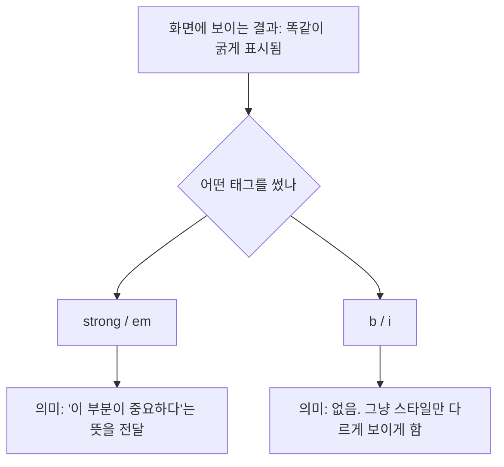

## 들어가며 (Situation)

국비지원 웹퍼블리싱 수업에서 오늘 처음 HTML 태그를 체계적으로 배웠다. 제목, 문단, 목록처럼 이름만 봐도 뜻을 알 것 같은 태그부터 실습을 시작했는데, 예제 파일을 따라 치다가 이상한 부분을 발견했다. `<strong>`과 `<b>`, `<em>`과 `<i>`처럼 **브라우저 화면에는 완전히 똑같이 보이는 태그가 짝을 지어** 존재하고 있었다.

## 문제 상황 (Task)

화면만 보면 `<strong>`도 굵게, `<b>`도 굵게 나온다. `<em>`도 기울임, `<i>`도 기울임이다. **겉보기가 똑같은데 왜 태그가 두 개씩 있는지**, 그리고 `<p>`와 `<pre>`는 둘 다 "문단(영역)을 나누는 태그"라고 배웠는데 **실제로 뭐가 다른지**가 오늘의 의문이었다.



## 해결 과정 (Action)

### 1. 제목 태그 h1~h6 - 크기가 아니라 위계

`<h1>`부터 `<h6>`까지 숫자가 커질수록 글자가 작아지길래 처음엔 "그냥 폰트 크기 6단계"인 줄 알았다. 실제로는 **문서의 위계(제목-소제목 구조)를 표현하는 태그**이고, 크기는 브라우저 기본 스타일일 뿐이다. 크기만 바꾸고 싶다면 CSS를 써야지, h 태그를 크기 순서대로 아무 데나 쓰면 안 된다.

| 태그 | 의미 |
|---|---|
| `<h1>` | 문서 전체에서 가장 중요한 제목 (보통 페이지당 1회) |
| `<h2>` ~ `<h6>` | 하위 제목. 숫자가 커질수록 하위 단계 |

### 2. 줄바꿈과 구분선 - br, hr

| 태그 | 역할 | 언제 쓰나 |
|---|---|---|
| `<br>` | 강제 줄바꿈 | 시나 주소처럼 의미 단위로 줄을 끊어야 할 때 |
| `<hr>` | 수평 구분선 | 주제가 바뀌는 지점을 시각적으로 나눌 때 |

`<br>`은 닫는 태그가 없는 **빈 요소(empty element)**라는 점도 이번에 처음 알았다. ``도 같은 부류다.

### 3. p vs pre - "문단을 나눈다"는 말의 함정

둘 다 문단 영역을 나누지만, **공백과 줄바꿈을 다루는 방식이 정반대**다.

| 항목 | `<p>` | `<pre>` |
|---|---|---|
| 여러 칸 공백 | 한 칸으로 줄여버림 | 입력한 그대로 유지 |
| 줄바꿈(Enter) | 무시함 | 입력한 그대로 유지 |
| 용도 | 일반 본문 문단 | 들여쓰기가 중요한 코드, ASCII 아트 등 |

즉 `<p>`는 "글자만 넘기고 배치는 브라우저가 알아서 정리해라", `<pre>`는 "내가 짠 모양 그대로 보여줘"라는 뜻이었다. 코드 블록을 `<pre>`로 감싸는 이유가 여기서 이해됐다.

### 4. 겉보기 vs 의미 - strong/b, em/i 짝 비교

오늘 실습에서 제일 헷갈렸던 부분. 화면 결과는 같지만 **의미론적(semantic) 태그인지, 순수 스타일 태그인지**가 다르다.

| 짝 | 화면 결과 | 의미 |
|---|---|---|
| `<strong>` | 굵게 | "이 내용은 중요하다"는 의미 전달 |
| `<b>` | 굵게 | 의미 없이 스타일만 굵게 |
| `<em>` | 기울임 | "이 부분을 강조해서 읽어라"는 의미 전달 |
| `<i>` | 기울임 | 의미 없이 스타일만 기울임 (전문 용어, 외국어 표기 등) |

스크린 리더 같은 보조 기술은 `<strong>`, `<em>`을 실제로 다르게 읽어준다는 걸 알게 됐다. `<b>`, `<i>`는 "뜻은 그대로인데 관례적으로 다르게 표기하는 부분"(예: 책 제목, 학명)에 쓰는 게 맞는 용례라고 한다.

### 5. 그 외 텍스트 태그 - mark, u, small, sub, sup, s

| 태그 | 효과 |
|---|---|
| `<mark>` | 형광펜 효과 (하이라이트) |
| `<u>` | 밑줄 |
| `<small>` | 작은 글씨 (약관, 저작권 표기 등 부가 설명) |
| `<sub>` | 아래첨자 (화학식 등) |
| `<sup>` | 윗첨자 (제곱, 각주 등) |
| `<s>` | 취소선 (더 이상 유효하지 않은 내용) |

### 6. 목록 태그 - ul, ol, ol type

목록도 "순서가 의미 있는지 없는지"로 구분한다는 걸 배웠다.

| 태그 | 의미 | 예시 |
|---|---|---|
| `<ul>` | 순서 없는 목록 (Unordered List) | 재료 목록, 태그 목록 |
| `<ol>` | 순서 있는 목록 (Ordered List) | 조리 순서, 랭킹 |

```html
<ol type="I">
  <li>HTML</li>
  <li>CSS</li>
  <li>JavaScript</li>
</ol>
```

`<ol>`은 `type` 속성으로 번호 표기 방식(숫자, 로마 숫자, 알파벳)을 바꿀 수 있다는 것도 실습 코드에서 확인했다.

## 결과 (Result)

| 이전 | 이후 |
|---|---|
| "굵게 보이면 아무 태그나 쓰면 된다"고 생각함 | "화면 효과"와 "의미 전달" 목적을 구분해서 태그를 고름 |
| p와 pre를 같은 태그로 착각함 | 공백·줄바꿈 처리 방식 차이로 용도를 구분함 |
| h 태그를 크기 조절 용도로 오해 | 문서 위계를 나타내는 구조 태그로 이해함 |

똑같아 보이는 태그 4쌍(`strong`/`b`, `em`/`i`)을 "의미가 있느냐 없느냐" 기준으로 구분해서 쓸 수 있게 됐다. 다음 글에서는 오늘 같이 배운 표(table) 태그를 정리한다.

## 더 학습하면 좋은 개념

- **웹 접근성 (Web Accessibility)** — 스크린 리더가 `strong`/`em`을 실제로 다르게 읽어준다는 걸 알고 나니, 시맨틱 태그를 쓰는 이유가 "예쁘게 보이려고"가 아니라 "정확하게 전달하려고"라는 게 이해됐다. 접근성 가이드라인(WAI-ARIA)을 더 찾아볼 필요가 있다.
- **시맨틱 HTML5 요소 (article, section, header, footer 등)** — 오늘 배운 `div`/`span`뿐 아니라 의미를 가진 레이아웃 태그들도 있다는 걸 알게 됐다. 다음 단계로 익힐 예정.
- **CSS로 스타일 분리하기** — `<b>`, `<i>`로 스타일만 바꾸는 대신 `class`와 CSS로 분리하면 유지보수가 쉬워진다는 점을 비교해서 익히면 좋다.

## 참고 자료
- [MDN - `<strong>`](https://developer.mozilla.org/en-US/docs/Web/HTML/Element/strong)
- [MDN - `<em>`](https://developer.mozilla.org/en-US/docs/Web/HTML/Element/em)
- [MDN - `<pre>`](https://developer.mozilla.org/en-US/docs/Web/HTML/Element/pre)
- [MDN - HTML text fundamentals](https://developer.mozilla.org/en-US/docs/Learn/HTML/Introduction_to_HTML/HTML_text_fundamentals)
