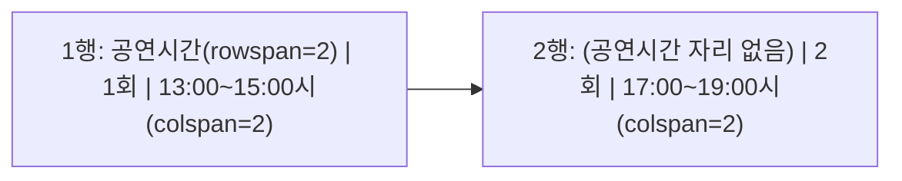

## 들어가며 (Situation)

텍스트 태그에 이어 오늘 두 번째로 배운 건 표(`table`) 관련 태그였다. 기본 표는 금방 이해했는데, 실습에서 공연 요금표·식단표처럼 **칸을 합친 표**를 따라 만들면서 막히기 시작했다.

## 문제 상황 (Task)

`<table>`, `<tr>`, `<th>`, `<td>`까지는 "행과 열을 만드는 태그"라고 이해했지만, `colspan`과 `rowspan`으로 셀을 합치기 시작하니 **한 행에 몇 개의 `<td>`를 써야 하는지 헷갈렸다**. 특정 셀이 위아래로 합쳐지면, 그 아래 행에서는 합쳐진 만큼 `<td>` 개수를 빼줘야 한다는 규칙을 실습 예제를 하나씩 뜯어보면서 파악해야 했다.

## 해결 과정 (Action)

### 1. 표의 기본 뼈대 - table, tr, th, td

| 태그 | 역할 |
|---|---|
| `<table>` | 표 전체 영역 |
| `<tr>` | 표의 한 행(row) |
| `<th>` | 제목 셀 (Table Header) |
| `<td>` | 내용 셀 (Table Data) |

```html
<table border="2">
  <tr>
    <th>메뉴 이름</th>
    <th>메뉴 가격</th>
    <th>판매 상태</th>
  </tr>
  <tr>
    <td>제육볶음</td>
    <td>8000원</td>
    <td>Y</td>
  </tr>
</table>
```

`<th>`는 `<td>`와 똑같이 셀을 만들지만, **제목 역할**이라는 의미가 있어서 브라우저 기본 스타일도 굵게+가운데 정렬로 다르게 나온다는 걸 확인했다.

### 2. colspan - 가로(열)로 합치기

`colspan="N"`을 주면 그 셀이 **가로로 N칸을 차지**한다. 대신 같은 행에서 원래 있어야 할 `<td>` 개수를 N-1개만큼 줄여야 한다.

```html
<tr>
  <td colspan="4">공연요금</td>
</tr>
<tr>
  <td>구분</td>
  <td>s석</td>
  <td colspan="2">VIP</td>
</tr>
```

표 전체가 4열짜리인데 첫 행은 `colspan="4"` 하나로 4칸을 다 차지하고, 둘째 행은 `구분`, `s석` 두 개는 1칸씩, `VIP`는 `colspan="2"`로 2칸을 차지해서 합이 4가 맞아떨어진다.

### 3. rowspan - 세로(행)로 합치기

`rowspan="N"`을 주면 그 셀이 **세로로 N칸을 차지**한다. 이 경우엔 **다음 행부터 N-1개 행에서 해당 열의 `<td>`를 아예 빼야** 한다는 게 제일 헷갈렸던 부분이다.

```html
<tr>
  <td rowspan="2">공연시간</td>
  <td>1회</td>
  <td colspan="2">13:00~15:00시</td>
</tr>
<tr>
  <td>2회</td>
  <td colspan="2">17:00~19:00시</td>
</tr>
```

첫 행에서 `공연시간` 셀이 `rowspan="2"`로 2행을 차지했기 때문에, 둘째 행에서는 `공연시간` 자리의 `<td>`를 아예 쓰지 않는다. "합쳐진 칸은 다음 행에서 존재하지 않는 셀"이라고 생각하니 이해가 됐다.



### 4. colspan과 rowspan을 같이 쓰는 복합 표

수업 예제 중 가장 복잡했던 건 `colspan`과 `rowspan`을 한 셀에 동시에 적용한 표였다.

```html
<tr>
  <td>가</td>
  <td>나</td>
  <td>다</td>
  <td rowspan="4">라</td>
</tr>
<tr>
  <td>마</td>
  <td colspan="2" rowspan="3">바</td>
</tr>
<tr>
  <td>사</td>
</tr>
<tr>
  <td>아</td>
</tr>
```

이 표는 전체 4열 구조인데, `라` 셀이 4행을 세로로 차지(`rowspan="4"`)하고 있어서 2~4행에서는 `라` 자리의 `<td>`를 빼야 한다. 동시에 `바` 셀은 2열을 가로로, 3행을 세로로 차지(`colspan="2" rowspan="3"`)하고 있어서, 3~4행에서는 `바`가 차지하는 2칸도 함께 빼줘야 한다. 그래서 3행과 4행은 `<td>`가 각각 `사`, `아` 하나씩만 남는다.

| 행 | 실제로 쓴 `<td>` 개수 | 이유 |
|---|---|---|
| 1행 | 4개 (가, 나, 다, 라) | 기준 행, 병합 없음 |
| 2행 | 2개 (마, 바) | 라(rowspan) 자리 제외 |
| 3행 | 1개 (사) | 라, 바(colspan+rowspan) 자리 제외 |
| 4행 | 1개 (아) | 3행과 동일한 이유 |

이렇게 **"이 행에서 몇 칸이 위에서부터 이미 채워져 있는가"**를 먼저 계산하고 나머지 칸만 `<td>`로 채운다는 순서로 접근하니 헷갈리지 않게 됐다.

### 5. caption - 표 제목 붙이기

```html
<table border="2">
  <caption>원티드 식단표</caption>
  <tr> ... </tr>
</table>
```

`<caption>`은 표 바로 위에 제목을 붙여주는 태그로, `<table>`의 첫 자식으로 와야 한다는 점도 확인했다.

## 결과 (Result)

| 항목 | 이전 | 이후 |
|---|---|---|
| colspan/rowspan 계산 | 어느 행에서 `<td>`를 빼야 할지 감으로 시도 | "이미 채워진 칸 수"를 먼저 계산하고 나머지만 채우는 방식으로 접근 |
| 복합 병합 표 | 표가 깨져도 원인을 못 찾음 | 행별로 실제 `<td>` 개수를 표로 정리해서 검증 가능 |

실습에 있던 공연요금표, 식단표, 가나다표 3개를 각각 행 단위로 셀 개수를 검산하면서, 표가 어긋났을 때 **어느 행의 `<td>` 개수가 잘못됐는지 스스로 찾아낼 수 있는 방법**을 익혔다.

## 더 학습하면 좋은 개념

- **CSS `border-collapse`, `border-spacing`** — `border` 속성 대신 CSS로 표 테두리를 다루는 방법. HTML 속성 방식과 비교해서 왜 CSS로 옮겨가는지 이해하면 좋다.
- **`thead`, `tbody`, `tfoot`** — 표의 머리글/본문/꼬리글을 구조적으로 분리하는 태그. 표가 커질수록 접근성과 스타일링에 유리하다.
- **반응형 테이블** — 모바일 화면에서 넓은 표를 어떻게 처리하는지(가로 스크롤, 카드형 레이아웃 전환 등)는 실무에서 자주 부딪히는 문제라 다음에 다뤄볼 만하다.

## 참고 자료
- [MDN - `<table>`](https://developer.mozilla.org/en-US/docs/Web/HTML/Element/table)
- [MDN - HTML table basics](https://developer.mozilla.org/en-US/docs/Learn/HTML/Tables/Basics)
- [MDN - HTML table advanced features (colspan, rowspan)](https://developer.mozilla.org/en-US/docs/Learn/HTML/Tables/Advanced)
