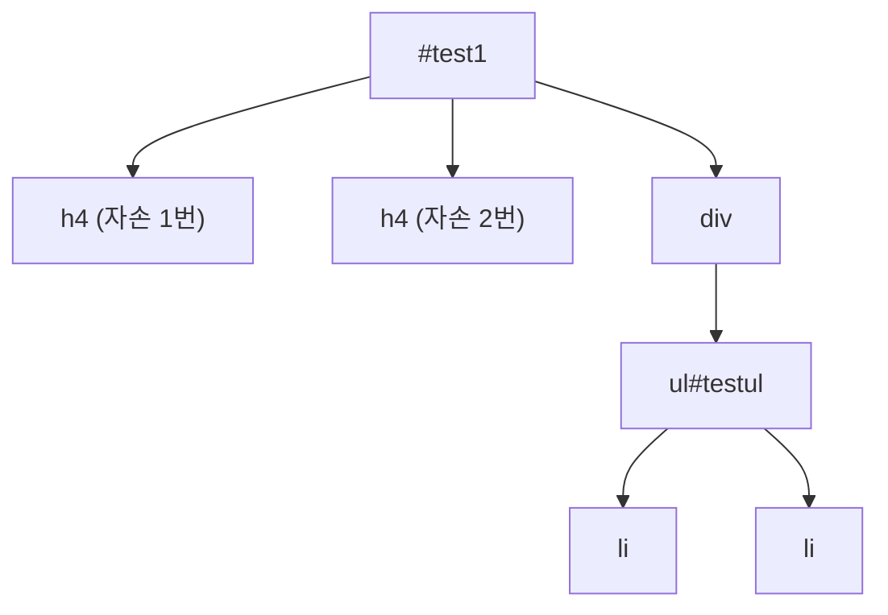

## 들어가며 (Situation)

기본 선택자에 이어 두 번째 실습은 `<style>` 태그 안에 CSS를 몰아 쓰던 방식에서 벗어나, **외부 스타일시트(`selector.css`)**로 분리하는 것부터 시작했다. 그 위에서 속성 선택자, 자손/자식 선택자, 마우스 반응 선택자, 입력 상태 선택자까지 한 번에 다뤘다.

```html
<!-- 01파일에서는 head 영역에 css 언어가 잔뜩 들어가 있었다.
     외부 스타일시트 방식으로 01파일에서의 문제를 해결해보자. -->
<link rel="stylesheet" href="selector.css">
```

## 문제 상황 (Task)

가장 헷갈렸던 건 대괄호 문법을 쓰는 **속성 선택자 5종류**였다. `[name=name2]`, `[name~=name1]`, `[class|=class]`, `[name^=name]`, `[class*=div]` - 전부 생김새가 비슷해서, 기호 하나 차이로 뜻이 완전히 달라진다는 걸 코드와 결과를 하나씩 대조해보고 나서야 구분할 수 있었다. 자손 선택자(공백)와 자식 선택자(`>`)도 "하위 요소를 고른다"는 느낌은 같아서 처음엔 같은 건 줄 알았다.

## 해결 과정 (Action)

### 1. 속성 선택자 5종류

실습에 쓰인 HTML은 이렇다.

```html
<div name="name1 name5 name6" class="div-class">div1</div>
<div name="name2" class="div-class">div2</div>
<div name="name3" class="div-class">div3</div>
<div name="name4" class="class-div">div4</div>
```

그리고 이 다섯 규칙을 하나씩 대조해봤다.

| 선택자 | 뜻 | 이 예제에서 매칭되는 div |
|---|---|---|
| `[name=name2]` | `name` 값이 정확히 `name2`와 **일치** | div2 |
| `[name~=name1]` | `name` 값을 공백으로 나눴을 때 그중 하나가 정확히 `name1` | div1 (`"name1 name5 name6"`을 공백으로 쪼개면 `name1`이 포함됨) |
| `[class\|=class]` | `class` 값이 `class`와 정확히 같거나, `class-`로 **시작** | div4 (`class-div`는 `class-`로 시작) |
| `[name^=name]` | `name` 값이 `name`으로 **시작** | div1, 2, 3, 4 전부 (`name1`~`name4` 모두 `name`으로 시작) |
| `[class*=div]` | `class` 값에 `div`라는 문자열이 **포함** | div1, 2, 3 (`div-class`에 `div`가 포함), div4는 `class-div`라 역시 포함 |

`~=`는 "공백으로 구분된 단어 중 하나"라서 `div1`의 `name="name1 name5 name6"`처럼 여러 값이 들어간 속성에 유용하고, `|=`는 언어 코드(`lang="en-US"`)처럼 `-`로 이어지는 값을 위해 설계된 선택자라는 것도 알게 됐다. `^=`(시작)과 `*=`(포함)은 "부분 일치"라는 점에서 비슷해 보이지만, `^=`는 **맨 앞**만 보고 `*=`는 **어디든** 포함되면 매칭된다는 위치 차이가 핵심이었다.

### 2. 자손 선택자 vs 자식 선택자

```html
<div id="test1">
  <h4>자손 1번 입니다.</h4>
  <h4>자손 2번 입니다.</h4>
  <div>
    <ul id="testul">리스트
      <li>ul 태그의 자손이면서, div 태그의 후손</li>
      <li>ul 태그의 자손이면서, div 태그의 후손</li>
    </ul>
  </div>
</div>
```

```css
/* 자식 선택자: 바로 한 단계 아래 */
#test1 > h4 { background-color: hotpink; }
#test1 > ul > li { background-color: aquamarine; }

/* 자손 선택자: 몇 단계든 하위 전부 */
#test1 ul { background-color: aquamarine; }
```



`#test1 > h4`는 `#test1`의 **바로 아래**(직계 자식)에 있는 `h4`만 고른다. 반면 `#test1 ul`은 `#test1` 아래 몇 단계를 내려가든 상관없이 `ul`이면 다 고른다 - 위 트리에서 `ul`은 `#test1`의 자식이 아니라 손자뻘(div의 자식)인데도 `#test1 ul`에는 걸린다. "화살표(`>`)가 있으면 딱 한 칸, 없으면 그 아래 전부"로 정리하니 구분이 됐다.

### 3. 반응 선택자와 상태 선택자

```css
#active-test:active { background: red; color: white; }
#hover-test:hover { cursor: pointer; background: darkgreen; color: bisque; }
```

```css
input[type=checkbox]:checked { width: 100px; height: 100px; }
#userId:focus, #userPwd:focus { background: hotpink; }
option:enabled { background: darkred; }
option:disabled { background: red; }
```

```html
<select>
  <option value="붕어빵" disabled>붕어빵</option>
  <option value="피자빵">피자빵</option>
</select>
```

`:hover`/`:active`는 마우스 동작에 반응하고, `:checked`/`:enabled`/`:disabled`/`:focus`는 입력 요소의 **현재 상태**에 반응한다는 차이로 나눠서 이해하니 각각 왜 필요한지가 명확해졌다. 특히 `disabled` 속성이 붙은 `<option>`, `<input>`, `<button>`이 `:disabled` 선택자로 한 번에 걸린다는 걸 실습에서 직접 확인했다.

## 결과 (Result)

| 항목 | 이전 | 이후 |
|---|---|---|
| 속성 선택자 | `[]` 안의 기호가 다 비슷해 보임 | `=`(일치)/`~=`(단어 포함)/`\|=`(일치 또는 `-` 시작)/`^=`(시작)/`*=`(포함)로 구분 가능 |
| 자손 vs 자식 | 둘 다 "하위 요소 선택"으로 뭉뚱그려 이해 | `>` 유무로 "한 칸만" vs "몇 단계든"을 구분 |

## 더 학습하면 좋은 개념

- **CSS 결합자(combinator) 전체 정리** - 오늘 다룬 자손(` `)·자식(`>`) 외에도 형제 결합자(`+`, `~`)가 있다. 다음 시간에 이어서 배울 예정이라 미리 존재만 알아두면 좋다.
- **`:focus-visible`** - `:focus`와 비슷하지만 키보드 탐색 등 실제로 포커스 링이 필요한 상황에만 스타일을 주는 접근성 개선 선택자. `:focus`를 익힌 김에 왜 이게 따로 생겼는지 찾아보면 좋다.
- **Emmet 약어 문법** - 실습 코드 주석에 `div#test1>h4{자손 $번 입니다.}*2` 같은 Emmet 축약 표기가 남아 있었다. 에디터에서 이 문법으로 HTML을 빠르게 생성할 수 있다는 것도 알아두면 실무에서 바로 쓸모가 있다.

## 참고 자료
- [MDN - Attribute selectors](https://developer.mozilla.org/en-US/docs/Web/CSS/Attribute_selectors)
- [MDN - Descendant combinator](https://developer.mozilla.org/en-US/docs/Web/CSS/Descendant_combinator)
- [MDN - Child combinator](https://developer.mozilla.org/en-US/docs/Web/CSS/Child_combinator)
- [MDN - :hover](https://developer.mozilla.org/en-US/docs/Web/CSS/:hover)
- [MDN - :checked](https://developer.mozilla.org/en-US/docs/Web/CSS/:checked)
- [MDN - :disabled](https://developer.mozilla.org/en-US/docs/Web/CSS/:disabled)
