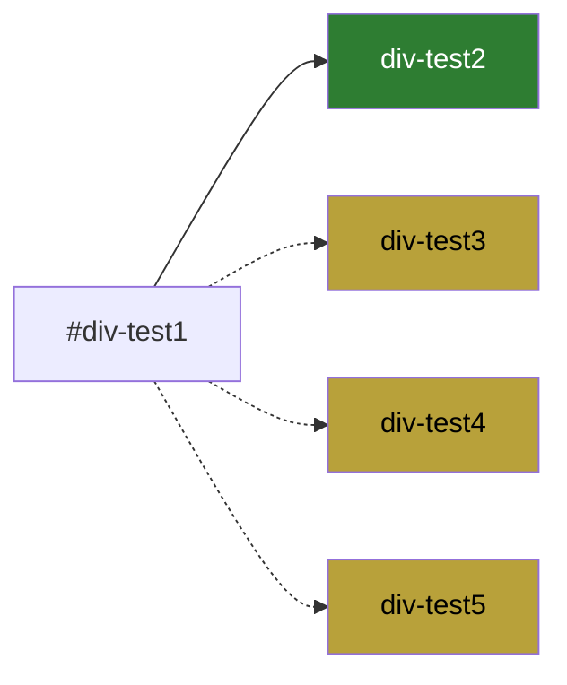

## 들어가며 (Situation)

오늘 CSS 선택자 실습의 마지막 파트는 부모-자식 관계가 아닌 **동위(형제) 관계**의 선택자, 그리고 위치나 조건으로 요소를 골라내는 **구조 선택자**, 마지막으로 문자 단위로 골라내는 **가상 요소 선택자**였다.

## 문제 상황 (Task)

형제 선택자 `+`와 `~`가 결과 화면만 봐서는 뭐가 다른지 감이 안 왔고, `:nth-child` 계열 구조 선택자도 종류가 많아서 헷갈렸다. 그런데 이번 글을 쓰려고 예제 코드를 다시 읽으면서, 실습 코드 자체에 **실제로 적용되지 않는 규칙 두 개**가 숨어 있다는 것도 발견했다. 그냥 넘어갔으면 몰랐을 부분이라, 이번 글의 절반은 그 실패 사례를 짚는 데 썼다.

## 해결 과정 (Action)

### 1. 인접 형제 선택자 `+` vs 일반 형제 선택자 `~`

```html
<div id="div-test1">div-test1</div>
<div id="div-test2">div-test2</div>
<div id="div-test3">div-test3</div>
<div id="div-test4">div-test4</div>
<div id="div-test5">div-test5</div>
```

```css
#div-test1 + div { background-color: green; }

/* #div-test1 ~ div {
  background-color: khaki;
} */
```



`#div-test1 + div`(초록, 실선 화살표)는 `#div-test1` **바로 다음 형제 하나만** 고른다 - 그래서 `div-test2`만 초록색이 된다. 반면 주석 처리된 `#div-test1 ~ div`(카키, 점선 화살표)를 살렸다면 `div-test1` 뒤에 오는 **모든 형제**(`div-test2`~`div-test5`)가 카키색이 됐을 것이다. 둘 다 켜두면 명시도가 같으므로 **나중에 선언된 규칙이 이겨서** `div-test2`는 초록이 아니라 카키가 됐을 텐데, 지금 코드는 `~` 쪽이 주석 처리돼 있어서 `+`의 효과만 순수하게 볼 수 있게 되어 있었다. 왜 하나가 주석 처리돼 있었는지 이유를 그제서야 이해했다.

### 2. 구조 선택자 - 그런데 하나는 실제로 동작하지 않았다

```html
<div id="test">
  <p>테스트1</p>
  <p>테스트2</p>
  <p>테스트3</p>
  <p>테스트4</p>
  <p>테스트5</p>
  <pre>테스트6</pre>
</div>
```

```css
#test :nth-last-child {
  background-color: aliceblue;
}
```

`:nth-last-child`는 "뒤에서 몇 번째 자식"을 고르는 선택자인데, 반드시 `:nth-last-child(2)`처럼 **괄호 안에 순번(또는 `2n` 같은 공식)을 인자로 받아야** 한다. 위 코드처럼 인자 없이 `:nth-last-child`만 쓰면 문법 자체가 유효하지 않아서, 브라우저가 이 규칙을 조용히 무시해버린다. CSS는 문법이 틀려도 에러 메시지 없이 그냥 안 먹히기만 해서, 개발자 도구로 "이 규칙이 실제로 적용됐는지"를 확인하는 습관이 왜 필요한지 체감했다.

### 3. `:not()`으로 제외하기 - 그런데 아이디가 틀려 있었다

```css
#tedt3 p:not(:nth-child(2n)) {
  background-color: aliceblue;
}
```

```html
<div id="test3">
  <p>절대음감절대음감</p>
</div>
```

`:not(:nth-child(2n))`은 "짝수 번째 자식이 **아닌** 것"을 고르는, `:not()`과 구조 선택자를 조합한 문법 자체는 맞다. 문제는 선택자에 쓰인 아이디가 `#tedt3`인데, 실제 HTML의 아이디는 `#test3`라는 점이었다. 글자 하나(`d`↔`s`)가 바뀌어 있어서 이 규칙은 애초에 어떤 요소와도 매칭되지 않는다. `:not()`의 동작 자체는 이해했지만, 이번에는 **선택자 문법이 아니라 오타** 때문에 결과가 안 나온 경우라 원인을 찾는 방법이 또 달랐다 - 문법은 개발자 도구의 스타일 패널에서 취소선(무효 규칙 표시)으로 바로 보이지만, 오타로 인한 미매칭은 "이 요소에 적용된 스타일 목록"에 그 규칙 자체가 아예 나타나지 않는지를 확인해야 알 수 있었다.

### 4. 문자 단위 선택자 `::first-letter`

```css
#test3 p::first-letter {
  font: 50px bold;
}
```

여기까지 온 김에 `::first-letter`도 확인했다. 이건 요소 자체가 아니라 **요소 안 텍스트의 첫 글자만** 골라내는 가상 요소(pseudo-element) 선택자다. `:not()`처럼 콜론 하나(`:`)가 아니라 콜론 두 개(`::`)를 쓴다는 표기 차이도 이번에 명확히 짚었다.

## 결과 (Result)

| 항목 | 이전 | 이후 |
|---|---|---|
| `+` vs `~` | 결과 화면만 보고 차이를 못 느낌 | "바로 다음 하나"와 "이후 전부"로 구분, 겹치면 나중 선언이 이긴다는 것도 확인 |
| 구조 선택자 오류 찾기 | 색이 안 나오면 그냥 넘어감 | 인자 누락(`:nth-last-child`)과 아이디 오타(`#tedt3`)처럼 원인이 다른 두 종류의 "안 먹히는 이유"를 구분해서 진단 |

같은 실습 파일을 글로 정리하면서 다시 읽어본 덕분에, 실행 결과만 봐서는 못 찾았을 오류 두 개(인자 누락, 오타)를 발견했다. "코드를 글로 설명해보기"가 코드 리뷰 대신도 될 수 있다는 걸 느꼈다.

## 더 학습하면 좋은 개념

- **`:nth-child()`의 공식 문법(`An+B`)** - `2n`, `2n+1`, `odd`, `even`처럼 다양한 패턴을 어떻게 조합하는지 정확히 알아야 `:nth-last-child()`도 실수 없이 쓸 수 있다.
- **개발자 도구 스타일 패널 읽는 법** - 무효한 선택자는 취소선으로, 명시도에서 진 규칙은 다른 방식으로 표시된다. 오늘처럼 "왜 안 먹히지?"를 스스로 진단하려면 필수다.
- **가상 클래스(`:`)와 가상 요소(`::`) 표기 구분** - CSS3부터는 가상 요소에 `::`를 쓰도록 권장하지만 `:first-letter`처럼 예전 문법(`:`)도 하위 호환으로 여전히 동작한다. 왜 표기가 갈렸는지 알아두면 헷갈리지 않는다.

## 참고 자료
- [MDN - Next-sibling combinator (`+`)](https://developer.mozilla.org/en-US/docs/Web/CSS/Next-sibling_combinator)
- [MDN - Subsequent-sibling combinator (`~`)](https://developer.mozilla.org/en-US/docs/Web/CSS/Subsequent-sibling_combinator)
- [MDN - :nth-child()](https://developer.mozilla.org/en-US/docs/Web/CSS/:nth-child)
- [MDN - :nth-last-child()](https://developer.mozilla.org/en-US/docs/Web/CSS/:nth-last-child)
- [MDN - :not()](https://developer.mozilla.org/en-US/docs/Web/CSS/:not)
- [MDN - ::first-letter](https://developer.mozilla.org/en-US/docs/Web/CSS/::first-letter)
