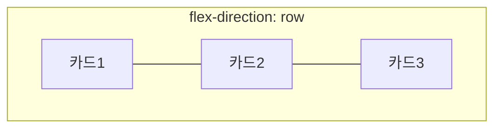

## 들어가며 (Situation)

오늘 두 번째 실습은 상품 카드 여러 장을 화면에 배치하는 작업이었다. `div`만으로 영역을 나누면 화면 가로축을 통째로 차지하고, 화면을 늘리거나 줄였을 때 유연하게 반응하지 못한다는 문제를 먼저 짚고, 이를 해결하는 두 가지 배치 방식인 **Flexbox**와 **Grid**를 실습했다. 곁들여 `div`/`span`의 기본 `display` 차이도 함께 확인했다.

## 문제 상황 (Task)

카드 3장은 한 줄로(Flex), 카드 6장은 3열 그리드로(Grid) 배치해야 했다. 그런데 글로 정리하려고 코드를 다시 읽는 과정에서, 실행 화면만 봐서는 몰랐을 **실제로 적용되지 않는 스타일 하나**를 발견했다.

## 해결 과정 (Action)

### 1. Flexbox - 카드 3장을 한 줄로

```css
.card-list {
    display: flex;
    flex-direction: row;
    justify-content: center;
    /* align-items: flex-start; */
    gap: 20px;
}
```

실습 코드에 달려 있던 주석을 그대로 옮기면, 플렉스에는 두 개의 축이 있다.



- **주축(main axis)**: `flex-direction`이 정하는 방향(기본값 `row`, 가로). `justify-content`는 이 축 방향으로 항목을 어디에 모을지 정한다. `center`를 썼으니 카드들이 가운데로 모인다.
- **교차축(cross axis)**: 주축과 수직인 방향. `align-items`가 이 축 방향 정렬을 담당하는데, 기본값 `stretch`는 컨테이너 높이만큼 카드를 늘려서 카드 높이를 서로 맞춘다.

`align-items: flex-start`가 주석 처리돼 있는 이유도 코드에 적혀 있었다. 이 값을 켜면 카드가 늘어나지 않고 **자기 내용만큼만** 높이를 갖게 되는데, 그러면 설명(`desc`)이 한 줄 더 있는 카드만 유독 길어져 보인다. 지금은 이 값이 꺼져 있어서(`stretch`가 기본 적용) 카드 높이가 서로 맞춰진 상태다.

### 2. Grid - 카드 6장을 3열로

```css
.grid-list {
    display: grid;
    grid-template-columns: repeat(3, 1fr);
}
```

플렉스가 "한 줄로 세우고 정렬"하는 방식이라면, 그리드는 "칸을 미리 그려두고 그 칸에 넣어 정렬"하는 방식이다. `grid-template-columns`로 열이 3개(`1fr`씩 균등)라고 지정하면 행은 카드 개수(6개)에 맞춰 자동으로 2행이 생긴다. 열만 지정하고 행은 지정하지 않아도 되는 이유가 여기 있었다.

### 3. 그런데 폰트 크기가 하나도 안 먹혀 있었다

```html
<h2 class="product__name">노트북 거치대</h2>
```

```css
.product_name {
    font-size: 30px;
}
```

HTML에는 `product__name`(언더바 두 개), CSS에는 `.product_name`(언더바 한 개)으로 선언돼 있었다. 글자 하나(`_`) 차이로 클래스가 매칭되지 않아서, 상품명에는 `font-size: 30px`가 전혀 적용되지 않고 브라우저 기본 크기로 렌더링된다. 개발자 도구의 "계산된 스타일(Computed)" 탭에서 확인하면, 이 요소에 적용된 규칙 목록에 `.product_name`이 아예 나타나지 않는다 - 지난번 CSS 선택자 정리 글에서 오타로 인한 미매칭을 확인하던 방법과 같다.

### 4. block과 inline - 그리고 정의가 빠진 클래스 하나

```css
.box-block-span { display: block; }
.box-inline-div { display: inline; }
```

`div`는 기본값이 block(줄바꿈되며 아래로 쌓임), `span`은 기본값이 inline(옆으로 이어짐)이다. `.box-block-span`은 `span`에 `display: block`을 강제해 줄을 차지하게 만들고, `.box-inline-div`는 반대로 `div`에 `display: inline`을 강제해 옆으로 붙게 만든다. 여기까지는 CSS에 정의된 대로 정상 동작한다.

```html
<span class="box-inline-block">span인데 너비가 먹습니다</span>
```

문제는 `box-inline-block`이다. 안내 문구는 "너비가 먹습니다"라고 돼 있어서 `display: inline-block`으로 너비/높이를 지정하는 케이스를 보여주려던 의도로 보이는데, CSS 어디에도 `.box-inline-block` 규칙이 정의돼 있지 않다. 결과적으로 이 `span`은 아무 규칙도 적용받지 못해 **기본값인 inline** 그대로 렌더링되고, 안내 문구와 달리 너비는 전혀 지정되지 않은 상태다.

## 결과 (Result)

| 항목 | 의도 | 실제 |
|---|---|---|
| `product__name` 폰트 크기 | 30px 적용 | 클래스명 불일치(`__` vs `_`)로 미적용, 기본 크기로 렌더링 |
| `.box-inline-block` | `inline-block`으로 너비 지정 | 정의 자체가 없어 기본 inline으로 렌더링, 너비 미지정 |
| `.box-block-span` / `.box-inline-div` | block ↔ inline 기본값 뒤집기 | 정의된 대로 정상 동작 |

Flex와 Grid의 동작 원리 자체는 실행 화면으로 바로 확인됐지만, 글로 옮기며 클래스명을 하나하나 대조해보니 실행 결과만 봐서는 티가 안 나는 오류 두 개(클래스명 불일치, 정의 누락)를 찾을 수 있었다.

## 더 학습하면 좋은 개념

- **BEM 네이밍 컨벤션** - `block__element--modifier`처럼 언더바 개수와 위치에 규칙이 있는 표기법이다. 오늘처럼 언더바 하나를 빠뜨리는 실수를 피하려면 표기 규칙 자체를 정확히 알아야 한다.
- **`display: inline-block`의 정확한 의미** - 오늘 빠져 있던 것처럼, 옆으로 흐르면서도(inline) 너비·높이 지정이 가능한(block) 세 번째 display 값이다. inline·block과 나란히 비교해야 오늘 놓친 부분이 채워진다.
- **CSS Grid의 `grid-template-areas`** - `repeat()`보다 더 명시적으로 각 칸의 역할을 이름 붙여 설계하는 방법으로, 복잡한 레이아웃일수록 유리하다.
- **Flexbox의 `flex-wrap`과 반응형 배치** - 오늘은 `nowrap`(기본값)만 다뤘는데, 화면이 좁아질 때 카드를 줄바꿈시키는 `wrap`까지 알아야 실전 반응형 레이아웃을 짤 수 있다.

## 참고 자료
- [MDN - Flexbox 기본 개념](https://developer.mozilla.org/en-US/docs/Web/CSS/CSS_flexible_box_layout/Basic_concepts_of_flexbox)
- [MDN - CSS Grid Layout](https://developer.mozilla.org/en-US/docs/Web/CSS/CSS_grid_layout)
- [MDN - display](https://developer.mozilla.org/en-US/docs/Web/CSS/display)
