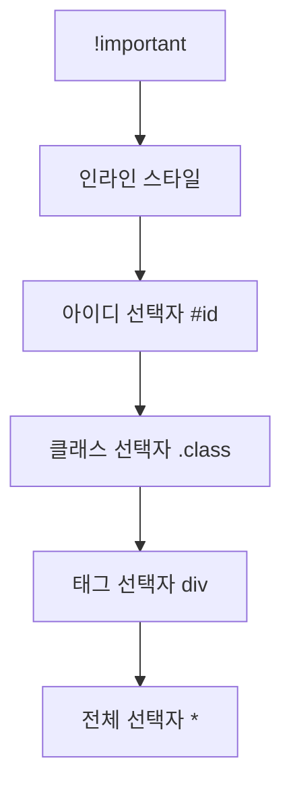

## 들어가며 (Situation)

CSS 선택자 시리즈를 이어서, 오늘은 한 요소에 여러 선택자의 규칙이 동시에 걸릴 때 **어떤 규칙이 실제로 적용되는지**를 다뤘다. 지금까지는 선택자 하나하나가 "무엇을 고르는지"에 집중했다면, 이번에는 여러 선택자가 같은 요소를 동시에 가리킬 때 누가 이기는지가 주제다.

## 문제 상황 (Task)

실습 파일에는 테스트용 `div`가 두 개 있었다.

```html
<div id="test1" class="test1">우선순위 테스트</div>
<div id="test2" class="test2" style="background-color: khaki;">우선순위 테스트</div>
```

`test1`은 아이디 선택자와 클래스 선택자가 동시에 배경색을 지정하고 있어서 둘 중 뭐가 이길지, `test2`는 여기에 인라인 스타일까지 더해져서 세 가지 규칙이 경쟁하는 상황이라 최종 색이 뭐가 될지 바로 예측이 안 됐다.

## 해결 과정 (Action)

### 1. 코드에 이미 적혀 있던 우선순위 계급

실습 파일 자체에 아래 순서가 그대로 명시돼 있었다.

```html
<strong>
    !important > 인라인 선택자 > 아이디 선택자
    > 클래스 선택자 > 태그 선택자 > 전체 선택자
</strong>
```



위로 갈수록 이긴다. 이 순서를 기준으로 두 테스트를 하나씩 짚었다.

### 2. `test1` - 아이디가 클래스를 이긴다

```css
* { color: red; }

div {
    background-color: darkolivegreen;
    color: yellow;
}

#test1 { background-color: blueviolet; }
.test1 { background-color: darkcyan; }
```

배경색 후보는 `#test1`(blueviolet)과 `.test1`(darkcyan) 둘인데, 아이디 선택자가 클래스 선택자보다 우선순위가 높으므로 **blueviolet**이 이긴다.

글자색은 `*`(red)와 `div`(yellow) 둘이 경쟁하는데, `test1`에는 글자색을 지정하는 아이디/클래스 규칙이 없다. 태그 선택자 `div`가 전체 선택자 `*`보다 우선하므로 최종 글자색은 **yellow**다. 처음에는 `*`가 제일 마지막에 선언돼 있으니 나중 규칙이 이기는 게 아닌가 헷갈렸는데, 순서가 아니라 **선택자 자체의 우선순위**가 먼저 비교되고, 순위가 같을 때만 순서(나중에 선언된 것)가 기준이 된다는 걸 이번에 짚었다.

### 3. `test2` - `!important`는 인라인 스타일도 이긴다

```css
#test2 { background-color: cadetblue; }
.test2 { background-color: chocolate !important; }
```

```html
<div id="test2" class="test2" style="background-color: khaki;">우선순위 테스트</div>
```

배경색 후보가 셋이다.

| 규칙 | 값 | 종류 |
|---|---|---|
| `#test2` | cadetblue | 아이디 선택자 |
| `.test2` | chocolate | 클래스 선택자 + `!important` |
| `style="background-color: khaki"` | khaki | 인라인 스타일 |

`!important`가 없었다면 인라인 스타일(khaki)이 아이디·클래스보다 우선순위가 높아서 이겼을 것이다. 하지만 `.test2`에 `!important`가 붙어 있어서, 이 규칙 하나가 인라인 스타일을 포함한 나머지 모든 규칙보다 우선한다. 최종 배경색은 **chocolate**다.

## 결과 (Result)

| 요소 | 최종 배경색 | 이유 |
|---|---|---|
| `#test1.test1` | blueviolet | 아이디 선택자가 클래스 선택자보다 우선순위가 높음 |
| `#test2.test2` + 인라인 style | chocolate | `!important`가 인라인 스타일까지 포함한 모든 규칙보다 우선함 |

| 항목 | 이전 | 이후 |
|---|---|---|
| 우선순위 판단 기준 | "나중에 선언된 게 이긴다"고만 생각함 | 선택자 종류(중요도)가 먼저 비교되고, 동점일 때만 선언 순서가 기준이 된다는 것을 확인 |
| `!important`의 위치 | 그냥 "강제 적용" 정도로만 알고 있었음 | 인라인 스타일보다도 우선한다는 것을 실제 코드로 확인 |

## 더 학습하면 좋은 개념

- **명시도(specificity) 계산 공식** - 인라인, 아이디, 클래스/속성/가상클래스, 태그/가상요소를 각각 자릿수로 환산해 비교하는 정확한 규칙이다. 오늘은 결과만 눈으로 확인했지만, 숫자로 계산할 줄 알면 복잡한 선택자가 겹쳐도 우선순위를 예측할 수 있다.
- **CSS 캐스케이드 레이어(`@layer`)** - `!important`를 남발하지 않고도 우선순위를 계층별로 관리하는 최신 스펙이다. 오늘처럼 `!important`가 인라인 스타일까지 뒤엎는 상황을 구조적으로 줄일 수 있는 방법이다.
- **CSS 상속(inheritance)** - `color`처럼 자식 요소에 상속되는 속성과 `background-color`처럼 상속되지 않는 속성이 갈리는 이유를 알아야, 오늘 다룬 명시도와는 별개로 "왜 이 속성만 자식에 전달되는지"를 설명할 수 있다.

## 참고 자료
- [MDN - Specificity](https://developer.mozilla.org/en-US/docs/Web/CSS/Specificity)
- [MDN - !important](https://developer.mozilla.org/en-US/docs/Web/CSS/important)
- [MDN - Cascade](https://developer.mozilla.org/en-US/docs/Web/CSS/Cascade)
