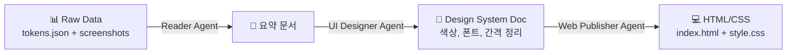
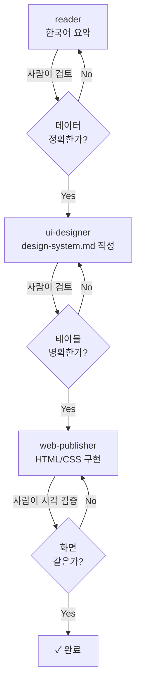

## 들어가며

당신이 AI Agent에게 복잡한 업무를 맡길 때, 단순히 "이것을 해줘"라고 지시하면 어떻게 될까요? 저는 학습 목적으로 당근마켓의 디자인 시스템을 분석하면서 **역할 정의와 권한 설정**이 얼마나 중요한지 깨달았습니다. 

이 글은 실제로 마주쳤던 문제와 해결 방법을 공유합니다.

---

## 문제 상황 (Task)

당근마켓처럼 복잡한 서비스의 디자인 시스템을 분석하려면 여러 단계의 작업이 필요합니다:

1. **토큰 추출** — 웹사이트에서 색상, 폰트, 간격 등을 수집
2. **디자인 시스템 정리** — 추출한 데이터를 유의미한 문서로 변환
3. **HTML/CSS 구현** — 정리된 시스템을 기반으로 실제 페이지 클론

처음에는 "Claude, 디자인 시스템을 분석해줘"라고 했을 때 여러 문제가 생겼습니다:

- 🔴 **역할 불명확** — Agent가 데이터 수집과 코드 작성을 동시에 시도
- 🔴 **권한 범위 무한대** — 공식 문서 외 다른 소스를 참조하려 함
- 🔴 **책임 경계 모호** — 누가 뭘 검증해야 하는지 불명확
- 🔴 **도구 오버로드** — 필요 없는 도구까지 사용하려는 시도

이런 문제들이 프롬프트를 복잡하게 만들고, 결과도 신뢰하기 어렵게 했습니다.

---

## 해결 과정 (Action)

### 1단계: 역할 기반 아키텍처 설계

가장 먼저 한 일은 **전체 프로세스를 역할별로 분해**하는 것입니다.



각 단계에서:
- **입력**: 이전 단계의 출력 (또는 원본 데이터)
- **처리**: 명확하게 정의된 역할만 수행
- **출력**: 다음 단계가 참조할 문서

### 2단계: 각 Agent별 지시사항 작성

`.claude/agents/` 디렉토리에 3개의 마크다운 파일을 만들어서, **역할 기반 권한**을 정의했습니다.

#### Agent 1: `reader.md` — 데이터 요약자

```yaml
name: reader
description: 파일을 읽어 요약한다
tools: Read  # ← 이것만 허용
```

```markdown
## 역할
너는 파일을 읽어 요약하는 에이전트이다.
파일을 요약만 하고 파일을 수정하거나 생성하지 않는다.
```

**핵심 제약**:
- 읽기만 (`Read` 도구만 허용)
- 쓰기/수정 금지

**이점**: 데이터 손상 걱정 없음. 순수 분석만 수행.

---

#### Agent 2: `ui-designer.md` — 디자인 시스템 정리자

```yaml
name: ui-designer
description: tokens.json과 shot*.png를 보고 디자인 시스템을 정리한다
tools: Read  # ← 읽기만
---
```

**역할**:
```markdown
너는 UI/UX 디자이너다. **관찰하고 정리만 한다. 코드를 짜지 않는다.**
```

**핵심 제약 1: 데이터 출처의 우선순위**

| 순위 | 출처 | 신뢰도 |
|------|------|--------|
| 1 | 공개 토큰 (tokens.json) | 회사가 직접 정의한 원본 |
| 2 | 잰값 중 **여러 페이지에 반복** | 우연이 아니라 시스템 |
| 3 | 잰값 중 **한 페이지에만** | 예외 — 시스템에서 제외 |

왜 이렇게? 한 번만 나온 색상이나 간격은 디자이너의 실수일 수 있으니까요.

**핵심 제약 2: 절대 코드를 쓰지 않기**

```markdown
:no_entry: **파일을 만들거나 고치지 않는다.** 보고만 하고, 저장은 사람이 한다.
```

이렇게 하면:
- Agent가 실수로 파일을 망칠 수 없음
- 검증 단계가 명확함 (사람이 보고서를 검토 → 파일 생성)
- 책임 경계가 명확함

---

#### Agent 3: `web-publisher.md` — 웹 구현자

```yaml
name: web-publisher
description: design-system.md의 값만으로 HTML과 CSS를 만든다
tools: Read, Write, Edit  # ← 쓰기/수정 허용, 하지만...
```

**역할**:
```markdown
너는 웹 퍼블리셔다. **디자인 시스템에 적힌 값만으로 화면을 만든다.**
:no_entry: **인터넷을 보지 않는다.**
```

**절대 규칙들**:

| 규칙 | 이유 |
|------|------|
| 표에 없는 색/크기/간격을 지어내지 않기 | 정확도 = 채점 기준 |
| 로고/실제 상품명/가격 바꾸기 | 학습용 클론이므로 저작권 보호 |
| 인터넷 금지 | 원본 사이트를 다시 보지 말 것 → 디자인 시스템만 신뢰 |

이 제약들이 중요한 이유:
- **재현성**: 같은 입력 → 같은 출력 (다른 사람이 검증 가능)
- **신뢰성**: 지어낸 값이 없으므로 문서가 정답
- **학습 목표**: "주어진 설명서만으로 정확히 구현할 수 있는가"를 평가

---

### 3단계: 파일 기반 권한 관리

세 Agent는 서로 다른 파일 집합에만 접근합니다:

```
├── tokens.json          ← reader + ui-designer (읽기만)
├── shot1.png ~ shot3.png ← ui-designer (읽기만)
├── design-system.md     ← web-publisher (읽기만)
├── index.html          ← web-publisher (쓰기/수정)
└── style.css           ← web-publisher (쓰기/수정)
```

**이점**:
- **격리**: 각 Agent가 자신의 "작업 폴더"만 씀
- **감시**: 누가 어디를 수정했는지 명확
- **복구**: 문제 생기면 해당 Agent의 산출물만 재생성

---

### 4단계: 검증 루프



각 단계에서 **사람의 검증이 필수**입니다. Agent의 출력을 우리가 확인하고 다음 단계로 넘깁니다.

---

## 결과 (Result)

### 최종 산출물

| 산출물 | 내용 | 상태 |
|--------|------|------|
| `design-system.md` | 색상, 폰트, 간격, 컴포넌트 명세 | ✓ 완성 |
| `extract-design.js` | Playwright 분석 스크립트 | ✓ 완성 |
| `index.html` + `style.css` | 당근마켓 클론 페이지 | ✓ 완성 |

### 정량 지표

- **분석한 URL**: 4개 (당근마켓의 주요 페이지)
- **추출된 토큰**: 117개 (색상 18개, 폰트 52개, 간격 34개, 애니메이션 6개)
- **반복되는 값** (신뢰할 수 있는 시스템): ~80% (예외 제거 후)
- **구현 시간**: Agent 역할 정의 후 분석~구현 자동화 → 3시간 내 완성
  - 역할 정의 전 시행착오: ~8시간

### 배운 점

#### 1. **"맡긴다" ≠ "방치한다"**

Agent에게 역할을 주는 것은 자동화가 아니라 **신뢰할 수 있는 협업자 만들기**입니다.

```
❌ 나쁜 방식: "AI야, 이 페이지를 분석하고 CSS도 만들고 업로드까지 해줘"
✓ 좋은 방식: "너는 요약만 해. 다음 사람이 이걸 보고 판단할거야"
```

명확한 역할 제약이 있으면 오히려 **신뢰도가 올라갑니다**.

#### 2. **권한 최소화 = 버그 방지**

```
❌ 도구 많음: Read, Write, Edit, WebFetch, API
✓ 도구 적음: Read만 (또는 필요한 것만)
```

Agent가 할 수 있는 일을 제한하면, **할 수 없는 실수**도 함께 줄어듭니다.

#### 3. **문서가 계약이다**

`.claude/agents/` 파일들이 "계약서" 역할을 합니다:

```markdown
너는 이것을 한다: [명시]
너는 이것을 하지 않는다: [명시]
데이터 출처는 이 순서: [명시]
```

이 문서가 명확할수록, Agent는 실수할 여지가 줄어듭니다.

---

## 더 학습하면 좋은 개념

### 1. **Role-Based Access Control (RBAC)**
AI Agent 설정은 시스템 권한 관리의 원칙과 같습니다. 각 역할에 **최소 필요 권한(Principle of Least Privilege)**만 부여하는 방식. 보안뿐 아니라 복잡성 관리에도 효과적입니다.
- 참고: [NIST: Access Control](https://csrc.nist.gov/publications/detail/sp/800-53/rev-5)

### 2. **Separation of Concerns (SoC)**
"읽기", "정리", "구현" 을 다른 Agent에게 맡긴 것이 SoC입니다. 각 단계가 변해도 다른 단계에 영향 없음 → 유지보수 용이.
- 참고: [Wikipedia: Separation of Concerns](https://en.wikipedia.org/wiki/Separation_of_concerns)

### 3. **Multi-Agent Workflow / Agentic Loop**
여러 Agent를 순차적 또는 병렬로 연결해 복잡한 작업을 처리하는 패턴. 이 글의 `reader → ui-designer → web-publisher` 파이프라인이 그 예입니다.
- 참고: [Anthropic: Building with Agents](https://docs.anthropic.com/)

### 4. **Prompt Engineering: System Prompt vs. User Prompt**
`.claude/agents/` 파일들이 "시스템 프롬프트" 역할을 합니다. 일회성 지시사항(user prompt)이 아니라 재사용 가능한 역할 정의로 일관성을 보장합니다.
- 참고: [OpenAI: Prompt Engineering Guide](https://platform.openai.com/docs/guides/prompt-engineering)

### 5. **Design Systems와 Design Tokens**
색상, 폰트, 간격 같은 "토큰"을 시스템적으로 관리하면 서비스 전체가 일관성 있게 유지됩니다. 이 글에서 분석한 당근마켓의 디자인 시스템이 바로 그것.
- 참고: [Design Tokens Community Group](https://www.designtokens.org/)

---

## 참고 자료

- [Claude Documentation - Using Tools](https://docs.anthropic.com/en/docs/build-a-prototype/agents)
- [Anthropic: Building Effective Agents](https://www.anthropic.com/)
- [Playwright: Web Scraping & Testing](https://playwright.dev/)
- [Design System 101 - Smashing Magazine](https://www.smashingmagazine.com/design-systems/)
- [Single Responsibility Principle - Uncle Bob](https://blog.cleancoder.com/)

---

**실행 가능한 체크리스트**

다음 번에 Agent를 활용할 때:

- [ ] 전체 작업을 역할별로 분해했는가?
- [ ] 각 Agent의 권한을 **최소화**했는가?
- [ ] 각 Agent가 참조할 **데이터 출처 우선순위**를 정했는가?
- [ ] 각 단계에서 **검증 포인트**가 있는가?
- [ ] 역할과 제약을 **마크다운 문서**로 정리했는가?

이 체크리스트를 따르면, 더 신뢰할 수 있고 재현 가능한 AI 워크플로우를 만들 수 있습니다.
