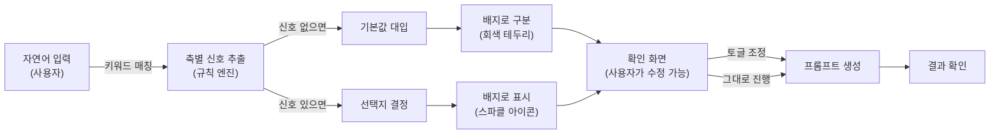

## 들어가며 (Situation)

AI 사용자층이 빠르게 늘고 있지만, 비전공자와 고령층(40대 이상)에게는 "좋은 결과를 얻기 위해 프롬프트를 어떻게 써야 하는가"가 진입장벽입니다. ChatGPT를 켜놔도 의도한 답을 받지 못하는 경험이 반복되면서, 사람들은 두 가지 선택지만 남습니다: 계속 시행착오하거나, 프롬프트 엔지니어링을 따로 배우거나.

이 문제를 푸는 웹 서비스를 만들고 있습니다. 이름은 **Yahoo_Prompt**(구명: QuickPrompt). 핵심 아이디어는 간단합니다.

> 사용자가 자연어로 편하게 입력하면, 규칙 기반으로 신호를 추출해서 AI가 더 잘 알아듣는 프롬프트로 자동 정리해준다.

**중요한 제약**: LLM을 쓰지 않습니다. 키워드 매칭과 고정 규칙만으로 동작합니다. 프로덕션 안정성을 최우선으로 하기 위함입니다.

오늘(2026-09-07)은 이 프로젝트의 핵심인 "카테고리별 스키마 설계"를 4명의 팀원이 함께 완성한 날입니다.

## 문제 상황 (Task)

카테고리 스키마 설계는 단순히 "어떤 축을 만들 것인가"라는 문제가 아니었습니다.

**우리가 풀어야 했던 과제들:**

1. **5개 카테고리를 4명이 독립적으로 설계** — 각자 다른 축을 정의하다 보니 개념상 충돌이 발생
2. **공통 축을 쓸까, 전용 축만 쓸까?** — 구현 단순성 vs. 각 카테고리의 의미 있는 설계 사이의 균형
3. **자유 슬롯(목적지, 이름 같은 고유명사) 처리** — 규칙 엔진으로 캐치할 수 없는 입력을 어떻게 할 것인가?
4. **축끼리 충돌하는 설정** — 예를 들어 개인상담에서 "완전 공감형이면서 직접 조언 제시"라는 모순
5. **신호 없을 때 사용자 경험** — 키워드가 안 잡혔을 때도 시스템이 신뢰할 만해야 함

## 해결 과정 (Action)

### 1단계: 스키마 형식 확정 (공통 축 제거)

처음엔 모든 카테고리가 공유하는 "공통 축"(예: 톤, 길이)을 생각했습니다. 하지만 첫 설계 시즌에서 문제를 발견했습니다.

- 작성 카테고리는 "대상(상급자/동료)"에 따라 존댓말이 결정됨
- 개인상담 카테고리는 "페르소나(연애고수/친구/선생님)" 안에 말투가 이미 포함됨
- 의료질문 카테고리는 "목적에 따라" 페르소나가 바뀜

**결론**: 공통 축은 추상화 수준이 맞지 않았습니다. 대신 **각 카테고리가 전용 축만으로 구성**하기로 전환했습니다.

최종 스키마 형식:

```yaml
카테고리_설정:
  이름: string
  출력_형식: "역할지정형" | "태그나열형"  # 역할지정형: "당신은 ~입니다"
                                        # 태그나열형: "원문, tag1, tag2" (사진 생성 전용)
  전용_축: 
    - 축_이름: string
      선택지: [선택지1, 선택지2, ...] # 2택 이상
      키워드사전: { 선택지1: [keyword1, ...], 선택지2: [...], ... }
      기본값: 선택지_중_하나
      효과: string (옵션)
    - ...
  고정_규칙:
    - 조건: "항상" | "축_이름=값"
      문구: string
    - ...
```

### 2단계: 5개 카테고리 병렬 설계 및 충돌 해결

4명의 팀원이 각자 담당 카테고리를 설계했습니다.

| 카테고리 | 전용 축 개수 | 특징 | 담당자 |
|---|---|---|---|
| **작성** (이메일·회의록·보고서) | 4개 | 가장 직관적, 축 간 충돌 없음 | 담당자 A |
| **개인상담** | 3개 | 축 간 충돌 있음, 매트릭스 필요 | 담당자 B |
| **의료질문/문진** | 3개 | 안전 고지문 필수 | 담당자 C |
| **여행계획** | 4개 | 자유 슬롯 처리 핵심 | 담당자 D |
| **AI 사진생성** | 4개 | 태그나열형 조립 (다른 방식) | 담당자 A |

#### 사례 1: 개인상담의 "관계유형 vs 상담주제" 충돌

담당자 B가 처음 제시한 구조:

```yaml
축 1 — 관계유형: 연애/인간관계/가족/진로/...
축 2 — 상담주제: 감정 위주/조언 위주
축 3 — 개입방식: 질문으로 유도/직접 조언
```

문제: 축 1의 "연애"와 축 3의 "직접 조언"이 동시에 선택되면?
- 연애고수 페르소나는 기본적으로 "비속어 금지"인데, 직접 조언을 주면서 동시에 감정 반영은 어떻게 하지?

**결정**: 축 1을 **"상담 주제별 페르소나"** (6택)로 통합했습니다.

```yaml
축 1 — 상담 주제별 페르소나 (6택):
  - 연애 (연애고수 모드): 반말, 비속어·은어 금지
  - 인간관계 (친구 상담 모드): 반말, 공감
  - 학업 (친한 선생님 모드): 존댓말, 현실적
  - 진로 (진로 선생님 모드): 존댓말, 경험담
  - 가족 (나이 많은 누나·언니 모드): 존댓말, 균형잡힌 조언
  - 자존감 (부모님 모드): 존댓말, 지지적
축 2 — 상담 스타일 (3택): 완전 공감형 / 균형형 / 직설·해결형
축 3 — 개입 방식 (2택): 질문으로 유도 / 직접 조언 제시
```

이제 축 1에서 이미 페르소나가 결정되면, 축 2·3은 그 페르소나 안에서 미세 조정하는 역할만 합니다. 대신 새로운 충돌이 생겼습니다.

**축 2 × 축 3 충돌 매트릭스**:

| 축2 (스타일) | 축3 (개입방식) | 처리 규칙 |
|---|---|---|
| 완전 공감형 | 직접 조언 제시 | ⚠️ 충돌 → 축2 우선. 조언 제시를 보류하고 감정 반영에만 집중 |
| 직설·해결형 | 질문으로 유도 | ⚠️ 충돌 → "짧은 진단 한 문장 + 다음 행동을 확인하는 질문"로 결합 |
| 그 외 조합 | — | 충돌 없음, 그대로 적용 |

이 매트릭스는 프롬프트 조립 로직에서 조건부 규칙으로 구현됩니다.

#### 사례 2: 여행계획의 "자유 슬롯" 처리

여행계획에서 가장 중요한 정보는 "목적지"입니다. 하지만 "오사카", "발리", "제주도" 같은 지명을 규칙 엔진으로 캐치할 수 없습니다.

처음 제안:
- 지명 사전을 만든다? → 관리 비용 높고, 해외 지명까지 다 포함하려면 무한정 커짐
- LLM 엔티티 추출? → 규칙 기반 원칙 위배

**최종 결정**: **자유 슬롯은 규칙 엔진으로 감지하지 않고, UI의 placeholder 문구로 유도합니다.**

```
입력 필드 placeholder:
"여행지와 함께 편하게 적어주세요 (예: 다음 달 오사카로 3박 4일, 아이랑 같이 갈 건데 일정 좀 짜줘)"
```

이 방식의 장점:
1. 규칙 엔진 단순화 (사전 관리 비용 0)
2. 사용자가 자연스럽게 필요한 정보를 준다
3. 프롬프트에 "여행지 정보가 누락되면 물어보세요"라는 고정 규칙을 미리 넣어둔다

#### 사례 3: 신호가 없을 때의 UX — 배지로 구분하기

규칙 엔진이 키워드를 못 찾으면, 기본값으로 자동 채웁니다. 하지만 사용자는 "이게 내가 의도한 건지, 시스템이 임의로 정한 건지" 헷갈립니다.

**해결책**: 확인 화면에서 배지 스타일로 구분합니다.

```
자동 감지된 값:  [✨ 카테고리명_축이름 = 선택지] ← 브랜드 컬러 + 스파클 아이콘
기본값으로 채워진 값: [□ 카테고리명_축이름 = 선택지] ← 회색 테두리
```

사용자는 한눈에 "어느 것이 자동으로 잡힌 건지"를 구분할 수 있고, 기본값이 맞지 않으면 토글만 클릭해서 수정할 수 있습니다. **프롬프트를 다시 쓸 필요가 없습니다.**

### 3단계: 공통 설계 원칙 문서화

모든 카테고리가 일관되게 동작하도록 다음을 명시했습니다.

**겹침 처리 규칙** (한 축 내에서 좌/우 신호가 동시에 감지될 때):
- 문장에서 **더 나중에 등장한 신호를 우선 채택**합니다.
- 예: "처음엔 침착하게 싶은데 너무 급해" → "급함" 선택

**고정 규칙 통일**:
- "항상 적용" (예: 의료질문의 응급 안내문)
- "특정 축=값일 때만 적용" (예: AI 사진생성에서 "상업용이면 저작권 확인 권고")

이 두 가지를 하나의 배열로 표현해서 프롬프트 조립 로직이 일관되게 처리할 수 있도록 했습니다.

### 4단계: GitHub 협업 기반 구축

5개 카테고리의 스키마가 각각 다르므로, 파일 구조와 리뷰 프로세스를 명확히 정의했습니다.

**폴더 구조**:
```
/schemas
  ├── 작성.md              # 담당자 A
  ├── 개인상담.md          # 담당자 B  
  ├── 의료질문.md          # 담당자 C
  ├── 여행계획.md          # 담당자 D
  ├── AI사진생성.md        # 담당자 A
  └── README.md            # 스키마 형식 설명
```

**브랜치 전략**:
```
feature/카테고리명-작업내용
예: feature/개인상담-스키마, feature/피그마-3차
```

**PR 체크리스트**:
- [ ] 다른 카테고리의 전용 축·키워드 사전과 충돌 없는지 확인
- [ ] (디자인 변경 시) Before/After 스크린샷 첨부
- [ ] (로직 변경 시) 신호 없음 → 기본값 시나리오 확인

특히 **카테고리 간 충돌 검사**가 중요합니다. 개인상담의 "페르소나" 축이 작성의 "대상" 축과 개념적으로 겹칠 수 있기 때문입니다.

### 5단계: Figma Make로 디자인 반영

병렬로 진행한 디자인 3~4라운드에서 스키마 결정 사항들이 반영되었습니다.

**반복된 개선사항:**

| 라운드 | 디자인 변화 | 스키마와의 연결 |
|---|---|---|
| 1차 | 톤 통일 (브랜드 컬러) | 배지 스타일 정의 (자동감지 ≠ 기본값) |
| 2차 | 카테고리 5개 카드 배치 (3·2 그리드) | 각 카테고리별 축 개수 확인 (4개 이상이면 UI 부담) |
| 3차 | "AI 프롬프트 도우미" 정체성 강화 (터미널 기호, 비교 예시) | 자동감지 스파클 아이콘 추가 |
| 4차 | 확인 화면 토글 밀도 (아코디언) | 카테고리별 축이 3~4개일 때 펼치기/접기로 대응 |

특히 개인상담의 축 3개 × 충돌 매트릭스가 확인 화면에 시각적으로 어떻게 표현될지가 디자인의 중요 포인트가 되었습니다.



## 결과 (Result)

**최종 산출물:**

```
✅ 5개 카테고리 스키마 확정
  - 작성: 4개 축 (목적, 대상, 문서유형, 긴급도)
  - 개인상담: 3개 축 (페르소나, 스타일, 개입방식) + 충돌 매트릭스
  - 의료질문: 3개 축 (목적, 대상, 증상성격) + 응급 안내 고정규칙
  - 여행계획: 4개 축 (목적, 동행, 시점, 스타일) + placeholder 유도
  - AI 사진생성: 4개 축 (용도, 스타일, 피사체, 구도) + 태그나열형 조립

✅ GitHub 협업 기반 완성
  - /schemas 폴더 구조 정의
  - PR/Issue 템플릿 3종 (pull_request, bug_report, schema_request, design_feedback)
  - CONTRIBUTING.md 작성 (브랜치 전략, 스키마 양식, PR 체크리스트)

✅ 규칙 엔진 명세 문서화
  - 겹침 처리: "문장에서 더 나중에 등장한 신호 우선"
  - 고정 규칙: "항상" 또는 "특정 축=값" 조건으로 통일
  - 자유 슬롯: 규칙으로 감지하지 않고 placeholder로 유도

✅ Figma 디자인 반영
  - 자동감지(스파클) vs 기본값(회색) 배지 구분
  - 카테고리별 축이 많을 때 아코디언 대응
```

### 배운 점

**1. 공통화의 유혹에 저항하기**

처음엔 "모든 카테고리가 공유하는 톤, 길이 같은 축"을 만들고 싶었습니다. DRY 원칙처럼 보이니까요. 하지만 각 카테고리의 비즈니스 로직을 파고들면서 깨달았습니다.

> 추상화는 반복되는 코드를 줄이는 게 아니라, **의미의 반복을 줄이는 것**이다.

개인상담의 "말투"와 작성의 "존댓말 여부"는 문법적으로 비슷하지만, 의미는 다릅니다. 강제로 공통화하면 나중에 "이 축은 왜 카테고리마다 다르게 동작하지?"라는 혼란을 만듭니다.

**결론**: 각 카테고리가 전용 축만 가지는 게 오히려 더 명확했습니다.

**2. 충돌은 설계 단계에서 찾고, 로직으로 복잡하게 풀지 말 것**

개인상담의 "완전 공감형 + 직접 조언" 충돌은 처음엔 로직으로 풀려고 했습니다. 하지만 매트릭스를 그리면서 "이건 설계 단계에서 분명히 해야 할 것"임을 알았습니다.

프롬프트 조립 로직은 그냥 매트릭스를 읽기만 하면 됩니다.

**3. 자유 슬롯의 답은 규칙이 아니라 UX**

목적지 같은 고유명사는 아무리 정교한 키워드 사전으로도 100% 캐치할 수 없습니다. "시스템이 못 잡는 건 자연스러운 일"이라고 받아들이고, 대신 placeholder 문구로 자연스럽게 유도하는 게 훨씬 효과적입니다.

**4. "신호 없음"도 설계의 일부**

기본값이 아닌 자동 감지 값을 배지로 구분하는 건 단순한 UI 꾸미기가 아닙니다. 이것이 규칙 기반 시스템의 **투명성**을 담보합니다.

사용자는 "시스템이 뭘 봤고 뭘 못 봤는지"를 한눈에 알 수 있습니다.

## 더 학습하면 좋은 개념

- **상태 관리와 의존성 그래프** — 개인상담의 축2×축3 매트릭스처럼, 선택지 간 의존성이 있을 때 선택순서나 우선순위를 정하는 방법론. 상태 머신이나 제약충족 문제(CSP)로 모델링할 수 있습니다.
  
- **키워드 매칭의 정밀도와 리콜** — 규칙 기반 시스템에서 신호를 놓치는 것(낮은 리콜)과 잘못 감지하는 것(낮은 정밀도) 사이의 트레이드오프. 여행계획에서 "목적지를 키워드로 감지하지 않기로 한 결정"이 리콜=0이지만, 오류=0인 셈입니다.

- **사용자 설정의 시각화** — 자동감지 배지와 기본값 배지의 구분이 UI에서 어떻게 신뢰를 만드는지. "투명한 자동화"라는 개념을 시각적으로 구현하는 디자인 패턴.

- **프롬프트 엔지니어링의 구조화** — STAR나 CoT(Chain of Thought) 같은 프롬프트 템플릿이 "축"으로 어떻게 표현될 수 있는지. 도메인별 프롬프트 템플릿 설계 방법론.

- **협업 프로세스에서의 충돌 해결** — 4명이 각각 다른 스키마를 설계할 때, 어떻게 일관성 있게 취합할 것인가. 테이블 기반 설명(표)이 다이어그램보다 의존성을 더 잘 드러내는 경우와 그 이유.

## 참고 자료

- Yahoo_Prompt README.md — [프로젝트 개요 및 스키마 형식](./README.md)
- CONTRIBUTING.md — [스키마 작성 양식과 PR 체크리스트](./CONTRIBUTING.md)
- `/schemas` 폴더 — [5개 카테고리별 최종 스키마](./schemas)
- [프롬프트 엔지니어링 101](https://platform.openai.com/docs/guides/prompt-engineering) — OpenAI 공식 가이드 (프롬프트 작성의 기본 원칙)
