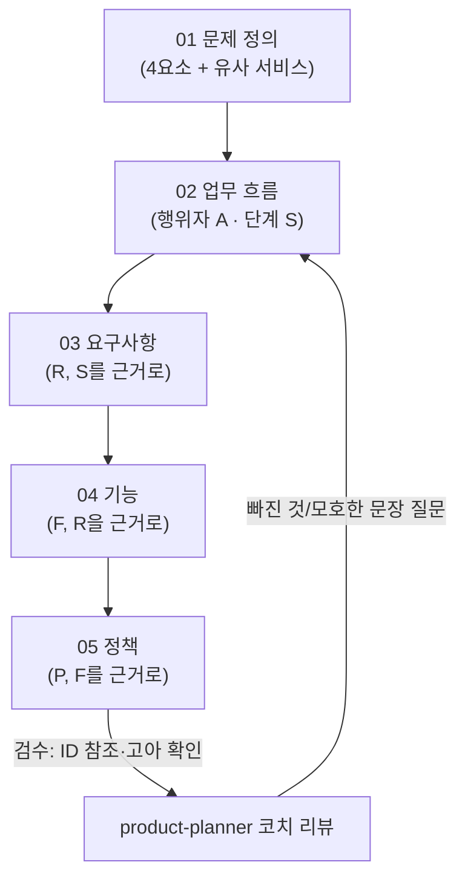

## 들어가며 (Situation)

팀 프로젝트 **Yahoo_Prompt**(비전공자를 위한 규칙 기반 AI 프롬프트 자동 정리 도구)를 진행하며, 오늘 수업은 본격적인 개발 전 "길닦기" — 기획 단계를 다지는 시간이었습니다.

수업의 목표는 명확했습니다. **에이전트를 적극적으로 활용하되, 에이전트에게 기획의 결정권을 주지 않는 것.** 에이전트가 "이렇게 하면 됩니다"라고 그럴듯하게 대신 정해버리면 편하긴 하지만, 정작 팀이 무엇을 왜 그렇게 결정했는지가 사라집니다. 그래서 에이전트가 팀에게 끊임없이 질문을 던지고, 팀이 답한 것만 문서에 남기는 방식으로 기획 문서(문제 정의 → 업무 흐름 → 요구사항 → 기능 → 정책)를 완성하는 실습을 했습니다.

## 문제 상황 (Task)

기획을 에이전트와 함께 진행할 때 마주치는 근본적인 딜레마가 있습니다.

- 에이전트에게 자유롭게 맡기면 속도는 빠르지만, 결과물이 **팀의 실제 의도**가 아니라 **에이전트가 그럴듯하게 지어낸 내용**이 될 위험이 큽니다.
- 반대로 에이전트를 전혀 안 쓰면, 문제 정의 → 업무 흐름 → 요구사항 → 기능 → 정책까지 이어지는 5단계 문서를 빠짐없이, 서로 ID로 참조가 맞물리게(요구사항 R이 업무 흐름의 어느 단계 S에서 나왔는지, 기능 F가 어느 요구 R을 만족하는지, 정책 P가 어느 기능 F에 대한 것인지) 작성하는 데 시간이 오래 걸립니다.

즉 **"에이전트의 속도"와 "팀의 의도 보존"을 동시에 만족시키는 워크플로우**가 필요했습니다.

## 해결 과정 (Action)

### 검토한 대안

| 방식 | 속도 | 팀 의도 반영 | 문제점 |
|---|---|---|---|
| 자유 브레인스토밍 (에이전트에게 채팅으로 통째로 물어보기) | 빠름 | 낮음 | 에이전트가 그럴듯한 답을 자체 생성 — 팀이 논의하지 않은 내용이 그대로 문서에 들어감 |
| 에이전트가 초안 전체를 작성 → 팀이 검수만 | 빠름 | 중간 | 검수 단계에서 "이 정도면 됐다"고 그냥 넘어가기 쉬움 — 결정하지 않은 것과 결정한 것이 문서상 구분 안 됨 |
| **역할을 분리한 서브에이전트 + 질의응답 강제 + `[제안]`/`[?]` 태깅** | 느림 | **높음** | **선택** |

느린 걸 감수하고 세 번째 방식을 선택했습니다.

### 역할 분리: 인터뷰 담당과 검수 담당을 나누기

`.claude/agents/`에 서브에이전트 두 개를 정의했습니다. ([Claude Code Sub-agents 공식 문서](https://code.claude.com/docs/en/sub-agents)에 따르면 서브에이전트는 프로젝트 안에 마크다운 파일로 정의하고, 각자 별도의 컨텍스트와 허용 도구를 가집니다.)

```yaml
---
name: planning-partner
description: 팀에게 기획 인터뷰 질문을 하나씩 던져 답을 docs/ 아래 기획 문서 양식에 받아 적고,
  발산 질문으로 팀이 생각하지 못한 후보를 [제안] 표시로 보탠다.
tools: Read, Write, Edit
---
```

```yaml
---
name: product-planner
description: docs/ 아래의 기획 문서를 읽고 빠진 것과 모호한 문장을 질문으로 돌려준다.
tools: Read
---
```

`planning-partner`는 질문을 **한 번에 하나만** 던지고 답을 그대로 받아 적습니다. `product-planner`는 쓰기 권한 자체가 없이(`tools: Read`) 문서를 읽고 빈칸·모호한 문장·ID 참조 오류만 질문으로 되돌려줍니다. 둘 다에게 걸린 절대 규칙은 같았습니다.

> **네가 보탠 것에는 반드시 `[제안]`을 붙인다. 대신 정하지 않는다. 모르면 `[?]`로 비운다.**

### 실제 진행: 5단계 문서를 질의응답으로 채우기



각 문서에서 실제로 있었던 결정 사례입니다.

**01 문제 정의** — 아이디어 후보 3개를 비교했습니다.

| 후보 | 실사용 장면 | 구현 안정성 | 비전공자 사용성 | 결과 |
|---|---|---|---|---|
| A안 — 규칙 기반 신호 추출 | O | O | O | **선택** |
| B안 — LLM 기반 자유 슬롯 완전 자동화 | O | X (오탐 위험·개발 난이도 과함) | O | 탈락 |
| 학습 콘텐츠 제공형 | X | O | X | 탈락 |

B안을 왜 탈락시켰는지, 어떤 근거로 판단했는지까지 "확인할 수 없어 표시해 둔 것" 항목에 그대로 남겨뒀습니다 — "실제 프로토타입으로 오탐률을 비교 측정한 것이 아니라 팀 논의 중 도출된 판단"이라고요.

**03 요구사항** — `[제안]`으로 올라왔지만 팀이 채택하지 않은 항목들이 있습니다. 예를 들어 "고령층 접근성 UI(큰 글씨·단순 메뉴)"는 01 문서의 대상 정의("40대 이상 고령층")를 근거로 에이전트가 제안했지만, 팀은 "검토했으나 제외" 표에 이유와 함께 남기고 채택하지 않았습니다.

**04 기능** — 가장 시간이 오래 걸린 문서입니다. 열린 질문(`[?]`)이 **15개**나 남았습니다. F1~F9 기능마다 "이게 안 되는 경우는?", "MVP인가 v2인가?"를 하나하나 판단해야 했는데, 예를 들어 F8(오탐 피드백을 운영자에게 보여주는 기능)과 F9(사용 기록 보기)는 "지금 급하지 않다"는 팀 판단으로 v2로 미뤘습니다.

**05 정책** — 가장 애먹었던 지점은 P12였습니다. 원안은 "재조정 3회 이상이면 하드 리밋(강제로 막고 대안 화면 표시)"이었는데, 팀은 이걸 거부했습니다.

> 재조정 루프를 줄이는 게 이 프로젝트의 핵심 가치라 하드 리밋(횟수 제한)을 걸면 설계 의도와 충돌함 (팀 결정)

결국 하드 리밋 대신 "3회 이상이면 도움말(소프트 넛지)만 띄우고 조정은 계속 허용"하는 P12로 확정됐습니다. 에이전트가 먼저 원안을 제안했지만, 최종 결정은 팀의 논의를 거쳐 원안과 반대 방향으로 바뀐 사례입니다.

### 겪은 시행착오

기대한 대로, 이 방식은 확실히 느렸습니다. `planning-partner`는 발산 질문을 던질 때마다 근거(어느 문서 어느 줄에서 나온 후보인지)를 요구했고, `product-planner`는 문서를 여러 개 동시에 검토할 때 ID 참조가 어긋난 부분("이 기능(F)이 가리키는 요구(R)가 실제로 있나", "이 정책(P)이 가리키는 기능(F)이 있나")을 계속 짚어냈습니다. 답변하고 판단하는 데만 상당한 시간을 썼습니다.

## 결과 (Result)

문서별 열린 질문과 채택된 제안 개수를 정리하면 이렇습니다.

| 문서 | 열린 질문 `[?]` | 채택된 `[제안]` |
|---|---|---|
| 02-workflow.md | 0개 | 3개 |
| 03-requirements.md | 0개 | 1개 |
| 04-features.md | 15개 | 0개 |
| 05-policy.md | 0개 | 8개 |

`[?]`가 남아 있다는 건 "아직 우리도 모른다"를 숨기지 않고 그대로 기록했다는 뜻이고, 채택된 `[제안]` 개수는 에이전트가 던진 발산 질문 중 팀이 실제로 받아들인 것만 헤아린 숫자입니다.

가장 중요한 결과는 정량 지표가 아니라 이겁니다 — **에이전트가 미친듯이 질문을 던져서 답변하느라 시간은 꽤 걸렸지만, 그만큼 정책 설정이나 주요 기능 등 기획 과정이 제가 생각한 것과 100% 일치하는 결과로 나왔습니다.** 자유롭게 브레인스토밍했다면 더 빨리 끝났겠지만, 완성된 문서가 정말 팀이 결정한 내용인지 되짚어봐야 했을 겁니다. 느린 대신, 나온 문서를 그대로 신뢰할 수 있다는 게 이 워크플로우의 핵심 성과입니다.

## 더 학습하면 좋은 개념

- **멀티 에이전트 역할 분리(Role Separation)** — `planning-partner`(쓰기 가능, 인터뷰)와 `product-planner`(읽기 전용, 검수)처럼 권한과 역할을 나누면 한 에이전트가 "제안하고 스스로 검수까지" 하는 자기 검증의 함정을 피할 수 있습니다. 왜 도구 권한(`tools:`)까지 갈라놨는지 이해하는 데 도움이 됩니다.
- **요구사항 추적성(Requirements Traceability)** — 03의 요구(R)가 02의 단계(S)를, 04의 기능(F)이 03의 요구(R)를, 05의 정책(P)이 04의 기능(F)을 ID로 되짚어 가리키는 구조. 이 사슬이 끊기면 "왜 이 기능이 필요한지" 아무도 설명 못 하는 고아 요구사항이 생깁니다.
- **MoSCoW / 우선순위 매트릭스** — 04 문서의 "우선순위 2축(중요도×노력)" 표는 이 기법의 축소판입니다. F8·F9를 v2로 미룬 판단 기준을 일반화해서 배워두면 다른 프로젝트에도 바로 적용할 수 있습니다.
- **상태 머신(State Machine) 설계** — 05 정책 문서의 "상태값 전이" 절(카테고리 선택 전 → 선택됨 → 정제 완료 → 재조정 중 → 소프트 넛지 안내)이 실제로는 상태 다이어그램입니다. 정책을 상태 전이로 표현하면 "언제 무엇이 가능한가"를 코드로 옮기기 훨씬 쉬워집니다.
- **Human-in-the-loop AI 워크플로우** — 에이전트가 결정권 없이 사람의 판단을 보조만 하도록 설계하는 패턴 전반. 오늘 겪은 "느리지만 신뢰할 수 있는" 트레이드오프가 왜 발생하는지 원리 차원에서 이해할 수 있습니다.

## 참고 자료

- [Claude Code — Sub-agents 공식 문서](https://code.claude.com/docs/en/sub-agents)
