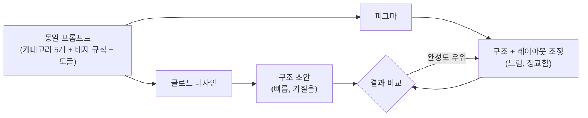

## 들어가며 (Situation)

**Yahoo_Prompt**(비전공자를 위한 규칙 기반 AI 프롬프트 자동 정리 도구) 프로젝트에서, 어제까지는 [카테고리별 스키마 설계]()와 [기획 문서 5단계 완성]()까지 끝냈습니다. 문제 정의부터 정책까지 텍스트로는 다 정리됐지만, 이걸 실제로 사용자가 보게 될 **화면**으로 옮기는 작업은 아직 손대지 않은 상태였습니다.

오늘 수업은 그 공백을 메우는 시간이었습니다. **클로드 디자인(Claude Design)**과 **피그마(Figma)**로 웹페이지 구조를 잡고 목업을 만드는 실습 위주 수업으로, 지난 이틀간 텍스트로만 존재하던 기획을 처음으로 시각화해보는 자리였습니다.

## 문제 상황 (Task)

수업의 과제는 명확했습니다. **완성도 높은 화면 하나를 만드는 것보다, 전체 페이지에 필요한 컴포넌트를 먼저 다 넣어보며 프로토타입 버전을 우선 구성하는 것**이 목표였습니다. 세부 디자인을 다듬기 전에 "이 화면에 뭐가 들어가야 하는가"를 컴포넌트 단위로 먼저 확인하는 방식입니다.

여기에 개인적으로 하나를 더 얹었습니다. **같은 프롬프트로 0부터 시작해서, 클로드 디자인과 피그마 각각에 동일한 웹페이지를 만들어보고 결과를 비교하는 것**입니다. 두 도구 모두 프롬프트 기반으로 화면을 뽑아낼 수 있다는 점은 같았지만, 실제로 어제 정한 기획(스키마, 배지·토글 같은 UX 규칙)을 화면에 옮겼을 때 어느 쪽이 더 쓸만한 결과를 주는지는 직접 만들어보기 전엔 알 수 없었습니다.

## 해결 과정 (Action)

### 같은 조건에서 두 도구를 나란히 실행

비교를 공정하게 하기 위해 조건을 맞췄습니다.

- 같은 프롬프트 문구를 그대로 사용
- 둘 다 기존 화면이나 템플릿 없이 **0부터** 시작
- 어제 확정한 기획 요소(카테고리 5개, 자동감지·기본값 배지 구분, 확인 화면 토글)를 동일하게 요청

이 조건으로 클로드 디자인과 피그마에 각각 같은 웹페이지를 만들어봤습니다.

### 겪은 시행착오

두 가지 지점에서 막혔습니다.

1. **어제 정한 UX 규칙을 화면에 그대로 옮기기 어려웠다.** 예를 들어 "자동감지는 스파클 아이콘, 기본값은 회색 테두리"처럼 문서에는 명확히 적어뒀던 배지 구분이나, 확인 화면의 토글 동작이 프롬프트만으로는 의도한 대로 잘 나오지 않았습니다. 텍스트로는 완결된 규칙이었지만, 화면 요소로 번역하는 과정에서 다시 구체화가 필요했습니다.
2. **두 도구의 결과물을 서로 맞추는 과정에서 반복 수정이 있었다.** 한쪽에서 나온 레이아웃을 다른 쪽에서 다시 흉내 내려다 보니, 프롬프트를 고치고 다시 생성하는 과정을 여러 번 거쳤습니다.

### 비교 결과

시행착오 끝에 두 도구의 특성 차이가 드러났습니다.

| 항목 | 클로드 디자인 | 피그마 |
|---|---|---|
| 시작 방식 | 프롬프트로 화면 초안을 빠르게 생성 | 프롬프트 기반 생성 + 수동 조정 |
| 레이아웃/간격 완성도 | 상대적으로 거칠음 | **더 정교함** |
| UX 규칙(배지·토글) 반영 | 세부 인터랙션까지 한 번에 반영되기 어려움 | 컴포넌트·오토레이아웃으로 세밀하게 조정 가능 |
| 이번 실습에서의 역할 | 빠른 구조 확인용 | **최종 완성도 확보용** |

결론적으로 이번 실습에서는 **피그마 쪽 결과물이 레이아웃과 간격 등 시각적 완성도 면에서 더 잘 나왔습니다.** 두 도구 모두 프롬프트로 시작한다는 점은 같았지만, 나온 결과를 다듬어 실제 화면 수준으로 끌어올리는 데는 피그마가 더 유리했습니다.

## 결과 (Result)

이번 실습은 정량 지표보다 **판단 기준**을 얻은 것이 핵심 성과입니다. 정확한 수치(컴포넌트 개수, 화면 수 등)를 세지는 않았지만, 두 도구를 같은 조건에서 직접 비교하고 나서 다음을 확인할 수 있었습니다.

- 프롬프트만으로 어제 정한 세밀한 UX 규칙(배지 구분, 토글)을 한 번에 완성된 화면으로 뽑아내기는 어렵다 — **기획 문서의 완결성과 화면 구현의 완결성은 별개**라는 걸 체감했습니다.
- 같은 목표를 두 도구로 반복해서 만들어보는 비교 방식 자체가, 한 도구만 썼다면 몰랐을 결과물 차이(레이아웃 완성도)를 드러내 줬습니다.
- 앞으로 프로토타입은 **피그마를 중심으로 다듬고, 구조를 빠르게 확인할 때만 클로드 디자인을 보조로 쓰는 방향**으로 역할을 나눠야겠다는 결론을 얻었습니다.

## 더 학습하면 좋은 개념

- **디자인 시스템(Design System)** — 색상·컴포넌트·간격 규칙을 재사용 가능한 단위로 묶는 방법론. 오늘 겪은 "두 도구 결과물을 맞추는" 반복 수정은, 애초에 디자인 시스템이 먼저 정의돼 있었다면 줄어들었을 문제입니다.
- **로우파이(Low-fidelity) vs 하이파이(High-fidelity) 프로토타입** — 오늘 과제였던 "컴포넌트를 먼저 다 넣어보는 프로토타입"은 로우파이 단계에 해당합니다. 언제 로우파이로 멈추고 언제 하이파이로 넘어가야 하는지 아는 게 다음 단계입니다.
- **오토레이아웃(Auto Layout)** — 피그마의 레이아웃/간격 완성도가 더 높았던 이유 중 하나로 추정되는 기능. 요소 간 간격과 정렬을 규칙으로 관리하면 프롬프트 생성 결과를 수동으로 다듬을 때도 일관성을 유지하기 쉽습니다.
- **컴포넌트와 인스턴스(Component/Instance)** — 배지·토글처럼 반복되는 UI 요소를 컴포넌트로 등록해두면, 화면이 늘어나도 규칙(자동감지 vs 기본값 구분)을 한 곳에서 관리할 수 있습니다.
- **디자인-개발 핸드오프(Design Handoff)** — 목업이 완성된 다음 단계. 피그마에서 확정한 디자인을 실제 프론트엔드 코드로 옮길 때 어떤 정보(스펙, 토큰)를 넘겨야 하는지 미리 알아두면 다음 단계가 수월해집니다.

## 참고 자료

- [Figma Learn - 디자인 시스템 소개](https://help.figma.com/hc/en-us/sections/14548397990423-Introduction-to-design-systems)
- [Figma Learn - 컴포넌트 가이드](https://help.figma.com/hc/en-us/articles/360038662654-Guide-to-components-in-Figma)
- [Figma Learn - 디자인 시스템 구축하기](https://help.figma.com/hc/en-us/sections/23536356509975-Build-design-systems)
