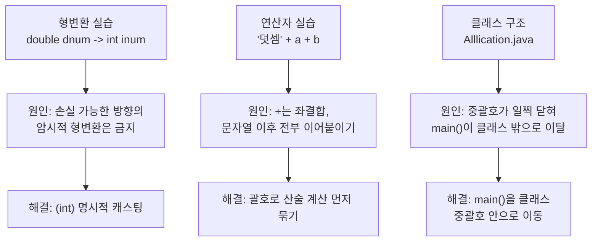

## 들어가며 (Situation)

그동안 Git, HTML/CSS, 기획·디자인 도구 위주로 수업이 진행되다가, 오늘부터 처음으로 **자바(Java)** 수업이 시작됐습니다. `chap01-java-basic`이라는 실습 프로젝트를 새로 만들고, `HelloWorld.java`부터 시작해서 자바의 실행 구조와 기본 문법을 하나씩 코드로 찍어보는 시간이었습니다.

## 문제 상황 (Task)

오늘 실습 범위는 크게 세 가지였습니다.

1. **자바 실행 구조** — `.java` 코드가 어떻게 컴파일되고 JVM 위에서 실행되는지
2. **리터럴과 기본 자료형, 변수 선언 규칙**
3. **형변환(암시적/명시적)과 연산자**

목표는 이론을 외우는 게 아니라 **직접 코드를 짜다가 마주친 에러의 원인을 스스로 설명할 수 있는 것**이었습니다. 그런데 실습 코드를 한 줄씩 늘려가는 과정에서 컴파일이 세 번 연속으로 깨졌고, 각각 원인이 달라서 하나씩 파고들어야 했습니다.

## 해결 과정 (Action)

### 자바 실행 구조부터: Hello World

가장 먼저 `Main.java`에 `System.out.println("Hello World!")` 한 줄을 찍어보면서, 자바 코드가 실행되기까지 거치는 과정을 정리했습니다.

```java
public static void main(String[] args) {
    System.out.println("Hello World!");
}
```

1. `.java` 파일을 작성한다.
2. JDK의 `javac`(컴파일러)가 `.java`를 `.class`(바이트코드)로 번역한다.
3. JVM이 `.class` 파일을 로드하고 실행한다.
4. JVM이 바이트코드를 각 OS에서 실행 가능한 기계어로 해석·변환한다.
5. 변환된 기계어가 실행된다.

여기까지는 "자바는 한 번 컴파일하면 OS에 상관없이 돌아간다"는 말이 실제로 어느 단계에서 이루어지는지 확인하는 정도였고, 문제는 다음 실습부터 시작됐습니다.

### 첫 번째 에러 — 암시적 형변환의 함정

형변환 실습에서 아래 코드를 작성했습니다.

```java
double dnum = 99.99; // 8 byte
int inum = dnum;      // 4 byte
```

의도는 "실수를 정수에 담으면 소수점이 날아가는 걸 눈으로 확인하자"였는데, 실제로 컴파일해보니 이 줄까지 가기도 전에 막혔습니다. 같은 파일 아래쪽에 세미콜론이 빠진 줄(`int num2 = 100`)이 있어서 `';' expected` 에러가 먼저 떴고, 그걸 걷어낸 뒤에야 진짜 확인하려던 에러를 볼 수 있었습니다.

```
error: incompatible types: possible lossy conversion from double to int
        int inum = dnum;
                   ^
```

**원인**: 자바의 암시적(묵시적) 형변환은 `byte → short → int → long → float → double`처럼 **표현 범위가 작은 타입에서 큰 타입으로 갈 때만** 자동으로 허용됩니다. 반대로 `double → int`처럼 정보(소수점 이하)가 사라질 수 있는 방향은 컴파일러가 "정말 이래도 되냐"고 묻는 셈이라, 개발자가 `(int)` 캐스팅으로 손실을 감수하겠다는 의사를 명시해야 합니다.

```java
int inum = (int) dnum; // 명시적 형변환 -> 99 (소수점 버림)
```

### 두 번째 에러 — 문자열 덧셈의 결합 방향

연산자 실습에서는 이런 코드를 만났습니다.

```java
int a = 10;
int b = 3;
System.out.println("덧셈" + a + b);
```

"10 + 3 = 13"이 찍힐 거라 예상했는데, 실제로는 `덧셈103`이 출력됐습니다. 별도로 검증해보니 결과는 아래와 같았습니다.

```java
System.out.println("덧셈" + a+b);   // 덧셈103
System.out.println("덧셈" + (a+b)); // 덧셈13
```

**원인**: `+` 연산자는 왼쪽에서 오른쪽으로 순서대로 평가되는 **좌결합** 연산자입니다. `"덧셈" + a`가 먼저 계산되는데, 문자열과 만난 순간부터 뒤에 오는 모든 `+`는 산술 덧셈이 아니라 **문자열 이어붙이기**로 취급됩니다. 그래서 `("덧셈"+a)+b` → `"덧셈10"+3` → `"덧셈103"`이 된 것입니다. 산술 결과를 먼저 문자열에 넣고 싶다면 괄호로 계산 순서를 강제해야 합니다.

### 세 번째 에러 — 클래스 범위를 착각한 구조 오류

연산자 실습 파일(`Alllication.java`)에서는 클래스를 감싸는 중괄호를 일찍 닫아버리고, 그 아래에 `main()`을 작성해버린 상태였습니다.

```java
public class Alllication {
}

public static void main(String[] args) {
    // ...
    int = age = 20; // 타입 없이 대입만 시도
}
```

컴파일하니 에러가 한 번에 여러 개 떴습니다.

```
error: not a statement
error: unnamed classes are a preview feature and are disabled by default.
error: ';' expected
error: unnamed class should not have package declaration
```

**원인**: 클래스 바디가 `}`로 먼저 끝나버려서, 그 아래 `main()`은 자바 21부터 미리보기로 들어온 **이름 없는 클래스(unnamed class)** 문법으로 해석됐습니다. 이 기능은 기본적으로 비활성화돼 있어서 바로 에러가 나고, 여기에 `int = age = 20;`처럼 **타입 없이 변수를 선언하려 한 문법 오류**까지 겹쳐서 에러 메시지가 한꺼번에 쏟아진 것이었습니다. 자바에서는 `{ }`의 위치가 곧 "이 코드가 어느 클래스에 속하는가"를 결정한다는 걸 에러 메시지를 따라가면서 다시 확인했습니다.



## 결과 (Result)

이번 실습은 수치로 잴 수 있는 지표보다 **"에러 메시지를 읽고 원인을 스스로 설명할 수 있는가"**가 기준이었습니다. 세 에러 모두 원인은 파악했습니다.

| 에러 | 원인 | 해결 방법 |
|---|---|---|
| `possible lossy conversion` | 손실 가능한 방향의 암시적 형변환 시도 | `(int)` 등 명시적 캐스팅 추가 |
| 문자열 덧셈 결과가 이상함 | `+` 연산자의 좌결합 특성 | 괄호로 산술 연산 우선순위 지정 |
| `unnamed class` 관련 에러 다수 | 클래스 중괄호가 일찍 닫혀 메서드가 밖으로 나감 | `main()`을 클래스 바디 안으로 이동 |

다만 오늘은 원인 파악까지만 진행했고, 실습 파일 자체의 코드는 아직 고치지 않은 상태로 남겨뒀습니다. 다음 실습에서 실제로 캐스팅·괄호·중괄호 위치를 고쳐서 정상 컴파일까지 확인하는 게 이어질 과제입니다.

## 더 학습하면 좋은 개념

- **자료형별 표현 범위(Range)** — `byte`(1byte)부터 `long`(8byte)까지 각 타입이 담을 수 있는 값의 범위가 다릅니다. 오늘 만난 형변환 에러의 뿌리이므로, 왜 `byte b = 200;`은 안 되는지 직접 확인해보면 좋습니다.
- **연산자 우선순위와 결합 방향(Precedence & Associativity)** — `+`의 좌결합만이 아니라, 산술·비교·논리 연산자가 섞였을 때 어떤 순서로 계산되는지 표로 정리해두면 비슷한 실수를 줄일 수 있습니다.
- **오버플로우(Overflow)** — 명시적 캐스팅이 항상 "안전하게 자르는 것"은 아닙니다. `int`를 `byte`로 캐스팅할 때처럼 범위를 넘어서면 값이 예상과 다르게 깨질 수 있다는 점도 이어서 볼 필요가 있습니다.
- **JVM과 바이트코드** — 오늘은 `.java → .class → JVM 실행`의 큰 흐름만 봤는데, `.class` 파일 내부 구조나 JIT 컴파일러가 바이트코드를 어떻게 최적화하는지까지 알아두면 자바 실행 모델을 더 깊이 이해할 수 있습니다.
- **자바 최신 문법 변화(Preview Features)** — 오늘 에러 메시지에 등장한 "unnamed classes"는 자바 21부터 미리보기로 도입된 문법입니다. 최신 버전에서 자바 언어 자체가 어떻게 단순화되고 있는지 살펴보는 것도 도움이 됩니다.

## 참고 자료

- [Oracle Java Tutorials - Primitive Data Types](https://docs.oracle.com/javase/tutorial/java/nutsandbolts/datatypes.html)
- [Java Language Specification - Conversions and Promotions](https://docs.oracle.com/javase/specs/jls/se21/html/jls-5.html)
- [Oracle Java Tutorials - Operators](https://docs.oracle.com/javase/tutorial/java/nutsandbolts/operators.html)
- [JEP 445: Unnamed Classes and Instance Main Methods (Preview)](https://openjdk.org/jeps/445)
