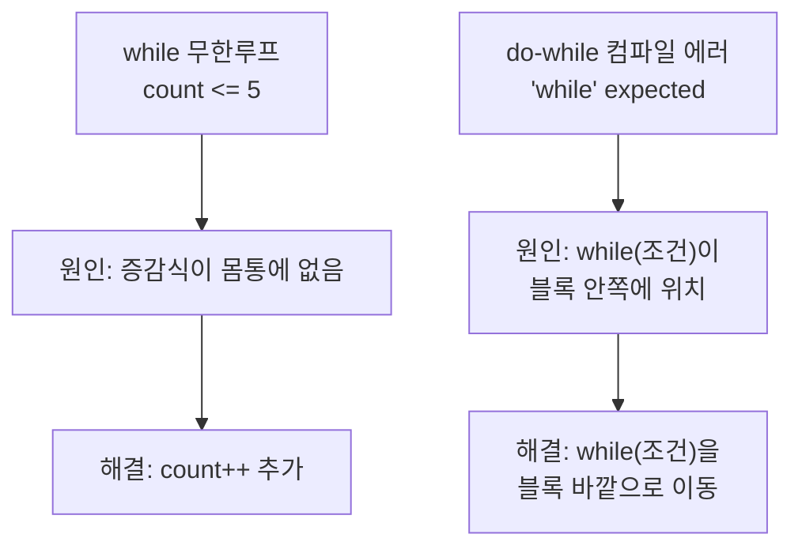

## 들어가며 (Situation)

`chap01-java-basic`에서 형변환·연산자 에러를 정리한 데 이어, 오늘은 `chap02-control-flow-and-method` 실습을 진행했습니다. 범위는 `if`/`switch` 같은 조건문, `for`/`while`/`do-while` 반복문, 그리고 메소드까지였습니다. 이론상으로는 익숙한 문법이었지만, 막상 실습 코드를 하나씩 실행해보니 반복문 두 개에서 각각 다른 종류의 문제(무한루프, 컴파일 에러)가 발생해서 원인을 짚고 넘어가야 했습니다.

## 문제 상황 (Task)

오늘 실습은 크게 세 패키지로 나뉘어 있었습니다.

1. `a_controlflow` — `if-else`, `switch`, 단축 평가(short-circuit evaluation)
2. `b_loop` — `for`, `while`, `do-while`
3. `c_method` — 메소드 정의와 호출

목표는 각 제어문의 형식을 익히는 것을 넘어서, **왜 이런 문법이 필요한지**와 **실습 코드가 의도대로 동작하는지**까지 확인하는 것이었습니다. 그런데 `b_loop` 패키지의 두 파일에서 문제가 생겼습니다.

- `Application01`의 `while` 문이 끝나지 않는 **무한루프**에 빠졌습니다.
- `Application03`의 `do-while` 문은 아예 **컴파일이 되지 않았습니다.**

## 해결 과정 (Action)

### 1. if-else 다중 조건: 등급 매기기와 할인율 계산

가장 먼저 점수에 따라 등급을 나누는 코드와, `Scanner`로 나이를 입력받아 할인율을 계산하는 코드를 실행했습니다.

```java
int score = 95;
if (score >= 90) {
    System.out.println("A 등급입니다!");
} else if (score >= 80) {
    System.out.println("B 등급입니다!");
} else if (score >= 70) {
    System.out.println("C 등급입니다!");
} else {
    System.out.println("재수강입니다");
}
```

이 부분은 조건을 위에서부터 순서대로 검사하다가 처음 만족하는 조건에서 분기하고 끝난다는 것, 그리고 `else if` 체인의 순서가 결과에 영향을 준다는 것(예: 90 이상 조건을 맨 뒤로 보내면 항상 앞 조건에 걸려 절대 실행되지 않음)을 확인하는 선에서 정상 동작했습니다.

### 2. 단축 평가(short-circuit evaluation) 실습 코드의 허점

`Application03`은 `System.nanoTime()`으로 "드문 조건을 먼저 검사할 때"와 "자주 발생하는 조건을 먼저 검사할 때"의 실행 시간을 비교하는 코드였습니다.

```java
if (age <= 19) {        // 드문 조건을 먼저 검사
    discount = "학생 할인 가능";
} else {
    discount = "할인 불가";
}
// ...
if (age > 19) {         // 자주 발생하는 조건을 먼저 검사
    discount = "학생 할인 가능";
} else {
    discount = "할인 불가";
}
```

주석에는 `&&`/`||` 복합 조건에서 **단축 평가**가 어떻게 성능에 영향을 주는지(예: 비밀번호 8자 미만 검사처럼 빠른 조건을 `&&`의 좌항에 두면 느린 조건을 건너뛸 수 있다는 것)가 자세히 적혀 있었는데, 정작 실행되는 코드는 `age <= 19`와 `age > 19`라는 **단일 조건**을 각각 다른 `if-else`에 넣고 비교하는 것이었습니다. 이 경우 두 번째 `else`는 애초에 평가할 두 번째 피연산자 자체가 없기 때문에, 이 코드는 조건 순서에 따른 **분기 예측(branch prediction)** 차이는 몰라도 주석이 설명하는 단축 평가를 검증하는 코드는 아니었습니다.

단축 평가를 실제로 확인하려면 아래처럼 `&&`/`||`로 묶인 복합 조건이 있어야 하고, 좌항이 평가를 멈추게 하는지 부작용(side effect)으로 확인해야 합니다.

```java
// 단축 평가 확인: checkB()가 호출되는지 여부로 검증
if (checkA() && checkB()) { /* ... */ }
```

이번 실습은 "의도한 개념"과 "실제 코드가 검증하는 것"이 다를 수 있다는 걸 확인한 케이스였습니다.

### 3. switch 문: 정상 동작 확인

`month` 값에 따라 몇 월인지 출력하는 `switch` 문은 각 `case`마다 `break`를 빠뜨리지 않았는지 확인하는 선에서 의도대로 동작했습니다. (10~12월 `case`가 없어 `default`로 빠지는 부분은 실습 범위상 의도된 생략으로 보고 넘어갔습니다.)

### 4. for는 되는데 while이 무한루프에 걸린 이유

`b_loop.Application01`에서 벤치프레스 횟수를 세는 `for` 문은 문제가 없었습니다.

```java
for (int i = 1; i <= 5; i++) {
    System.out.println("@@님" + i + "번 했습니다~");
}
```

그런데 바로 아래 같은 동작을 `while`로 옮긴 코드가 무한루프에 빠졌습니다.

```java
int count = 0;
while (count <= 5) {
    System.out.println(" 카운트 " + count);
}
```

**원인**: `for` 문은 `초기식; 조건식; 증감식`이 한 줄에 강제로 묶여 있어서 증감식을 빼먹기 어렵지만, `while` 문은 조건식과 증감식이 분리되어 있어서 **증감식을 몸통 안에 직접 적어주지 않으면 컴파일러가 잡아주지 않습니다.** `count`가 한 번도 변하지 않으니 `count <= 5`는 영원히 참이고, 콘솔에 `카운트 0`만 무한히 찍히게 됩니다.

```java
int count = 0;
while (count <= 5) {
    System.out.println(" 카운트 " + count);
    count++; // 누락됐던 증감식
}
```

### 5. do-while이 컴파일조차 안 된 이유

`b_loop.Application03`은 더 근본적인 문제였습니다.

```java
int num = 0;

do {
    System.out.println("0~2까지 반복 출력 : " + num);
    num++;
    while (num < 3);
}
```

`do-while` 문의 형식은 `do { 실행 코드 } while (조건식);`처럼 **블록이 닫힌 다음에 `while(조건)`이 와야 완성**되는데, 이 코드는 `while (num < 3);`을 블록 **안쪽**에 넣어버렸습니다. 그 결과 `do { ... }` 뒤에 이어져야 할 `while` 절이 사라진 형태가 되어, javac가 아래와 같은 에러를 냅니다.

```
error: 'while' expected
```

블록 안에 들어간 `while (num < 3);`도 그 자체로는 문법상 유효한(빈 몸통의) `while` 문이라, 만약 이 부분만 따로 떼어 실행 가능한 상태였다면 `num`이 더 이상 증가하지 않으니 또 다른 무한루프가 됐을 자리입니다. 즉 이 한 줄은 "컴파일 에러"와 "논리적 무한루프" 두 가지 문제를 동시에 품고 있었던 셈입니다. 올바른 형태는 `while` 절을 블록 밖으로 꺼내는 것입니다.

```java
int num = 0;

do {
    System.out.println("0~2까지 반복 출력 : " + num);
    num++;
} while (num < 3);
```

### 6. 메소드 호출 순서 확인하기

`c_method` 패키지에서는 `main()`이 항상 프로그램의 시작점이고, 그 안에서 명시적으로 호출하지 않은 메소드는 아무리 아래에 정의돼 있어도 실행되지 않는다는 것을 `methodA() → methodB()` 순서로 직접 호출하며 확인했습니다.

```java
public void method() {
    System.out.println("methodA() 호출됨");
    methodB(); // methodA 내부에서 호출해야 methodB가 동작한다
    System.out.println("methodA  종료됨");
}
```

주석에 남아있던 "10 작성 후 프로그램 시작해도 method 출력구문 출력안됨 - 호출을 한적이 없기 때문이다"라는 메모가, 메소드는 정의만으로는 실행되지 않고 반드시 호출돼야 한다는 점을 스스로 검증해본 흔적이었습니다.



## 결과 (Result)

| 파일 | 증상 | 원인 | 조치 |
|---|---|---|---|
| `b_loop.Application01` | `while` 실행 시 종료되지 않음 (무한루프) | 몸통에 증감식(`count++`) 누락 | 몸통 마지막 줄에 `count++` 추가 |
| `b_loop.Application03` | `error: 'while' expected` (컴파일 실패) | `while(조건)`이 `do` 블록 안쪽에 위치 | `while(조건);`을 블록 바깥으로 이동 |

수정 전/후를 실행 결과로 비교하면 다음과 같습니다.

- `while` 문: 무한 실행(종료 안 됨) → `count 0`부터 `count 5`까지 정확히 **6회** 출력 후 정상 종료
- `do-while` 문: 컴파일 실패(실행 자체 불가) → `num 0`부터 `num 2`까지 **3회** 출력 후 정상 종료

참고로 `for` 문은 `i=1`부터 5회(1~5) 반복했는데, `while` 문은 `count=0`부터 6회(0~5) 반복하도록 짜여 있어서 두 반복문의 결과 횟수가 다릅니다. 같은 동작을 의도했다면 초기값이나 조건식 중 하나를 맞춰야 한다는 것도 함께 확인했습니다.

## 더 학습하면 좋은 개념

- **반복문의 종료 조건 설계** — `for`는 초기식·조건식·증감식이 한 줄에 강제로 묶여 있지만 `while`/`do-while`은 그렇지 않습니다. `while`을 쓸 때는 "이 조건을 언젠가 거짓으로 만드는 코드가 몸통 안에 있는가"를 항상 자문하는 습관이 필요합니다.
- **switch 표현식(Switch Expressions, Java 14+)** — 오늘 다룬 전통적인 `switch`는 `break`를 빠뜨리면 다음 `case`로 흘러내리는(fall-through) 위험이 있습니다. 화살표(`->`) 문법 기반의 switch 표현식은 이 문제를 구조적으로 없애줍니다.
- **단축 평가(Short-circuit Evaluation)의 정확한 범위** — 오늘 실습 코드는 단일 조건 비교였지만, 단축 평가는 `&&`/`||`로 묶인 **복합 조건**에서만 의미가 있습니다. JLS의 Conditional-And/Or 연산자 정의를 직접 읽어보면 어떤 경우에 우항이 아예 평가되지 않는지 정확히 알 수 있습니다.
- **재귀(Recursion)** — 메소드가 자기 자신을 호출하는 방식으로, 오늘 배운 반복문(`for`/`while`)의 대안이 될 수 있습니다. 반복문과 재귀가 언제 서로 바꿔 쓰일 수 있는지 비교해보면 메소드 호출의 동작 원리를 더 깊이 이해할 수 있습니다.
- **메소드 오버로딩(Method Overloading)** — 오늘은 메소드 하나를 정의하고 호출하는 것까지만 다뤘는데, 같은 이름의 메소드를 매개변수만 다르게 여러 개 정의하는 오버로딩까지 이어서 보면 메소드 시그니처의 개념이 명확해집니다.

## 참고 자료

- [Oracle Java Tutorials - The if-then and if-then-else Statements](https://docs.oracle.com/javase/tutorial/java/nutsandbolts/if.html)
- [Oracle Java Tutorials - The while and do-while Statements](https://docs.oracle.com/javase/tutorial/java/nutsandbolts/while.html)
- [Oracle Java Tutorials - The switch Statement](https://docs.oracle.com/javase/tutorial/java/nutsandbolts/switch.html)
- [Oracle Java Tutorials - Defining Methods](https://docs.oracle.com/javase/tutorial/java/javaOO/methods.html)
- [Java Language Specification - Conditional-And Operator &&](https://docs.oracle.com/javase/specs/jls/se21/html/jls-15.html#jls-15.23)
