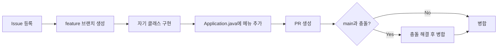

## 들어가며 (Situation)

자바 기초 과정의 통합 실습으로, 4명이 한 팀이 되어 콘솔 기반 **식단 계산기**를 만들었습니다. 혼자 밥 해 먹는 사람이 하루 칼로리를 관리하고, 재료를 n인분으로 환산하고, 배달비를 나누는 용도의 프로그램입니다. 저는 그중 **메뉴 4번 배달 더치페이**(`DivideCalculator`)를 맡았습니다.

| 메뉴 | 기능 | 클래스 |
|------|------|--------|
| 1 | 오늘 먹은 칼로리 합계 | `PlusCalculator` |
| 2 | 남은 칼로리 | `MinusCalculator` |
| 3 | n인분 칼로리 표 | `MultiplyCalculator` |
| 4 | 배달 더치페이 | `DivideCalculator` |

## 문제 상황 (Task)

실습에는 다음 조건이 있었습니다.

- 각자 자기 클래스 파일을 만들어 기능을 구현한다.
- `Application.java`의 `switch` 메뉴는 **모두가 같은 파일을 수정**하므로, 이 부분에서 충돌을 경험하고 해결해 본다.
- 그 외에는 각자 다른 파일을 만지며 작업한다.

즉 이 실습의 과제는 기능 구현 자체보다 **"같은 파일을 여럿이 고칠 때 어떻게 합치는가"**였습니다. 그리고 병합 이후에는 기능이 하나의 프로그램으로 묶이면서, 각자 따로 구현할 때는 보이지 않던 **입력 검증의 불일치**라는 두 번째 문제가 나타났습니다.

## 해결 과정 (Action)

### 1. 작업 방식: Issue → 브랜치 → PR

기능마다 Issue를 만들고, 브랜치를 따서 작업한 뒤 PR로 `main`에 합쳤습니다.



### 2. 충돌은 어디서 났고, 어떻게 풀었나

클래스 파일은 사람마다 달라서 충돌이 없었고, 충돌은 전부 `Application.java`의 `switch` 안에서 났습니다. 모두 같은 위치에 `case` 블록을 추가했기 때문입니다.

| PR | 충돌 위치 | 해결 |
|----|-----------|------|
| #5 | 메뉴 1, 2번과 4번 줄 | 세 줄 모두 남기고 번호순 정렬 |
| #7 | 메뉴 1번과 2번 줄 | 두 줄 모두 남기고 번호순 정렬 |
| #8 | 메뉴 1, 2, 4번과 3번 줄 | 네 줄 모두 남기고 번호순 정렬 |

충돌의 성격은 **문장이 겹치는 수준**이었습니다. 서로 다른 로직이 같은 줄을 바꾼 것이 아니라, 각자 추가한 코드가 같은 자리에 붙으려 한 것이라 "양쪽 다 남기고 순서만 정리"하면 끝났습니다. 그래서 병합이 꼬이거나 되돌려야 하는 일은 없었습니다.

다만 이 방식이 통한 이유는 코드가 작고 팀이 4명이었기 때문이라는 점은 분명히 해 둡니다. 충돌 지점이 `Application.java` 한 곳에 몰려 있는 구조는 인원이 늘면 바로 병목이 됩니다. 이 실습에서 팀원들이 공통으로 느낀 점이기도 했습니다.

### 3. 병합 후 발견된 두 번째 문제: 입력 검증 불일치

병합 뒤 코드 리뷰 피드백과 직접 실행해 본 테스트에서, 같은 "음수 입력" 상황을 메뉴마다 다르게 처리하고 있다는 것을 발견했습니다. 각자 따로 구현했기 때문에 생긴 차이입니다.

| 메뉴 | 음수 입력 시 동작 |
|------|-------------------|
| 1번 (칼로리 합계) | `break`로 **메뉴로 복귀** (다시 입력받지 않음) |
| 2번, 3번 | `while` 루프로 **재입력** |
| 4번 (더치페이) | 항목마다 검증 기준이 다름 |

제가 맡은 4번은 특히 기준이 제각각이었습니다.

- 음식값: `price > 0` (0도 불가)
- 인원 수: `people >= 0`으로 받은 뒤, 0이면 별도 `if`에서 안내하고 메뉴로 복귀
- 배달비: `deliveryFee >= 0` (0은 "배달비 없음"이라는 의미라 허용)

인원이 0이면 `DivideCalculator`의 `(double) price / people`에서 0으로 나누게 됩니다. 이 경우 `double` 나눗셈이라 예외 없이 `Infinity`가 나오는데, 그래서 오히려 잘못된 값이 조용히 출력될 수 있었습니다.

```java
// DivideCalculator.java (실제 코드)
public double divide(int price, int people) {
    return (double) price / people;
}
```

그래서 "음수 및 0 입력 시 재입력 처리" 커밋으로 4번 입력부를 `while` 재입력 방식으로 고쳤습니다. 아래는 그 구조를 보여 주는 코드입니다.

```java
// Application.java 메뉴 4번 중 일부 (실제 코드)
int price;
while (true) {
    System.out.print("음식값 : ");
    price = sc.nextInt();
    if (price > 0) break;
    System.out.println("음식값은 0보다 커야 합니다. 다시 입력하세요.");
}
```

이후 별도 PR(#18, #19)에서 음수 재입력 처리를 다른 메뉴까지 맞추고, PR #20(`정수만`)에서 정수 입력 관련 처리를 추가했습니다.

### 4. 시행착오에서 얻은 것

검증 로직을 "계산 클래스"가 아니라 `Application.java`(입력부)에 두었기 때문에, 메뉴가 늘 때마다 같은 `while (true)` 패턴이 복사되고 조금씩 어긋났습니다. 다음에 한다면 아래처럼 정리하고 싶습니다. (아래는 제가 실제로 작성한 코드가 아니라 **예시 코드**입니다.)

```java
// 예시 코드: 반복되는 재입력 패턴을 메소드 하나로 묶는 방향
static int readPositiveInt(Scanner sc, String prompt) {
    while (true) {
        System.out.print(prompt);
        int value = sc.nextInt();
        if (value > 0) return value;
        System.out.println("0보다 큰 값을 입력하세요.");
    }
}
```

## 결과 (Result)

수치로 표현할 만한 지표는 따로 측정하지 않았습니다. 대신 정성적으로 정리하면 다음과 같습니다.

- 충돌 3건(PR #5, #7, #8)을 모두 "양쪽 유지 + 번호순 정렬"로 해결했고, 병합이 꼬이는 일은 없었습니다.
- 4번 메뉴에서 인원 0·음수 입력이 계산까지 넘어가던 문제를 입력 단계에서 막았습니다.
- 기능 구현보다 **합치는 과정에서 문제가 생긴다**는 것을 확인했습니다.

**배운 점**

- 다른 팀원이 만든 메소드가 무엇을 받고 무엇을 돌려주는지 일일이 코드를 열어 추적하는 것은 비효율적입니다. 메소드 명세를 팀이 자주 보는 곳에 정리해 두었다면 중복 구현과 기준 불일치를 줄일 수 있었을 것입니다. 이 실습에서는 README에 담당자·메소드 시그니처 표를 두었는데, 여기에 **입력 검증 규칙**까지 적었어야 했습니다.
- 각자 자기 파일만 고치더라도, 하나로 합쳐지는 지점(`Application.java`)에서는 반드시 통합 테스트를 다시 해야 합니다.

## 더 학습하면 좋은 개념

- **Git 병합 전략과 충돌 마커 (`<<<<<<<`, `=======`, `>>>>>>>`)** — 이번에는 "양쪽 유지"로 끝났지만, 충돌이 어떻게 감지되는지(3-way merge) 이해하면 더 복잡한 충돌에서도 판단 기준이 생깁니다.
- **입력 검증(Validation)과 예외 처리** — `Scanner.nextInt()`는 정수가 아닌 값이 들어오면 `InputMismatchException`을 던집니다. 이번 실습에서 다룬 "범위 검증"의 다음 단계가 "타입 검증"입니다.
- **책임 분리 (관심사의 분리)** — 입력 검증을 `Application`에 몰아 두면 중복이 생깁니다. 입력·검증·계산을 나누는 관점을 익히면 팀 작업의 충돌 지점도 줄어듭니다.
- **부동소수점 나눗셈과 0으로 나누기** — 정수 나눗셈은 `ArithmeticException`, `double` 나눗셈은 `Infinity`가 되는 차이를 알아야 방어 코드를 올바른 곳에 둘 수 있습니다.
- **브랜치 전략과 코드 리뷰 문화 (GitHub Flow)** — Issue·PR 단위로 일하는 방식이 협업 비용을 어떻게 줄이는지 살펴볼 가치가 있습니다.

## 참고 자료

- [Git 공식 문서 - git merge](https://git-scm.com/docs/git-merge)
- [Pro Git - 브랜치와 Merge 기초](https://git-scm.com/book/ko/v2/Git-브랜치-브랜치와-Merge-의-기초)
- [Oracle Java SE - Scanner (nextInt, InputMismatchException)](https://docs.oracle.com/en/java/javase/17/docs/api/java.base/java/util/Scanner.html)
- [Oracle Java Tutorials - Primitive Data Types](https://docs.oracle.com/javase/tutorial/java/nutsandbolts/datatypes.html)
- [JLS §15.17.2 - Division Operator](https://docs.oracle.com/javase/specs/jls/se17/html/jls-15.html#jls-15.17.2)
