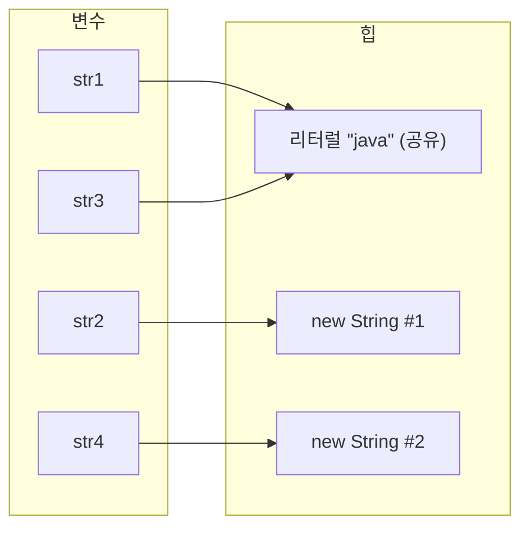
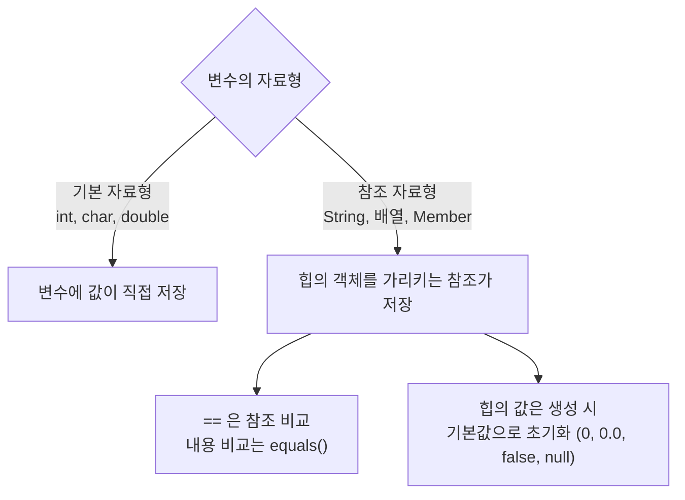

## 들어가며 (Situation)

자바 기초 과정의 세 번째 챕터(객체지향 프로그래밍)를 시작했습니다. 오늘 실습한 내용은 크게 세 덩어리입니다.

| 순서 | 주제 | 실습 파일 |
|------|------|-----------|
| 1 | `String` 클래스와 문자열 생성 방식 | `a_string/Application01~02` |
| 2 | 배열 | `b_array/Application01~02` |
| 3 | 사용자 정의 자료형 (`Member` 클래스) | `b_oop/a_user_type` |

세 주제는 따로 보이지만 실습 코드를 짜 보니 하나의 질문으로 이어졌습니다. **"변수에 담긴 것은 값인가, 값이 있는 곳의 주소인가?"** 이 글은 그 질문을 중심으로 정리합니다.

## 문제 상황 (Task)

실습 코드를 실행하다가 직관과 다르게 동작하는 지점이 세 군데 있었습니다.

1. 내용이 똑같은 `"java"` 두 개를 `==`로 비교했는데 `false`가 나온다.
2. 배열에 값을 한 번도 넣지 않았는데 `iarr[0]`을 출력하면 `0`이 나온다. 배열 변수 자체를 출력하면 숫자가 아니라 이상한 문자열이 나온다.
3. 회원 한 명의 정보(아이디, 비밀번호, 이름, 나이, 성별, 취미)를 변수 하나로 묶고 싶은데, 자료형이 서로 달라서 배열로도 묶을 수 없다.

## 해결 과정 (Action)

### 1. 문자열 `==` 비교가 false인 이유

문자열을 만드는 방법은 두 가지입니다.

```java
// 1. 리터럴 방식
String str1 = "java";
// 2. 객체 생성 방식
String str2 = new String("java");

String str3 = "java";
String str4 = new String("java");

System.out.println("동등비교 : " + (str1 == str2)); // false
System.out.println("동등비교 : " + (str1 == str3)); // true
System.out.println("동등비교 : " + (str2 == str4)); // false
System.out.println("equals() 활용 비교 : " + str1.equals(str2)); // true
```

내용은 전부 `"java"`인데 결과가 제각각입니다. 원인은 `==`가 **참조 자료형에서는 내용이 아니라 참조(주소)를 비교**하기 때문입니다. 리터럴로 만든 문자열은 같은 내용이면 하나의 객체를 재사용하고, `new String(...)`은 호출할 때마다 새 객체를 만듭니다.



> A string literal is a reference to an instance of class `String`... Moreover, a string literal always refers to the same instance of class `String`. ... literal strings within different classes in the same or different packages ... are "interned" and so share unique instances, using the method `String.intern`.
>
> — [JLS §3.10.5 String Literals](https://docs.oracle.com/javase/specs/jls/se17/html/jls-3.html#jls-3.10.5)

그래서 `str1 == str3`만 `true`, 나머지는 `false`가 됩니다. 문자열의 **내용**을 비교하려면 `equals()`를 써야 하고, 이 경우 생성 방식과 무관하게 `true`가 나옵니다.

| 비교 방법 | 비교 대상 | `str1`(리터럴) vs `str2`(new) |
|-----------|-----------|-------------------------------|
| `==` | 참조(주소) | `false` |
| `equals()` | 문자열 내용 | `true` |

> 실습 노트에는 `new`를 "할당 연산자"라고 적어 두었는데, 정확한 표현은 **클래스 인스턴스 생성 표현식**입니다. 이 키워드를 만나면 항상 새 객체를 만든다는 설명 자체는 맞습니다. ([JLS §15.9](https://docs.oracle.com/javase/specs/jls/se17/html/jls-15.html#jls-15.9))

`String`의 자주 쓰는 메소드는 아래처럼 직접 실행해 보며 익혔습니다.

```java
String str1 = "apple";
for (int i = 0; i < str1.length(); i++) {
    System.out.println(str1.charAt(i)); // a, p, p, l, e 를 한 줄씩 출력
}

String trimStr = "   java   ";
System.out.println("공백 제거 후 : #" + trimStr.trim() + "#"); // #java#
```

여기서 `charAt(index)`의 index는 **0부터 시작**하기 때문에 반복문 조건이 `i < str1.length()`여야 합니다. `<=`로 쓰면 마지막에 `StringIndexOutOfBoundsException`이 발생합니다.

### 2. 변수 5개를 배열 하나로: 그리고 값을 안 넣었는데 0이 나오는 이유

먼저 변수만으로 `1~5`의 합을 구하면 이렇게 됩니다.

```java
int num1 = 1;
int num2 = 2;
int num3 = 3;
int num4 = 4;
int num5 = 5;

int sum = 0;
sum += num1;
sum += num2;
sum += num3;
sum += num4;
sum += num5;
```

변수는 값을 **하나**만 담을 수 있어서, 값이 늘어나면 변수도 같이 늘어납니다. 10개라면 변수 10개와 `+=` 10줄이 필요합니다. 동일한 자료형의 묶음인 **배열**은 이 문제를 해결합니다.

```java
int[] iarr = new int[5];               // 선언 + 할당
System.out.println("iarr = " + iarr);  // 주소처럼 보이는 문자열 출력
System.out.println(iarr.length);       // 5
System.out.println(iarr[0]);           // 0
```

두 가지가 눈에 띕니다.

**(1) `iarr`을 출력하면 값이 아니라 `[I@...` 형태의 문자열이 나온다.** 배열 변수에는 값 5개가 아니라 힙에 만들어진 배열 객체의 참조가 들어 있기 때문입니다. 1번에서 본 `String`과 같은 구조입니다.

**(2) 값을 넣은 적이 없는데 `iarr[0]`이 `0`이다.** 배열은 생성되는 순간 JVM이 자료형별 기본값으로 채워 줍니다.

| 자료형 | 기본값 |
|--------|--------|
| 정수 (`int` 등) | `0` |
| 실수 (`double` 등) | `0.0` |
| 논리 (`boolean`) | `false` |
| 참조 (`String`, 배열 등) | `null` |

> 실습 노트에는 "heap 공간은 비어있는 값이 존재할 수 없다"고 정리했습니다. 규칙의 근거는 JLS의 초기값 규정(§4.12.5)입니다. 같은 규정이 **필드**에도 적용되기 때문에 뒤에서 다시 만납니다. 반면 메소드 안의 **지역 변수**는 기본값이 없어서, 초기화하지 않고 쓰면 컴파일 에러가 납니다.

배열의 장점은 인덱스가 0부터 1씩 증가한다는 점이라 **반복문과 궁합이 좋다**는 것입니다. 이를 적용해 5명의 점수를 입력받아 합계와 평균을 구하는 프로그램을 만들었습니다.

```java
Scanner sc = new Scanner(System.in);
int[] scores = new int[5];

for (int i = 0; i < scores.length; i++) {
    System.out.println((i + 1) + " 번 째 학생의 java 점수를 입력해주세요 : ");
    scores[i] = sc.nextInt();
}

double sum = 0;
double avg = 0.0;

for (int i = 0; i < scores.length; i++) {
    sum = sum + scores[i];
}
avg = sum / scores.length;

System.out.println("sum = " + sum);
System.out.println("avg = " + avg);
```

반복 횟수를 `5`로 쓰지 않고 `scores.length`로 쓴 덕분에, 인원이 바뀌어도 `new int[5]` 한 곳만 고치면 됩니다. `sum`을 `double`로 선언한 것은 평균을 실수로 출력해야 하기 때문입니다. `sum`이 `int`였다면 `sum / scores.length`가 정수 나눗셈이 되어 소수점이 잘립니다. (이전 글의 형변환 주제와 이어지는 부분입니다.)

### 3. 서로 다른 자료형을 하나로: 클래스 정의

회원 한 명의 정보를 변수로 관리하면 이렇습니다.

```java
String id = "user01";
String pwd = "pass01";
String name = "racoon";
int age = 20;
char gender = '남';
String[] hobby = {"괴롭히기", "웃기", "야구 하이라이트 시청"};
```

배열은 **같은 자료형**만 묶을 수 있으므로 이 값들을 하나로 묶을 수 없고, 다음과 같은 문제가 생깁니다.

| 문제 | 설명 |
|------|------|
| 변수명 전부 관리 | 회원이 늘면 `id1`, `id2`... 식으로 감당이 안 됨 |
| 메소드 인자 비대화 | 회원 정보를 넘기려면 매개변수가 6개 이상 |
| 반환 불가 | 메소드는 반환값이 하나뿐이라 회원 정보를 묶어서 `return` 할 수 없음 |

해결책은 **클래스를 자료형으로 정의**하는 것입니다. 지금까지는 `Application`이 아닌 클래스에 메소드만 썼는데, 클래스 안에는 메소드 없이 변수를 바로 선언할 수도 있습니다.

```java
public class Member {
    String id;
    String pwd;
    String name;
    int age;
    char gender;
    String[] hobby;
}
```

실습 노트에는 이것을 "전역변수(필드 == 인스턴스 변수 == 속성)"라고 정리했습니다. 자바에는 전역변수라는 개념이 따로 없고 **필드(인스턴스 변수)**가 정확한 용어입니다. 사용은 이렇게 합니다.

```java
Member member = new Member();
System.out.println("member의 이름 : " + member.name); // null
System.out.println("member의 나이 : " + member.age);  // 0

member.id = "user02";
member.hobby = new String[]{"야구시청", "배드민턴"};
System.out.println("member.id = " + member.id);       // user02
```

값을 넣지 않은 `name`은 `null`, `age`는 `0`이 출력됩니다. 2번에서 본 배열의 기본값 규칙이 **필드에도 똑같이 적용**된 것입니다. 정리하면 `String`, 배열, `Member`는 모두 **참조 자료형**이고, 객체는 힙에 생기며 변수는 그 참조를 가리킨다는 하나의 원리로 설명됩니다.



### 4. 이어서 다룰 내용: 생성자

마지막으로 `new Member()`에서 `Member()`가 사실은 **생성자**라는 메소드 호출이라는 것까지 짚고, `b_constructor` 패키지에서 생성자 실습을 시작했습니다. `Member` 클래스에 생성자를 직접 쓴 적이 없는데도 `new Member()`가 동작하는 이유는 컴파일러가 기본 생성자를 만들어 주기 때문인데, 이 부분은 아직 실습 파일이 비어 있어서 다음 글에서 이어서 정리하겠습니다. ([JLS §8.8.9 Default Constructor](https://docs.oracle.com/javase/specs/jls/se17/html/jls-8.html#jls-8.8.9))

## 결과 (Result)

수치로 측정한 지표는 없어서, 실행 결과와 정리된 개념으로 대신합니다.

| 실습 | 확인한 결과 |
|------|-------------|
| 문자열 비교 | `str1 == str2` → `false`, `str1 == str3` → `true`, `str1.equals(str2)` → `true` |
| 배열 | 변수 5개 + `+=` 5줄 → 배열 + 반복문, `1~5` 합계 `15` |
| 배열 기본값 | `new int[5]`의 모든 칸이 `0` |
| 사용자 정의 자료형 | 변수 6개 → `Member` 객체 1개 |

**배운 점**

- 문자열은 **`==`가 아니라 `equals()`로 비교**한다. 리터럴과 `new`의 차이는 참조 자료형 전체에 적용되는 원리의 한 사례다.
- 배열, 클래스의 필드는 JVM이 기본값으로 초기화하지만 **지역 변수는 그렇지 않다**.
- 용어를 정확히 쓰자. "전역변수"가 아니라 필드, "할당 연산자 `new`"가 아니라 인스턴스 생성 표현식이다. 용어가 정확해야 공식 문서를 검색할 수 있다.

## 더 학습하면 좋은 개념

- **String Constant Pool과 `intern()`** — 리터럴이 같은 객체를 공유하는 메커니즘의 실체입니다. `==`가 왜 가끔 `true`가 나오는지 설명할 수 있게 됩니다.
- **`String`의 불변성(Immutability)** — `trim()`을 호출해도 원본이 바뀌지 않고 새 문자열이 반환됩니다. 불변이기 때문에 풀에서 공유가 가능하며, 반복문에서 `+`로 문자열을 이어 붙일 때 `StringBuilder`가 필요한 이유로 이어집니다.
- **스택과 힙, 그리고 JVM 메모리 구조** — 이번 글의 "변수 vs 객체" 구분을 실제 메모리 영역 수준으로 확장해 줍니다. 가비지 컬렉션을 이해하는 출발점입니다.
- **`equals()`와 `hashCode()` 규약** — `Member` 같은 사용자 정의 클래스는 `equals()`를 직접 재정의하지 않으면 `==`와 똑같이 동작합니다. 컬렉션(`HashSet`, `HashMap`)을 쓰기 전에 필수입니다.
- **캡슐화와 접근 제어자 (`private`, getter/setter)** — 실습의 `Member` 필드는 어디서든 직접 수정할 수 있습니다. 다음 단계에서 이 문제를 해결하는 방법입니다.

## 참고 자료

- [JLS §3.10.5 - String Literals](https://docs.oracle.com/javase/specs/jls/se17/html/jls-3.html#jls-3.10.5)
- [JLS §4.12.5 - Initial Values of Variables](https://docs.oracle.com/javase/specs/jls/se17/html/jls-4.html#jls-4.12.5)
- [JLS §15.9 - Class Instance Creation Expressions](https://docs.oracle.com/javase/specs/jls/se17/html/jls-15.html#jls-15.9)
- [JLS §8.8.9 - Default Constructor](https://docs.oracle.com/javase/specs/jls/se17/html/jls-8.html#jls-8.8.9)
- [Oracle Java SE - String](https://docs.oracle.com/en/java/javase/17/docs/api/java.base/java/lang/String.html)
- [Oracle Java Tutorials - Arrays](https://docs.oracle.com/javase/tutorial/java/nutsandbolts/arrays.html)
- [Oracle Java Tutorials - Classes](https://docs.oracle.com/javase/tutorial/java/javaOO/classes.html)
