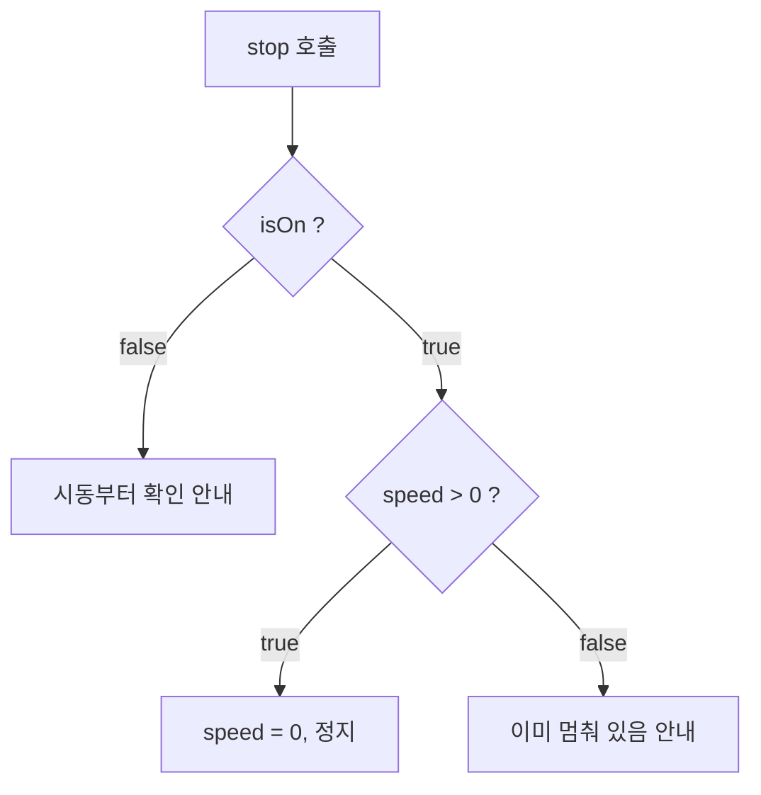
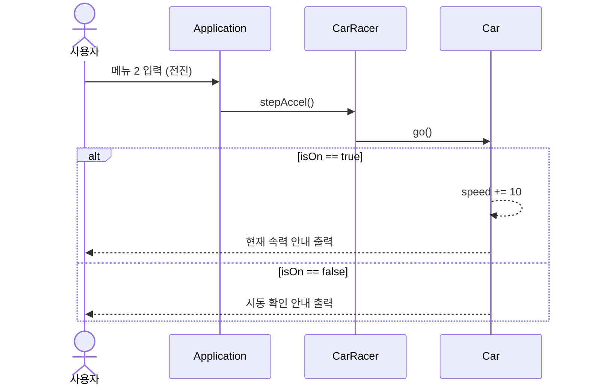

## 들어가며 (Situation)

앞선 글들에서 생성자로 객체를 만들고, 캡슐화로 필드를 `private`으로 숨기는 방법까지 익혔습니다. 이번에는 이 도구들을 **어떤 클래스를 만들지 정하는 단계**부터 사용해 보는 실습(`d_abstraction`)입니다. 주제는 "카레이서가 자동차를 운전하는 프로그램"입니다.

## 문제 상황 (Task)

실습 요구사항은 다음 7줄입니다.

| 번호 | 요구사항 |
|------|----------|
| 1 | 자동차는 처음에 멈춘 상태로 대기한다. |
| 2 | 카레이서는 먼저 자동차에 시동을 건다. 이미 걸려 있으면 다시 걸 수 없다. |
| 3 | 엑셀을 밟으면, 시동이 걸려 있을 때 시속이 10km/h 증가하며 앞으로 나간다. |
| 4 | 달리는 중에 브레이크를 밟으면 시속이 0으로 떨어지며 멈춘다. |
| 5 | 달리는 중이 아닌데 브레이크를 밟으면 이미 멈춰 있다고 안내한다. |
| 6 | 시동을 끄면 더 이상 자동차는 움직이지 않는다. |
| 7 | 달리는 중에는 시동을 끌 수 없다. |

풀어야 할 질문은 이렇습니다.

1. 현실의 카레이서와 자동차는 훨씬 복잡한데, **무엇을 남기고 무엇을 버릴 것인가?**
2. 위 문장에서 **클래스는 어떻게 뽑아내는가?**
3. `Application`(사용자 입력)이 `Car`까지 직접 건드리지 않게 하려면?

## 해결 과정 (Action)

### 1. 추상화: 프로그램의 목적에 맞게 현실을 단순화한다

실습 주석의 정의는 이렇습니다. 추상화는 **공통된 부분을 추출하고, 공통되지 않는(필요 없는) 부분은 제거**하는 것입니다. 현실의 자동차에는 엔진 종류, 색상, 연비, 타이어 압력 등 무한한 속성이 있지만, 위 요구사항에서 필요한 것은 **시동이 걸렸는가, 지금 속력은 얼마인가** 두 가지뿐입니다.

```java
public class Car {
    // 변하는 상태 후보군: 속력, 시동 여부
    private int speed;
    private boolean isOn;
}
```

프로그램 목적에 필요 없는 정보는 모델에 넣지 않습니다. 같은 자동차라도 중고차 매매 프로그램이라면 `price`, `mileage`가 필요하고 `speed`는 필요 없을 것입니다. **추상화의 기준은 현실이 아니라 프로그램의 목적**입니다.

### 2. 요구사항에서 클래스와 메시지 뽑기

실습 주석에서 배운 요령은 "**은/는, 이/가 앞의 단어가 대부분 클래스 후보**"라는 것입니다. 요구사항에서 주어를 찾으면 `자동차`, `카레이서`가 나옵니다. 그리고 각 객체가 받을 수 있는 메시지(= 해야 할 일)를 정리합니다.

| 객체 | 수신할 수 있는 메시지 | 메소드 |
|------|----------------------|--------|
| 카레이서 | 시동을 걸어라 / 엑셀을 밟아라 / 브레이크 밟아라 / 시동 꺼라 | `stratUp()` / `stepAccel()` / `stepBreak()` / `turnOff()` |
| 자동차 | 시동을 걸어라 / 앞으로 가라 / 멈춰라 / 시동을 꺼라 | `startUp()` / `go()` / `stop()` / `turnOff()` |

같은 "시동"이어도 카레이서는 "시동을 걸어라"라는 **행동**을, 자동차는 "시동이 켜진다"라는 **상태 변화**를 담당합니다. 객체마다 책임이 다르다는 것이 눈에 보입니다.

### 3. 요구사항을 조건문으로: `Car`

요구사항 4, 5의 `stop()`이 가장 조건이 많았습니다. 시동 여부와 속력 두 가지를 모두 봐야 하기 때문입니다.

```java
public void stop() {
    if (isOn) {
        if (speed > 0) {
            this.speed = 0;
            System.out.println("끼~~~~~~~~~~익~~ 브레이크 밟기 OK. 차는 멈췄습니다.");
        } else {
            System.out.println("차는 이미 멈춰있습니다!!!");
        }
    } else {
        System.out.println("⭐차의 시동이 걸려있지 않습니다!시동부터 확인해주세요!⭐");
    }
}
```



같은 방식으로 `turnOff()`는 "시동이 꺼져 있으면 안내 / 달리는 중이면 거부(요구사항 7) / 아니면 `isOn = false`"로 작성했습니다. 요구사항을 문장 그대로 `if`로 옮기되, **상태(`isOn`, `speed`)를 바꾸는 코드는 `Car` 안에만** 있게 했습니다.

`go()`에서는 속력을 올릴 때 아래처럼 복합 대입 연산자를 썼습니다.

```java
// this.speed = speed + 10;
this.speed += 10;
```

### 4. `Application`이 `Car`를 모르게 하기: `CarRacer`

처음에는 `Application`에서 `Car`를 직접 만들어 `car.startUp()`을 호출해도 됩니다. 하지만 실습의 의도는 요구사항 문장 그대로 "**카레이서가** 자동차를 운전한다"를 코드로 옮기는 것입니다. 사용자가 조작하는 것은 카레이서이고, 카레이서가 자동차에게 일을 시킵니다.

```java
public class CarRacer {
    // 클래스도 자료형이므로 필드에 선언할 수 있다.
    // Car 는 CarRacer 만 접근해야 한다. Application 은 Car 에 접근하면 안 된다.
    private Car car = new Car();

    public void stratUp() {
        car.startUp();   // 자동차에게 시동 걸어!
    }

    public void stepAccel() {
        car.go();
    }

    public void stepBreak() {
        car.stop();
    }

    public void turnOff() {
        car.turnOff();
    }
}
```

`Car`를 `private` 필드로 가진 덕분에 `Application`에서는 `racer.car`로 접근할 수 없습니다. 앞 글에서 배운 캡슐화가 **클래스 사이의 관계**에서도 똑같이 쓰인 것입니다. (클래스도 자료형이라 필드로 선언할 수 있다는 것은 `Member`, `String[]`을 필드로 둔 것의 연장선입니다.)

그러면 `Application`은 메뉴와 입력 처리만 담당합니다.

```java
CarRacer racer = new CarRacer();

while (true) {
    // 메뉴 출력 후 입력
    int no = sc.nextInt();

    switch (no) {
        case 1 : racer.stratUp();   break;
        case 2 : racer.stepAccel(); break;
        case 3 : racer.stepBreak(); break;
        case 4 : racer.turnOff();   break;
        case 9 : break;
        default:
            System.out.println("잘못 된 번호 입력!");
            break;
    }

    if (no == 9) {
        System.out.println("프로그램을 종료합니다...");
        break;
    }
}
```

`switch`의 `case 9 : break;`는 `switch`만 빠져나올 뿐 `while`을 끝내지 못합니다. 그래서 아래의 `if (no == 9)`에서 별도로 `while`의 `break`를 실행합니다. ([무한루프 글](/2026/09/29/java-loop-infinite-do-while-compile-error.html)에서 다룬 반복문 탈출 주제와 이어집니다.)

호출 순서를 시퀀스 다이어그램으로 보면 책임 분담이 한눈에 보입니다.



### 5. 복습하며 발견한 개선점

실습 중 막힌 곳은 없었고, 코드를 다시 읽으며 발견한 부분입니다.

| 발견한 것 | 내용 | 개선 방향 |
|-----------|------|-----------|
| 오타 | `CarRacer`의 메소드가 `stratUp`(strat) — `Car`는 `startUp` | `startUp`으로 통일. 컴파일은 되어서 더 늦게 발견되기 쉽다 |
| 이름 | `stepBreak` — 브레이크(break의 의미는 "부수다") | 브레이크는 `brake`가 올바른 철자 |
| 입력 검증 | `sc.nextInt()`에 숫자가 아닌 값이 들어오면 예외 발생 | 입력 검증 또는 `nextLine()` 사용 검토 |
| 중복 | `CarRacer`가 `Car`에 단순 위임만 한다 | 지금은 학습 목적이라 의도적. 규모가 커지면 카레이서만의 책임이 생기는지 점검 |

오타 두 개는 컴파일러가 잡아 주지 못합니다. 메소드 이름이 서로 일관되기만 하면 컴파일은 통과하기 때문입니다.

## 결과 (Result)

수치로 측정한 지표는 없어서, 요구사항이 코드의 어디에서 충족되는지 정리합니다.

| 요구사항 | 구현 위치 |
|----------|-----------|
| 1. 처음에는 멈춘 상태 | `speed`, `isOn` 필드 기본값 `0`, `false` |
| 2. 시동 중복 방지 | `Car.startUp()`의 `if (isOn)` |
| 3. 엑셀 시 +10km/h | `Car.go()`의 `this.speed += 10` |
| 4, 5. 브레이크 | `Car.stop()`의 중첩 `if` |
| 6, 7. 시동 끄기 / 주행 중 거부 | `Car.turnOff()` |

요구사항 1이 별도 코드 없이 충족되는 것은 앞선 글에서 본 **필드 기본값 초기화** 규칙 덕분입니다.

**배운 점**

- 추상화는 현실을 그대로 옮기는 것이 아니라 **프로그램의 목적에 맞게 단순화**하는 일이다.
- 요구사항 문장의 주어에서 클래스 후보를, 서술어에서 메소드 후보를 뽑으면 설계의 출발점이 생긴다.
- 캡슐화(`private`)는 필드뿐 아니라 **객체 간의 접근 경계**를 정하는 데에도 쓰인다.
- 오타와 철자처럼 컴파일러가 잡지 못하는 이름 문제는 코드를 쓸 때 가장 먼저 눈에 들어오지 않는다.

## 더 학습하면 좋은 개념

- **상태 패턴(State Pattern)과 enum** — `isOn`과 `speed > 0`의 조합으로 상태를 판단하는 중첩 `if`는 상태가 늘수록 복잡해집니다. 정지, 시동 ON, 주행 중 같은 상태를 명시적으로 모델링하는 방법을 배울 수 있습니다.
- **추상 클래스와 인터페이스** — 이번 글의 "추상화"가 설계 개념이라면, 자바에서는 `abstract`, `interface`로 문법적으로 표현합니다. 이름은 같지만 층위가 다르다는 점을 구분하면 이후 상속 단원이 훨씬 쉬워집니다.
- **객체 간 관계: 연관, 집합, 합성** — `CarRacer`가 `Car`를 필드로 가지는 관계의 이름과 의미입니다. 클래스 다이어그램을 읽기 위한 기본기입니다.
- **책임 주도 설계와 단일 책임 원칙(SRP)** — "누가 이 일을 해야 하는가"로 클래스를 나누는 기준입니다. `Application`, `CarRacer`, `Car`의 역할 분리가 왜 적절한지 설명하는 근거가 됩니다.
- **`Scanner` 입력 처리의 함정** — `nextInt()` 뒤에 `nextLine()`을 쓸 때 개행 문자가 남는 문제 등 콘솔 입력 프로그램에서 자주 만나는 버그입니다.

## 참고 자료

- [Oracle Java Tutorials - What Is an Object?](https://docs.oracle.com/javase/tutorial/java/concepts/object.html)
- [Oracle Java Tutorials - What Is a Class?](https://docs.oracle.com/javase/tutorial/java/concepts/class.html)
- [Oracle Java Tutorials - Controlling Access to Members of a Class](https://docs.oracle.com/javase/tutorial/java/javaOO/accesscontrol.html)
- [Oracle Java Tutorials - The switch Statement](https://docs.oracle.com/javase/tutorial/java/nutsandbolts/switch.html)
- [JLS §14.11 - The switch Statement](https://docs.oracle.com/javase/specs/jls/se17/html/jls-14.html#jls-14.11)
- [Java SE API - java.util.Scanner](https://docs.oracle.com/en/java/javase/17/docs/api/java.base/java/util/Scanner.html)
