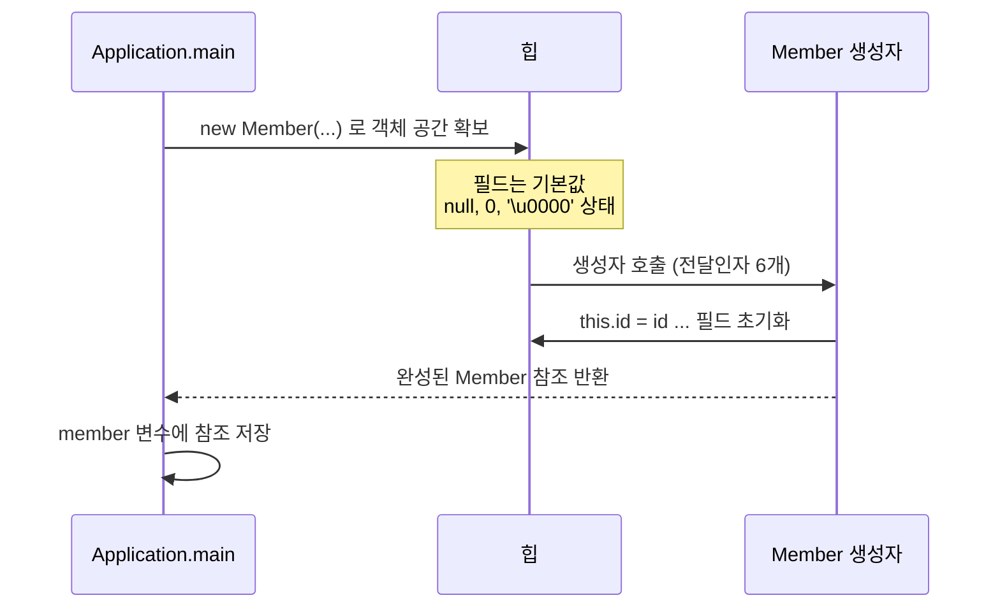
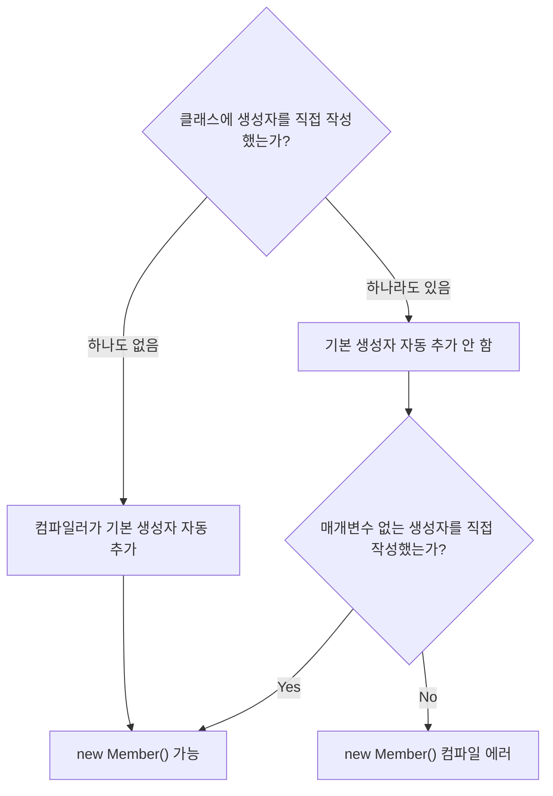

## 들어가며 (Situation)

[지난 글](/2026/10/01/java-string-array-user-type.html)에서 `Member` 클래스로 회원 정보를 하나의 자료형으로 묶었습니다. 그 글 마지막에 "`new Member()`의 `Member()`는 사실 생성자라는 메소드 호출이고, 생성자는 다음 글에서 정리하겠다"고 미뤄 두었습니다. 이번 글이 그 이어지는 내용입니다.

## 문제 상황 (Task)

이번 수업은 개념 학습 위주여서 실제로 장애를 겪은 것은 아니고, 개념을 이해하기 위해 아래와 같은 상황을 **가정**하고 따라가 봤습니다.

지난 실습의 `Member`는 필드만 있고 생성자를 쓴 적이 없는데도 `new Member()`가 잘 동작했습니다. 그런데 객체를 만들고 나서 필드를 하나씩 대입하는 방식에는 불편한 점이 있을 것입니다.

```java
Member member = new Member();
member.id = "user02";
member.hobby = new String[]{"야구시청", "배드민턴"};
// name, age 는? 깜빡하면 null, 0 으로 남는다
```

정리하면 풀고 싶은 문제는 두 가지입니다.

1. 쓴 적 없는 `Member()`는 대체 어디서 온 것인가?
2. 객체가 만들어지는 **시점에** 필드를 한 번에 초기화하려면 어떻게 해야 하는가?

## 해결 과정 (Action)

### 1. `new Member()`의 `Member()`는 메소드다

`new Member()`에서 괄호가 붙은 `Member()`는 클래스 이름과 같은 이름의 특수한 메소드, **생성자(constructor)** 를 호출하는 구문입니다. 실습 코드 주석에도 이렇게 정리해 두었습니다.

| 구분 | 일반 메소드 | 생성자 |
|------|-------------|--------|
| 이름 | 자유 | **클래스명과 동일** |
| 반환형 | 있음 (`void` 포함) | **없음** |
| 호출 시점 | 호출할 때마다 | **`new`를 만나는 시점에 가장 먼저 1회** |
| 주된 역할 | 기능 수행 | 객체 생성 시점의 명령 실행, 필드 초기화 |

쓴 적 없는 생성자가 동작했던 이유는 컴파일러가 만들어 주기 때문입니다. 클래스에 생성자 선언이 하나도 없으면 컴파일러가 매개변수 없는 **기본 생성자(default constructor)** 를 자동으로 추가합니다. ([JLS §8.8.9 Default Constructor](https://docs.oracle.com/javase/specs/jls/se17/html/jls-8.html#jls-8.8.9))

### 2. 생성자 표현식과 매개변수가 있는 생성자

실습에서 작성한 생성자는 아래 형태입니다. 생성자의 문법은 `접근제한자 클래스명([매개변수]) { }` 입니다.

```java
public class Member {

    String id;
    String pwd;
    String name;
    int age;
    char gender;
    String[] hobby;

    public Member(String id, String pwd, String name, int age, char gender, String[] hobby) {
        System.out.println("매개변수 있는 생성자 동작함...");
        this.id = id;
        this.pwd = pwd;
        this.name = name;
        this.age = age;
        this.gender = gender;
        this.hobby = hobby;
    }
}
```

사용하는 쪽은 `new`와 함께 전달인자를 넘기기만 하면 됩니다.

```java
Member member = new Member(
        "user01", "pass01", "raccoon",
        20, '남', new String[] {"탁구", "야구"}
);
```

필드를 대입하던 5~6줄이 `new` 한 줄로 줄었고, 값을 빠뜨린 객체가 만들어질 가능성도 줄었습니다. 인자를 하나라도 빠뜨리면 **컴파일 단계에서** 걸러지기 때문입니다.

생성자 안의 `this.id = id;`에서 왼쪽은 필드, 오른쪽은 매개변수입니다. 이름이 같으면 지역 변수(매개변수)가 우선하기 때문에 필드에 값을 넣으려면 `this.`를 명시해야 합니다. 실습 주석에는 `this`를 "인스턴스가 생성될 때 자신의 주소를 저장하는 변수"라고 적었는데, 정확히는 **현재 객체를 가리키는 키워드(표현식)** 이고 변수는 아닙니다. 이 글에서는 "자기 자신을 가리키는 참조" 정도로 이해하고 넘어가겠습니다.

객체가 만들어지는 순서를 그려 보면 다음과 같습니다.



필드는 생성자가 실행되기 전에 이미 기본값으로 채워져 있고(지난 글의 배열·필드 기본값 규칙), 생성자가 그 값을 덮어쓰는 구조입니다.

### 3. 주의할 점: 기본 생성자가 사라진다

실습 코드에는 아래처럼 **주석 처리된 코드가 두 군데** 남아 있습니다. 이것이 이번 실습의 핵심 포인트입니다.

```java
// Member.java
//    public Member() {
//        System.out.println("기본생성자 동작함...");
//    }

// Application01.java
//        Member member = new Member();
```

매개변수 있는 생성자를 하나라도 직접 작성하면, 컴파일러는 **더 이상 기본 생성자를 자동으로 만들지 않습니다.** 그래서 `Member`에 6개짜리 생성자만 있는 상태에서 `new Member()`를 쓰면 컴파일 에러가 납니다. 주석의 "주의사항"이 바로 이 규칙입니다.



다른 코드에서 이미 `new Member()`를 쓰고 있다면 생성자를 추가하는 순간 한꺼번에 컴파일 에러가 날 수 있다는 뜻입니다. 이 경우 선택지는 두 가지입니다.

| 선택지 | 방법 | 판단 |
|--------|------|------|
| 기본 생성자를 직접 추가 | `public Member() { }` 를 함께 작성 | 기존 호출부 유지가 필요할 때 |
| 호출부를 전부 수정 | `new Member(...)` 로 변경 | 필드를 반드시 채우고 싶을 때 |

이 실습에서는 "회원은 모든 정보를 가진 채 태어나야 한다"는 쪽으로 보고 기본 생성자를 **일부러 주석 처리**했습니다.

## 결과 (Result)

수치로 측정한 지표는 없어서, 실습에서 확인한 동작을 정리합니다.

| 항목 | Before | After |
|------|--------|-------|
| 객체 생성 + 초기화 | `new Member()` + 필드 대입 6줄 | `new Member(...)` 1회 |
| 값 누락 | 컴파일 시점에 못 잡고 `null`, `0`으로 남음 | 인자 개수가 다르면 컴파일 에러 |
| 기본 생성자 | 컴파일러가 자동 추가 | 매개변수 생성자 작성 시 자동 추가 안 됨 |

**배운 점**

- `new 클래스명()`은 생성자 메소드 호출이고, 생성자는 `new`를 만나는 순간 가장 먼저 실행된다.
- 기본 생성자는 "생성자를 하나도 안 썼을 때만" 컴파일러가 공짜로 준다.
- 생성자가 실행될 때는 이미 필드가 기본값으로 초기화된 상태다.

한 가지 한계도 남았습니다. 생성자로 값을 넣는 것까지는 좋은데, 필드가 여전히 외부에서 직접 수정 가능하다는 점입니다. `member.age = -5` 같은 대입을 막을 방법이 아직 없습니다. 다음 글(캡슐화)에서 이어집니다.

## 더 학습하면 좋은 개념

- **생성자 오버로딩** — 매개변수 개수·타입이 다른 생성자를 여러 개 두는 방법입니다. 기본 생성자가 사라지는 문제를 푸는 가장 흔한 방식이라 곧바로 필요해집니다.
- **`this()` 로 다른 생성자 호출하기** — 생성자가 여러 개일 때 중복된 초기화 코드를 줄여 줍니다.
- **초기화 블록과 필드 초기화 순서** — 필드 기본값, 필드 선언부 초기화, 생성자 실행의 순서를 알면 "값이 언제 들어가는가"를 정확히 설명할 수 있습니다.
- **상속에서의 `super()` 호출** — 상속 관계에서는 부모 생성자가 먼저 실행됩니다. 이번에 본 "기본 생성자가 사라진다" 규칙이 상속에서 컴파일 에러의 단골 원인이 됩니다.
- **`toString()` 오버라이딩** — 실습의 `System.out.println("member = " + member)`가 `[I@...` 같은 주소 대신 읽을 수 있는 문자열을 출력하는 원리입니다.

## 참고 자료

- [JLS §8.8 - Constructor Declarations](https://docs.oracle.com/javase/specs/jls/se17/html/jls-8.html#jls-8.8)
- [JLS §8.8.9 - Default Constructor](https://docs.oracle.com/javase/specs/jls/se17/html/jls-8.html#jls-8.8.9)
- [Oracle Java Tutorials - Providing Constructors for Your Classes](https://docs.oracle.com/javase/tutorial/java/javaOO/constructors.html)
- [Oracle Java Tutorials - Using the this Keyword](https://docs.oracle.com/javase/tutorial/java/javaOO/thiskey.html)
