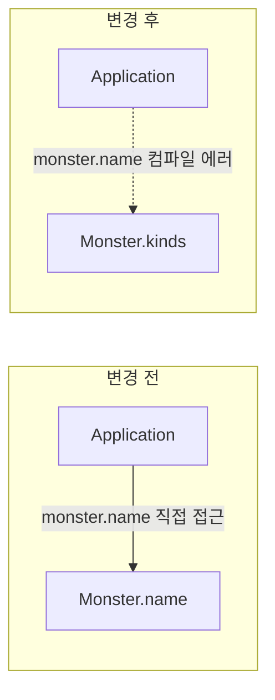
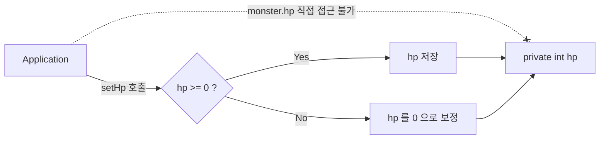

## 들어가며 (Situation)

앞선 글에서 `Member` 클래스에 생성자를 달아 객체를 만드는 시점에 값을 채우는 데까지 갔습니다. 하지만 필드는 여전히 `Application`에서 `member.age = -5`처럼 마음대로 대입할 수 있었습니다.

이번 실습(`c_encapsulation`)은 캡슐화가 왜 필요한지 이해시키기 위해, `Monster`(이름과 체력을 가진 몬스터) 클래스로 **일부러 문제 상황을 가정해 단계별로 보여 주는** 구성입니다. 패키지가 `problem1` → `problem2` → `problem3` → `problem_solved` 순서로 나뉘어 있어서, **가정한 문제 → 해결 → 남은 구멍 확인** 과정을 그대로 따라가 보겠습니다. 실제 서비스에서 겪은 문제가 아니라 개념 학습용 시나리오입니다.

## 문제 상황 (Task)

수업에서 가정한 문제는 네 단계로 정리됩니다.

| 단계 | 상황 | 한 줄 요약 |
|------|------|-----------|
| problem1 | 필드에 검증 없는 값이 들어간다 | `hp = -200`이 그대로 저장됨 |
| problem2 | 필드 이름을 바꾸자 사용하는 곳이 전부 에러 | `name` → `kinds` 변경의 파급 |
| problem3 | 1, 2번을 고쳤는데도 필드에 직접 접근 가능 | `monster3.hp = -5500`이 통과됨 |
| problem_solved | 접근 자체를 막기 | `private` 적용 |

## 해결 과정 (Action)

### 1. problem1: 검증 없는 값이 그대로 들어간다

`Monster`의 필드를 접근제한자 없이 선언하고, 외부에서 직접 대입했습니다.

```java
public class Monster {
    String name;
    int hp;
}
```

```java
Monster monster2 = new Monster();
monster2.name = "피카츄";
monster2.hp = -200;   // 체력이 음수인데 아무도 막지 않는다

System.out.println("monster2.hp = " + monster2.hp); // -200
```

체력이 음수인 몬스터는 프로그램의 요구사항에서는 있을 수 없는 상태입니다. 그런데 필드에 직접 대입하면 **값을 검사할 자리가 없습니다.** 그래서 값을 설정하는 전용 메소드(setter)를 만들고 검증을 그 안에 넣었습니다.

```java
public void setHp(int hp) {
    if (hp >= 0) {
        System.out.println("정상 값입니다. 몬스터의 체력을 " + hp + "로 설정합니다.");
        this.hp = hp;
    } else {
        System.out.println("삐빅... 오류 발생 잘못된 값이 탐지되어 hp 를 0으로 강제합니다.");
        this.hp = 0;
    }
}
```

음수가 들어오면 예외를 던지는 방법도 있지만, 이 실습의 요구사항은 **0으로 보정**하는 것이었기 때문에 이 방식을 택했습니다. (`this.hp = hp;`에서 `this`가 필요한 이유는 [생성자 글](/2026/10/02/java-constructor-default-constructor-error.html)에서 정리했습니다.)

`monster3.setHp(-300)`을 호출하면 `hp`가 `0`으로 보정됩니다. 다만 이 단계에서는 `setHp`를 만들어 놓았을 뿐, `monster2.hp = -200`처럼 **우회하는 길이 그대로 열려 있습니다.**

### 2. problem2: 필드명을 바꿨더니 컴파일 에러가 동시다발로 발생

"요구사항이 바뀌어 몬스터의 `name`을 `kinds`(종류)로 바꿔야 한다"고 가정합니다.

```java
public class Monster {
//    String name;
    String kinds;   // name -> kinds
    int hp;
}
```

`Monster`를 고치는 순간 `Application`의 `monster1.name = "성원몬"`, `monster1.name` 출력 등 **필드를 직접 쓰던 모든 줄에서 컴파일 에러**가 발생했습니다. 실습 코드의 `Application`이 거의 전부 주석 처리된 것은 그래서입니다. 여기서는 몬스터가 3마리, 접근 줄이 몇 줄뿐이라 괜찮지만, 이 클래스를 수십 곳에서 쓰고 있다면 필드 이름 하나가 수십 곳의 수정으로 번집니다.



핵심은 **사용하는 쪽이 필드의 이름(내부 구현)에 의존하고 있었다**는 점입니다.

### 3. problem3: 메소드를 통해서만 쓰게 하면 에러 범위가 줄어든다

두 문제를 한 번에 풀기 위해 이름도 setter/getter 메소드로 감쌌습니다.

```java
public void setName(String name) {
    this.kinds = name;
}

public String getInfo() {
    return "몬스터의 이름은 " + this.kinds + " 이고," +
            " 체력은 " + this.hp + " 입니다!";
}
```

```java
Monster monster1 = new Monster();
monster1.setName("성원몬");
monster1.setHp(50);
System.out.println(monster1.getInfo());
```

여기서 중요한 점은 `setName`의 매개변수는 `name`인데 실제 필드는 `kinds`라는 것입니다. `Application`은 `setName(...)`만 알고 있기 때문에 **내부 필드명이 `name`에서 `kinds`로 바뀌어도 `Application`은 수정할 필요가 없습니다.** 문제 2가 해결된 것입니다.

그런데 이 단계의 마지막 부분을 보면 구멍이 하나 남아 있습니다.

```java
monster3.setHp(-300);              // 0 으로 보정됨
monster3.hp = -5500;               // 이건 아무도 막지 않는다!
System.out.println(monster3.getInfo()); // 체력은 -5500 입니다!
```

`setHp`에서 보정을 만들어도 필드가 열려 있으면 **검증을 우회하는 코드가 얼마든지 가능합니다.** 메소드로 접근하는 길을 만든 것이지, 필드로 접근하는 길을 막은 것은 아니기 때문입니다.

한 가지 더 짚자면, `problem3`의 `Application`과 `Monster`는 **같은 패키지**에 있습니다. 필드에 접근제한자를 생략하면 같은 패키지 안에서는 접근이 허용되기 때문에 이 우회가 가능했습니다.

| 접근제한자 | 같은 클래스 | 같은 패키지 | 하위 클래스 | 그 외 |
|-----------|:-----------:|:-----------:|:-----------:|:-----:|
| `public` | O | O | O | O |
| `protected` | O | O | O | X |
| (생략, package-private) | O | O | X | X |
| `private` | O | X | X | X |

### 4. problem_solved: `private`으로 접근 자체를 막는다

마지막 단계는 한 줄만 바뀝니다.

```java
public class Monster {
    private String kinds;
    private int hp;

    // setHp, setName, getInfo 는 그대로
}
```

```java
// monster3.hp = -5500;   // 주석을 풀면 컴파일 에러: hp has private access in Monster
System.out.println(monster3.getInfo());
```

이제 `Application`에서는 `monster3.hp`를 쓰는 순간 컴파일 에러가 납니다. `Monster`의 데이터를 바꾸는 유일한 통로가 `setHp`가 되었고, 그 안의 검증 로직을 **반드시 거쳐야 합니다.**



이렇게 **데이터(필드)를 숨기고, 공개된 메소드로만 접근하게 하는 것**이 캡슐화(encapsulation)입니다. 실습을 요약하면 다음과 같은 과정이었습니다.

| 단계 | 필드 접근 | 해결한 문제 | 남은 구멍 |
|------|-----------|-------------|-----------|
| problem1 | 직접 접근 | - | 검증 불가 |
| problem2 | 직접 접근 | - | 필드명 변경 시 호출부 전부 에러 |
| problem3 | setter/getter + 필드 열림 | 검증, 이름 변경 영향 | 필드 직접 접근으로 우회 |
| problem_solved | setter/getter + `private` | 전부 | 없음 |

## 결과 (Result)

수치로 측정한 지표는 없어서, 단계별 실행 결과로 정리합니다.

| 시나리오 | 캡슐화 전 | 캡슐화 후 |
|----------|-----------|-----------|
| `hp = -200` 대입 | `-200` 저장 | `setHp(-200)` 호출 시 `0`으로 보정 |
| 필드명 `name` → `kinds` 변경 | `Application` 컴파일 에러 다수 | `Application` 수정 없음 |
| `monster3.hp = -5500` | 통과, 체력 `-5500` | 컴파일 에러 |

**배운 점**

- 검증 로직은 setter 안에 둘 수 있지만, **필드를 `private`으로 막지 않으면 우회 가능**하다.
- 캡슐화는 데이터 보호뿐 아니라 **내부 구현 변경의 영향 범위를 줄이는** 효과가 있다. 호출부는 `setName()`만 알면 된다.
- 접근제한자를 생략하면 같은 패키지에서는 열려 있다. 의도하지 않은 접근을 막으려면 명시적으로 `private`을 쓴다.
- setter/getter를 기계적으로 만드는 것은 캡슐화가 아니다. **검증이나 의미 있는 동작이 있어야** 숨기는 의미가 생긴다.

실습 코드에서 개선할 부분도 하나 발견했습니다. `getInfo()`가 문자열을 만들어 반환하는데, `problem3`에서 `monster1.getInfo();`처럼 **반환값을 받지 않고 호출만 하는 줄**이 있습니다. 컴파일은 되지만 아무 출력도 없는 코드라서, 반환값을 출력하거나 변수에 담아야 의미가 있습니다. 또 `hp`를 읽을 getter(`getHp()`)가 아직 없어서, 지금은 `private`이 된 `hp`를 외부에서 숫자로 꺼낼 방법이 `getInfo()`의 문자열뿐입니다.

## 더 학습하면 좋은 개념

- **불변 객체(Immutable Object)** — setter 자체를 없애고 생성자에서만 값을 정하는 설계입니다. 캡슐화를 더 강하게 밀어붙인 형태이고, 앞서 본 `String`이 대표적인 예입니다.
- **방어적 복사(Defensive Copy)** — `private` 필드가 배열이나 컬렉션이면 getter가 참조를 그대로 반환해 외부에서 내용을 바꿀 수 있습니다. 캡슐화의 흔한 허점입니다.
- **예외를 이용한 검증 (`IllegalArgumentException`)** — 이번 실습은 잘못된 값을 `0`으로 보정했지만, 실무에서는 예외로 호출자에게 알리는 경우가 많습니다. 두 방식의 장단점 비교가 필요합니다.
- **접근 제어와 패키지 구조** — 위 표의 `protected`, package-private이 상속과 패키지 설계에서 어떻게 쓰이는지 이해하면 접근제한자를 근거 있게 고를 수 있습니다.
- **Lombok의 `@Getter`/`@Setter`** — 보일러플레이트를 줄여 주지만, 모든 필드에 setter를 여는 것은 캡슐화를 무너뜨리기 쉽습니다. 편리함과 설계 원칙의 균형을 보는 좋은 예입니다.

## 참고 자료

- [Oracle Java Tutorials - Controlling Access to Members of a Class](https://docs.oracle.com/javase/tutorial/java/javaOO/accesscontrol.html)
- [JLS §6.6 - Access Control](https://docs.oracle.com/javase/specs/jls/se17/html/jls-6.html#jls-6.6)
- [Oracle Java Tutorials - Using the this Keyword](https://docs.oracle.com/javase/tutorial/java/javaOO/thiskey.html)
- [Oracle Java Tutorials - Defining Methods](https://docs.oracle.com/javase/tutorial/java/javaOO/methods.html)
