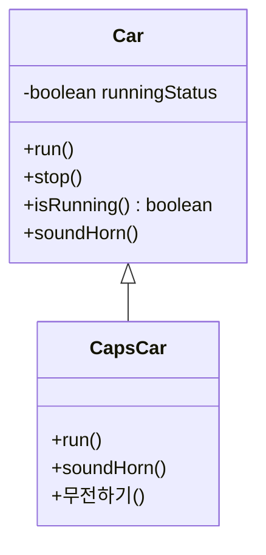

## 들어가며 (Situation)

앞에서 정리한 static, 싱글톤 다음은 `c_inheritance` 실습이었습니다. `Car`(자동차) 클래스와 이를 상속하는 `CapsCar`(경찰차)로 구성되어 있고, 부모의 기능을 물려받는 것과 일부만 다르게 동작시키는 것을 한 번에 보여 줍니다.

> 실제 서비스에서 겪은 문제가 아니라, 개념 학습 중 정리한 내용입니다.

## 문제 상황 (Task)

경찰차도 차라서 달리기(`run`), 경적(`soundHorn`), 멈추기(`stop`)가 모두 필요합니다. 그런데 `Car`의 코드를 `CapsCar`에 그대로 복사하면 **같은 코드가 두 군데**에 생기고, 달리기 로직이 바뀔 때마다 둘을 함께 고쳐야 합니다. 경찰차만 다르게 동작해야 하는 부분(사이렌 소리)은 따로 처리하면서도 나머지는 재사용하는 방법이 필요했습니다.

## 해결 과정 (Action)

### 1. 대안 비교: 복사 vs 상속

| 항목 | 코드 복사 | 상속(`extends`) |
|------|-----------|-----------------|
| 중복 | 클래스 수만큼 | 부모에만 존재 |
| 공통 로직 수정 | 모든 클래스를 수정 | 부모만 수정 |
| 다르게 동작시키기 | 그냥 수정 | `@Override` |
| 적합한 관계 | - | **IS-A** (경찰차는 차다) |

수업에서 강조한 판단 기준이 **IS-A 관계**였습니다. "경찰차는 차다"가 성립하므로 상속을 쓸 수 있고, 반대로 "차는 경찰차다"는 성립하지 않습니다.

### 2. 부모 클래스: 상태를 private으로 감추기

```java
public class Car {
    private boolean runningStatus;     // 달리는 상태

    public void run()  { runningStatus = true;  System.out.println("자동차가 달려갑니다~~~~~~"); }
    public void stop() { runningStatus = false; System.out.println("자동차가 멈춥니다..."); }
    public boolean isRunning() { return runningStatus; }

    public void soundHorn() {
        if (isRunning()) System.out.println("빵~~~~~~~~빵!!");
        else             System.out.println("주행 중이 아니여서 경적을 울릴 수 없습니다.");
    }
}
```

`runningStatus`는 `private`이라 자식 클래스에서도 직접 접근할 수 없습니다. 캡슐화 글에서 본 내용 그대로, 자식도 `isRunning()` 같은 공개 메소드를 통해서만 상태를 봅니다.

### 3. 자식 클래스: 다르게 동작할 부분만 재정의

```java
public class CapsCar extends Car {
    public CapsCar() {
        System.out.println("CapsCar 의 기본 생성자 호출됨..");
    }

    @Override
    public void run() {
//        super.run();
        System.out.println("🚙경찰차는 삐용삐용~~ 하면서 달립니다!!🚙");
    }

    @Override
    public void soundHorn() {
        System.out.println("❌삐~~~~~~~~~용~~~~~~~~~~~~~삐~~~~~~~~❌");
    }

    public void 무전하기() { ... }   // 경찰차만의 고유 메소드
}
```

`stop()`은 재정의하지 않았으므로 부모 것을 그대로 씁니다.



### 4. 실행해서 확인하기

```text
Car 클래스의 기본생성자 호출됨...          ← Car 생성
...
============================
Car 클래스의 기본생성자 호출됨...          ← CapsCar 생성 시 부모 생성자가 먼저
CapsCar 의 기본 생성자 호출됨..
🚙경찰차는 삐용삐용~~ 하면서 달립니다!!🚙
❌삐~~~~~~~~~용~~~~~~~~~~~~~삐~~~~~~~~❌
자동차가 멈춥니다...                      ← 재정의하지 않은 stop()은 부모 것
치지지ㅣ...412호에 성원몬 등장
```

확인한 점이 세 가지 있습니다.

1. `new CapsCar()` 한 번에 **`Car`의 생성자가 먼저, `CapsCar`의 생성자가 다음에** 출력됩니다. 자식 인스턴스 안에는 부모 부분이 함께 만들어지기 때문입니다.
2. `stop()`은 재정의하지 않았는데도 `capsCar.stop()`이 동작합니다. 상속된 것입니다.
3. `무전하기()`는 부모 타입으로는 호출할 수 없는 자식만의 기능입니다. (다음 글의 다형성에서 다시 만납니다.)

### 5. 시행착오: super.run()을 주석 처리한 이유

`CapsCar.run()`에는 `super.run()`이 주석 처리되어 있습니다. 이 줄을 살리면 부모의 `run()`이 먼저 실행되어 `runningStatus = true`로 바뀝니다. 주석 처리한 지금 코드에서는 경찰차의 `run()`이 **상태를 바꾸지 않으므로**, `capsCar.run()` 직후에도 `isRunning()`은 `false`입니다.

그래서 이 예제에서 경적이 항상 울리도록 하려면 `soundHorn()`도 재정의해서 상태 체크를 건너뛰어야 합니다. 실제로 `CapsCar.soundHorn()`은 상태와 무관하게 출력합니다. 부모 로직을 완전히 대체할지 `super.`로 확장할지는 설계 선택이라는 점을 이 부분에서 느꼈습니다. (이 해석은 코드를 읽고 판단한 것이며, `super.run()`을 살려 실행해 비교해 보는 것은 추가 실습 거리로 남깁니다.)

## 결과 (Result)

- 중복 코드 없이 `Car`의 기능을 `CapsCar`가 물려받고, 달라야 하는 `run`/`soundHorn`만 재정의하는 구조를 직접 실행해 확인했습니다.
- 상속을 쓸지 판단하는 기준은 **IS-A 관계**라는 점을 정리했습니다.
- 자식 객체 생성 시 부모 생성자가 먼저 호출되는 순서를 출력으로 확인했습니다.
- 정량 지표를 낼 성격의 작업은 아니라서 코드 중복의 구체적 수치는 측정하지 않았습니다.

## 더 학습하면 좋은 개념

- **IS-A vs HAS-A (상속 vs 합성)** — 상속은 결합도가 높아서, 실무에서는 합성(Composition)을 우선하라는 조언이 많습니다. 왜 그런지 이해하면 설계 판단이 달라집니다.
- **`super` 키워드와 생성자 체이닝** — 부모 생성자가 먼저 실행되는 규칙과, 부모에 기본 생성자가 없을 때 에러가 나는 이유와 연결됩니다.
- **접근제한자 `protected`** — 자식에게만 열어 주는 접근 범위입니다. `private` 상태를 자식이 어떻게 다뤄야 하는지 고민할 때 필요합니다.
- **`final` 클래스/메소드** — 상속과 오버라이딩 자체를 막는 방법으로, 앞선 글의 `final` 개념이 확장됩니다.

## 참고 자료

- [Oracle Java Tutorials - Inheritance](https://docs.oracle.com/javase/tutorial/java/IandI/subclasses.html)
- [Oracle Java Tutorials - Overriding and Hiding Methods](https://docs.oracle.com/javase/tutorial/java/IandI/override.html)
