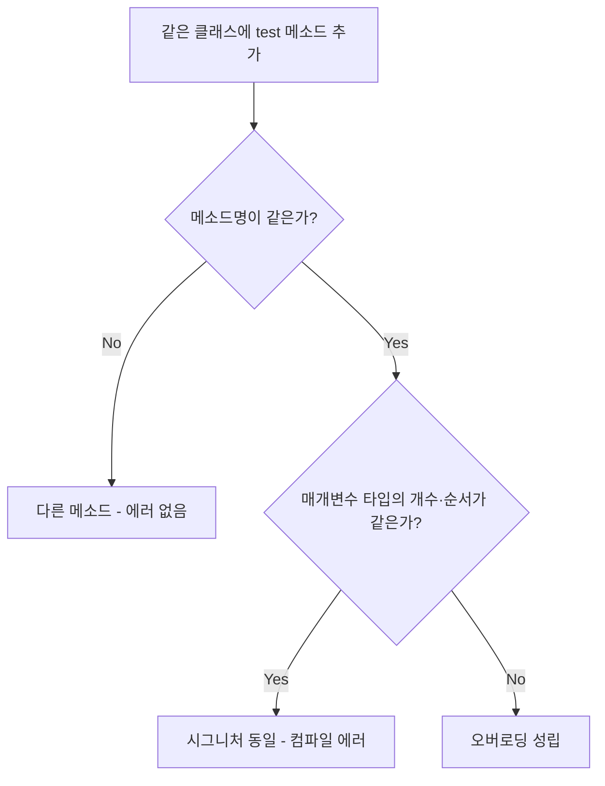

## 들어가며 (Situation)

생성자와 캡슐화까지 정리하고 나니, 같은 클래스 안에 `test()`라는 이름의 메소드를 여러 개 만들어도 되는 경우와 안 되는 경우가 헷갈렸습니다. 수업 실습(`e_overloading/OverloadingTest.java`)은 **메소드를 하나씩 추가하면서, 에러가 나는 경우를 주석으로 남겨 두는** 방식이었습니다. 이 글은 주석 처리된 에러 케이스를 직접 컴파일해 보며 "무엇이 메소드를 구분하는 기준인가"를 정리한 기록입니다.

> 실제 서비스에서 겪은 문제가 아니라, 개념 학습 중 정리한 내용입니다.

## 문제 상황 (Task)

궁금했던 것은 두 가지였습니다.

- 접근제한자나 반환 타입이 다르면 같은 이름의 메소드를 만들 수 있을까?
- 그렇다면 자바는 **무엇을 기준으로** 메소드를 같다/다르다고 판단할까?

## 해결 과정 (Action)

### 1. 기준은 '메소드 시그니처'

실습 코드 상단의 주석이 핵심이었습니다. 메소드를 식별하는 고유한 값이 **메소드 시그니처**이고, 형태는 `메소드명([매개변수])`입니다. 공식 명세(JLS §8.4.2)도 시그니처를 이름과 매개변수 타입 목록으로 정의합니다. 반환 타입과 접근제한자는 여기에 포함되지 않습니다.



### 2. 에러가 나는 경우를 직접 컴파일

주석 처리되어 있던 세 줄을 하나씩 풀어서 컴파일했습니다. (JDK 21, 아래는 각각 최소 코드로 재현한 결과입니다.)

| 시도 | 코드 | 결과 |
|------|------|------|
| 완전히 동일 | `void test(){}` 두 번 | 에러 |
| 접근제한자만 변경 | `void test(){}` + `private void test(){}` | `method test() is already defined` |
| 반환 타입만 변경 | `void test(){}` + `int test(){return 0;}` | `method test() is already defined` |
| 매개변수 **이름**만 변경 | `test(int a)` + `test(int b)` | `method test(int) is already defined` |

```text
OverloadingTest.java: error: method test() is already defined in class OverloadingTest
```

특히 마지막 케이스가 의외였습니다. 매개변수 이름은 사람이 읽기 위한 것이지 시그니처에는 들어가지 않습니다. 컴파일러 입장에서 `test(int a)`와 `test(int b)`는 같은 메소드입니다.

### 3. 오버로딩이 성립하는 경우

```java
public void test() {}                       // 기준 메소드
public void test(int num) {}                // 매개변수 유무
public void test(int num, String str) {}    // 매개변수 개수
public void test(String str, int num) {}    // 매개변수 순서
public void test2() {}                      // 이름 자체가 다름 → 애초에 오버로딩이 아님
```

정리하면 오버로딩이 성립하는 조건은 **매개변수의 타입·개수·순서 중 하나 이상이 다를 때**입니다.

| 바꾼 요소 | 오버로딩 성립? |
|-----------|----------------|
| 매개변수 개수 | O |
| 매개변수 타입 | O |
| 매개변수 순서 (타입이 다를 때) | O |
| 매개변수 이름 | X |
| 반환 타입 | X |
| 접근제한자 | X |

### 4. 시행착오: 'test2()가 에러가 안 나는 건 오버로딩인가?'

실습 코드 마지막의 `test2()`에는 "메소드 이름은 시그니처이기 때문에 Error 소멸"이라는 주석이 있습니다. 처음에는 이것도 오버로딩이라고 생각했는데, 이름이 다르면 그냥 **서로 다른 메소드**입니다. 오버로딩은 *같은 이름*에 *다른 매개변수*일 때만 말하는 개념입니다. 이 구분을 놓치기 쉽다는 점을 메모해 두었습니다.

또 하나 짚은 점: 반환 타입으로 구분이 안 되는 이유를 생각해 보면, 호출하는 쪽은 `test();`처럼 반환값을 받지 않을 수도 있어서 컴파일러가 어느 메소드인지 고를 단서가 없습니다. (이 부분은 제 추론이며, 공식 명세가 설명하는 것은 "시그니처가 같으면 중복 선언"이라는 규칙까지입니다.)

## 결과 (Result)

- 같은 이름의 메소드를 만들 수 있는지는 **시그니처(이름 + 매개변수 타입 목록)**로 판단한다는 기준을 갖게 되었습니다.
- 접근제한자·반환 타입·매개변수 이름 3가지는 구분 기준이 아님을 컴파일 에러로 직접 확인했습니다.
- 정량 지표로 표현할 성격의 작업은 아니었지만, 헷갈리던 4가지 케이스(접근제한자/반환 타입/매개변수 이름/순서)를 표 하나로 정리했습니다.

## 더 학습하면 좋은 개념

- **오버로딩 vs 오버라이딩** — 오버로딩은 컴파일 시점에 호출 메소드가 결정되고, 오버라이딩은 런타임에 결정됩니다. 다음 글들(상속, 다형성)에서 이어지는 개념입니다.
- **오버로딩 해석(Overload Resolution)** — `test(long)`과 `test(Integer)`가 있을 때 `test(1)`이 어느 쪽을 부르는지처럼, 타입 변환이 끼면 규칙이 복잡해집니다. 형변환 글에서 본 내용과 연결됩니다.
- **가변 인자(varargs)** — `String...` 같은 매개변수도 오버로딩과 함께 쓰이면 모호성 에러가 날 수 있습니다.
- **생성자 오버로딩** — 앞서 정리한 생성자도 같은 규칙으로 여러 개 만들 수 있습니다.

## 참고 자료

- [Oracle Java Tutorials - Defining Methods (Overloading Methods)](https://docs.oracle.com/javase/tutorial/java/javaOO/methods.html)
- [Java Language Specification SE 21 - 8.4.2 Method Signature](https://docs.oracle.com/javase/specs/jls/se21/html/jls-8.html#jls-8.4.2)
