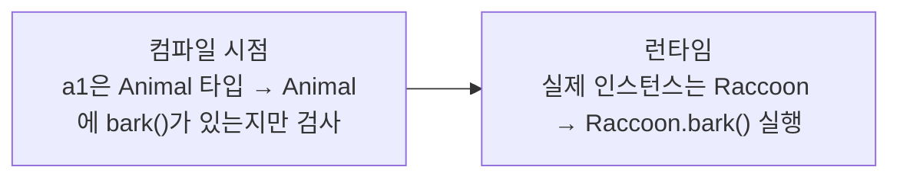
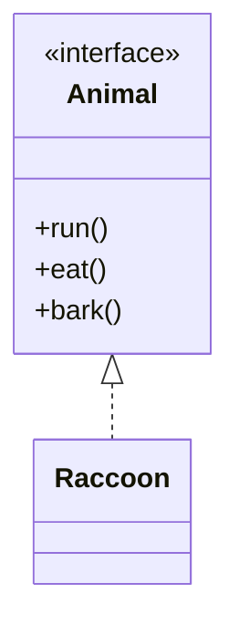

## 들어가며 (Situation)

상속(`Car` → `CapsCar`)에 이어 `d_polymorphism` 실습이 나왔습니다. `Animal`을 부모로 `Raccoon`(너구리), `Koala`(코알라)가 있고, 하위 패키지 `a_interface`에서는 같은 `Animal`을 **인터페이스**로 바꿔 다시 다룹니다. 이 글은 "부모 타입 변수에 자식 객체를 넣으면 무슨 일이 일어나는가"를 직접 실행하고, 안 되는 코드는 컴파일해서 에러를 확인한 기록입니다.

> 실제 서비스에서 겪은 문제가 아니라, 개념 학습 중 정리한 내용입니다.

## 문제 상황 (Task)

- `Animal a1 = new Raccoon();`은 되는데 `Raccoon r1 = new Animal();`은 왜 안 될까?
- `a1.bark()`는 너구리의 소리가 나는데, 왜 `a1.bite()`는 호출할 수 없을까?
- 클래스 상속이 이미 있는데 인터페이스는 왜 또 필요할까?

## 해결 과정 (Action)

### 1. 먼저 개별 객체로 실행

`Animal`, `Raccoon`, `Koala`를 각각 만들어 `eat()`, `run()`, `bark()`를 호출했습니다. 자식 둘은 세 메소드를 모두 `@Override`하고, 각자 고유 메소드(`bite()`, `sleep()`)를 하나씩 갖습니다.

```text
너구리가 너구리라면을 먹습니다..
너굴너굴 너굴맨..
분노한 너구리가 깨물기 시작합니다..
코알코알
코알라는 하루에 20시간을 잡니다...zzz
```

### 2. 부모 타입 변수에 자식 인스턴스 담기

```java
Animal a1 = new Raccoon();
a1.bark();                 // 너굴너굴 너굴맨..
```

변수의 타입은 `Animal`인데 실행된 것은 **`Raccoon`의 `bark()`**입니다. 수업에서는 이를 **동적 바인딩**이라고 불렀습니다.



### 3. 되는 것과 안 되는 것을 컴파일로 구분

| 코드 | 결과 | 이유 |
|------|------|------|
| `Animal a = new Raccoon();` | O | 너구리는 동물이다 (IS-A) |
| `a.bark();` | O (너구리 소리) | 오버라이딩 된 메소드는 런타임 인스턴스 기준 |
| `a.bite();` | **컴파일 에러** | `Animal` 타입에는 `bite()`가 없음 |
| `((Raccoon) a).bite();` | O | 명시적 형변환 |
| `Raccoon r = new Animal();` | **컴파일 에러** | 동물이 너구리인 것은 아님 |

`bite()`를 호출했을 때의 실제 메시지입니다.

```text
error: cannot find symbol
  symbol:   method x()
```

(재현용 코드에서 `bite()` 대신 `x()`로 이름을 붙였습니다.) **컴파일러는 변수의 타입만 보고** 호출 가능 여부를 판단하기 때문입니다.

### 4. 시행착오: 형변환이 항상 안전하진 않다

`((Raccoon) a1).bite()`는 `a1`의 실제 인스턴스가 `Raccoon`이라서 동작합니다. 그런데 부모 타입 그대로의 객체를 자식으로 캐스팅하면 어떨까요? 최소 코드로 실행해 봤습니다.

```java
P p = new P();
K k = (K) p;   // 컴파일은 통과
```

```text
Exception in thread "main" java.lang.ClassCastException: class P cannot be cast to class K
```

캐스팅은 **컴파일은 통과하고 런타임에 터질 수 있습니다.** 그래서 형변환 전에 `instanceof`로 확인하는 습관이 필요하다는 것을 알게 됐습니다.

### 5. 인터페이스: 같은 다형성, 다른 강제력

`a_interface` 패키지에서 `Animal`은 인터페이스로 바뀝니다.

```java
public interface Animal {
    void run();
    void eat();
    void bark();
}

public class Raccoon implements Animal { ... }   // extends가 아니라 implements
```

수업 주석은 인터페이스를 **"Can-Do"**, 즉 구현 클래스가 반드시 해야 하는 일을 강제하는 약속으로 설명했습니다. 직접 에러를 확인한 결과입니다.

| 시도 | 메시지 |
|------|--------|
| `new Animal()` | `Animal is abstract; cannot be instantiated` |
| 메소드를 구현하지 않은 클래스 | `... is not abstract and does not override abstract method run()` |

| 항목 | 클래스 상속 (`extends`) | 인터페이스 (`implements`) |
|------|-------------------------|---------------------------|
| 키워드 | `extends` | `implements` |
| 객체 생성 | 부모도 가능 | 불가 |
| 의미 | IS-A, 코드 재사용 | Can-Do, 메소드 구현 강제 |
| 다형성 | `Animal a = new Raccoon()` | `Animal a = new Raccoon()` (동일) |



참고로 실습의 `Raccoon`은 `eat()`와 `bark()`를 빈 메소드로 두고 있습니다. 구현을 *강제*한다는 것은 "내용을 채우라"가 아니라 "메소드를 반드시 선언하라"까지라는 점을 보여 줍니다. 컴파일러는 빈 몸체도 통과시킵니다.

### 6. 오버로딩과의 연결

첫 번째 글의 오버로딩은 **컴파일 시점에** 시그니처로 호출 대상이 정해졌습니다. 반면 오버라이딩된 메소드를 부모 타입으로 호출하면 **런타임에** 실제 인스턴스를 보고 결정됩니다. 이름은 비슷하지만 결정 시점이 다르다는 점이 두 개념을 구분하는 가장 큰 기준이었습니다.

## 결과 (Result)

- "변수 타입은 컴파일 시점에 호출 가능 범위를, 인스턴스 타입은 런타임에 실제 동작을 결정한다"는 한 문장으로 다형성을 정리했습니다.
- 컴파일 에러 3종(`cannot find symbol`, `is abstract; cannot be instantiated`, 메소드 미구현)과 런타임 에러 1종(`ClassCastException`)을 직접 재현해 에러 시점이 다름을 확인했습니다.
- 클래스 상속과 인터페이스를 표로 비교해 선택 기준을 정리했습니다.
- 정량 지표는 해당 사항이 없습니다.

## 더 학습하면 좋은 개념

- **추상 클래스(abstract class)** — 인터페이스와 클래스 상속의 중간 지점입니다. 공통 구현은 주고 일부만 강제할 때 선택하며, 두 개념의 차이를 설명할 수 있어야 합니다.
- **`instanceof`와 패턴 매칭** — 안전하게 다운캐스팅하는 방법입니다. `ClassCastException`을 피하는 기본기입니다.
- **인터페이스의 `default` 메소드 (Java 8+)** — 이번 실습의 "구현부가 있는 메소드를 못 쓴다"는 설명은 기본적인 형태에 대한 것이며, 현재 버전에서는 예외가 있습니다. 공식 문서로 확인해 볼 만합니다.
- **전략 패턴 / 의존성 역전** — 인터페이스 타입으로 객체를 받는 설계가 왜 유연한지, 다형성이 실무 설계로 이어지는 지점입니다.

## 참고 자료

- [Oracle Java Tutorials - Polymorphism](https://docs.oracle.com/javase/tutorial/java/IandI/polymorphism.html)
- [Oracle Java Tutorials - Interfaces](https://docs.oracle.com/javase/tutorial/java/IandI/createinterface.html)
- [Java Language Specification SE 21 - 5.5 Casting Contexts](https://docs.oracle.com/javase/specs/jls/se21/html/jls-5.html#jls-5.5)
