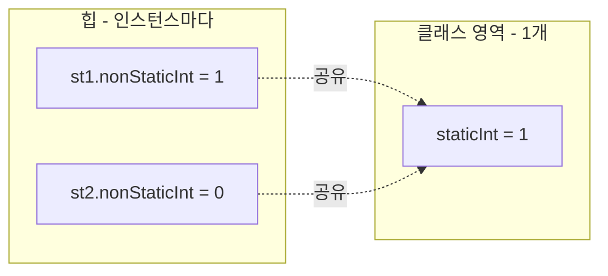
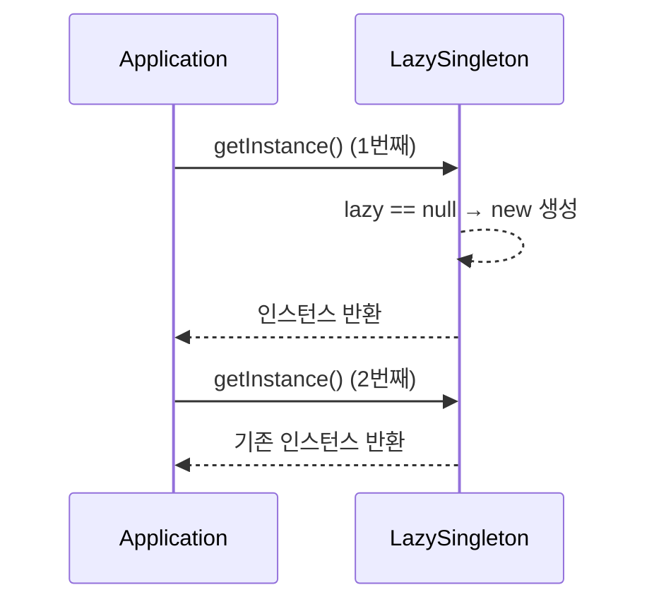

## 들어가며 (Situation)

오버로딩 다음 진도는 `f_keyword` 패키지였고, `static`, 싱글톤 패턴, `final` 세 가지가 차례로 나왔습니다. 세 개념이 따로 노는 것처럼 보였는데, 실습 코드를 실행해 보니 **"값이 누구의 것인가(인스턴스 / 클래스)"와 "값을 바꿀 수 있는가"** 두 축으로 묶였습니다. 직접 실행한 결과를 기준으로 정리합니다.

> 실제 서비스에서 겪은 문제가 아니라, 개념 학습 중 정리한 내용입니다.

## 문제 상황 (Task)

| 키워드 | 궁금했던 점 |
|--------|-------------|
| `static` | 인스턴스를 새로 만들면 필드는 0으로 시작하는데, `static` 필드는 왜 값이 남아 있을까? |
| 싱글톤 | `new`를 막고 어떻게 "객체 1개"를 보장할까? Eager와 Lazy는 무엇이 다를까? |
| `final` | 선언만 하고 초기화를 안 하면 왜 에러일까? 초기화 방법은 몇 가지일까? |

## 해결 과정 (Action)

### 1. static: 필드 두 개로 비교 실험

`StaticFieldTest`에 일반 필드와 `static` 필드를 하나씩 두고, 둘 다 1씩 증가시킨 뒤 새 인스턴스(`st2`)를 만들어 값을 출력했습니다.

```java
public class StaticFieldTest {
    private int nonStaticInt;
    private static int staticInt;

    public void increaseNonStatic() { this.nonStaticInt++; }
    public void increaseStatic()    { StaticFieldTest.staticInt++; }
}
```

실행 결과입니다.

```text
non-static 변수 값 확인 : 0
static 변수 값 확인 : 0
non-static 변수 값 확인 : 1      ← st1 증가 후
static 변수 값 확인 : 1
st2 = non-static 변수 값 확인 : 0   ← 새 인스턴스는 다시 0
st2 = static 변수 값 확인 : 1       ← static은 공유되어 1 유지
```



`static` 필드는 인스턴스가 아니라 **클래스에 소속**되어 모든 인스턴스가 같은 값을 봅니다. 그래서 `this`가 아니라 `클래스명.변수명`으로 접근하는 것이 자연스럽습니다.

**시행착오/보정 1.** 수업 주석에는 "어플리케이션 시작 시점에 초기화된다"고 적혀 있었는데, JLS §12.4를 확인해 보니 클래스 초기화는 **해당 클래스를 처음 사용하는 시점**(인스턴스 생성, static 메소드 호출, static 필드 접근 등)에 일어납니다. "프로그램 시작 시 전부"라기보다 "객체 생성과는 별개의, 클래스 단위의 생명주기"로 이해하는 편이 정확해 보입니다.

**시행착오/보정 2.** static 메소드 안에서 인스턴스 필드를 쓰면 어떻게 되는지 확인했습니다.

```text
error: non-static variable n cannot be referenced from a static context
error: non-static variable this cannot be referenced from a static context
```

static 메소드는 인스턴스 없이 호출되므로, 특정 인스턴스를 가리키는 `this`와 인스턴스 필드를 쓸 수 없습니다.

### 2. 싱글톤: 생성자를 막고 static으로 공유

"리모컨은 1개"라는 비유로, 생성자를 `private`으로 막고 `static` 메소드로 인스턴스를 내어주는 구조였습니다. 방식은 두 가지입니다.

| 항목 | Eager (이른 초기화) | Lazy (게으른 초기화) |
|------|---------------------|----------------------|
| 생성 시점 | 클래스 로딩(초기화) 시 | `getInstance()` 첫 호출 시 |
| 코드 | `private static E e = new E();` | `if (lazy == null) lazy = new L();` |
| 안 쓸 때 | 메모리 낭비 가능 | 생성 안 함 |
| 멀티스레드 | 클래스 초기화가 보장해 안전 | **동기화 없이는 안전하지 않음** |

```java
public class LazySingleton {
    private static LazySingleton lazy;
    private LazySingleton() {}

    public static LazySingleton getInstance() {
        if (lazy == null) {
            lazy = new LazySingleton();
        }
        return lazy;
    }
}
```



두 번 호출해 `hashCode()`를 비교한 결과, 같은 객체임이 확인됐습니다.

```text
eager1 의 hashcode() : 1421795058
eager2 의 hashcode() : 1421795058
lazy1 의 hashcode() : 471910020
lazy2 의 hashcode() : 471910020
```

(해시값은 실행마다 달라질 수 있고, 중요한 건 쌍으로 같다는 점입니다.) `hashCode()`가 같다고 항상 동일 객체인 것은 아니므로, 엄밀히는 `eager1 == eager2`로 비교하는 편이 더 확실합니다.

**남은 구멍.** Lazy 방식은 두 스레드가 동시에 `lazy == null`을 통과하면 인스턴스가 2개 생길 수 있습니다. 실습 범위에서는 다루지 않았고, 아래 "더 학습하면 좋은 개념"으로 남겼습니다. 이 부분은 직접 재현하지 않은, 일반적으로 알려진 특성입니다.

### 3. final: 두 가지 초기화 방법

```java
private final int NON_STATIC_NUM = 1;   // 1. 선언과 동시에 초기화
private final int NON_STATIC_NUM2;      // 2. 생성자에서 초기화

public FinalFieldTest(int num) {
    this.NON_STATIC_NUM2 = num;
}
```

주석 처리된 에러 케이스를 풀어 컴파일했습니다.

| 시도 | 메시지 |
|------|--------|
| 초기화 없이 선언만 (`private final int N;`) | `variable N not initialized in the default constructor` |
| 초기화 후 재대입 (`this.N = 2;`) | `cannot assign a value to final variable N` |

`final` 필드는 기본값(0)으로 두는 것을 허용하지 않기 때문에, **선언 시점이나 생성자 중 한 곳에서 반드시 한 번** 값이 정해져야 합니다. 그래서 `final` 필드에는 setter를 만들 수 없습니다. (캡슐화 글에서 만들었던 getter/setter 패턴과 대비되는 지점입니다.)

## 결과 (Result)

- `static`은 "클래스 소속, 인스턴스 간 공유"라는 기준으로 정리했고, 실행 결과로 `st2`에서 일반 필드 0 / static 필드 1이 갈리는 것을 확인했습니다.
- 싱글톤은 `private` 생성자 + `static` 필드/메소드의 조합이며, Eager/Lazy의 차이는 **생성 시점**과 **스레드 안전성**이라는 점을 표로 정리했습니다.
- `final`의 초기화 방법 2가지와 컴파일 에러 2종을 직접 재현했습니다.
- 수업 주석의 "애플리케이션 시작 시점 초기화" 표현을 JLS 기준으로 보정했습니다.

## 더 학습하면 좋은 개념

- **클래스 초기화 시점 (JLS §12.4)** — static 초기화가 정확히 언제 일어나는지 알아야 Eager 싱글톤이 왜 스레드 안전한지 설명할 수 있습니다.
- **Double-Checked Locking / Holder 패턴 / enum 싱글톤** — Lazy 싱글톤의 스레드 문제를 푸는 대표 방법들입니다.
- **불변 객체(Immutable Object)** — `final` 필드와 setter 제거를 확장한 설계로, 멀티스레드 환경에서 안전한 객체를 만드는 기본기입니다.
- **싱글톤의 단점과 의존성 주입(DI)** — 전역 상태가 되면 테스트가 어려워지는 이유와, 프레임워크가 싱글톤 스코프를 관리하는 방식과 연결됩니다.

## 참고 자료

- [Oracle Java Tutorials - Understanding Class Members](https://docs.oracle.com/javase/tutorial/java/javaOO/classvars.html)
- [Java Language Specification SE 21 - 12.4 Initialization of Classes and Interfaces](https://docs.oracle.com/javase/specs/jls/se21/html/jls-12.html#jls-12.4)
- [Java Language Specification SE 21 - 8.3.1.2 final Fields](https://docs.oracle.com/javase/specs/jls/se21/html/jls-8.html#jls-8.3.1.2)
