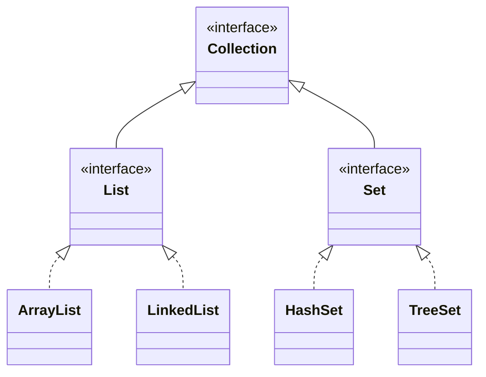

## 들어가며 (Situation)

[1편]()의 제네릭은 사실 컬렉션을 쓰기 위한 준비였습니다. `List<String>`의 `<String>`이 바로 그 제네릭이기 때문입니다. 이 글은 `b_collection.a_list` 실습을 다룹니다.

수업에서는 컬렉션을 "여러 데이터를 담고 관리하는 자료구조 도구 상자(`java.util`)"로 소개하고 세 종류로 나눴습니다.

| 종류 | 순서 | 중복 | 비유 | 이 시리즈 |
|------|------|------|------|-----------|
| `List` | 있음 | 허용 | 출석부 | 3편 (이 글) |
| `Set` | 없음 | 불허 | 구슬 주머니 | [4편]() |
| `Map` | 키-값 쌍 | 키 중복 불가 | 사전 | 이번 실습에는 없음 |

> 실제 서비스에서 겪은 문제가 아니라, 개념 학습 중 정리한 내용입니다. 실행 결과는 JDK 21에서 직접 확인했습니다.

## 문제 상황 (Task)

- 책 정보(번호, 제목, 저자, 가격) 5권을 변수 하나로 관리하고 싶습니다. 책마다 변수를 만들면 100권일 때 변수도 100개입니다.
- 배열은 크기가 고정이고, 중간에 끼워 넣거나 삭제하려면 직접 한 칸씩 밀고 당겨야 합니다.
- 수업 주석의 목표는 "가격 오름차순 정렬"인데, 코드는 저장과 출력까지만 구현돼 있습니다.

## 해결 과정 (Action)

### 1. 인터페이스 `List`와 구현체 `ArrayList`

```java
List list = new ArrayList();
```

`List`는 인터페이스라서 `new List()`는 안 되고, 구현체인 `ArrayList`로 객체를 만듭니다. 왼쪽을 `List`로 선언해 두면 나중에 `LinkedList` 등으로 바꾸기 쉬운데, 이것도 다형성의 응용입니다. (`ArrayList`는 내부적으로 배열의 특징을 가집니다.)



### 2. 주요 메소드 실행해 보기 (제네릭 없는 List)

```java
list.add("apple");  list.add(1);  list.add(123.123);  list.add(true);  list.add(new Date());
System.out.println("list = " + list);
System.out.println("list.size() = " + list.size());
System.out.println("1번 공간에 있는 값 = " + list.get(1));

list.add(1, "banana");   // 1번 위치에 끼워 넣기
list.remove(2);          // 2번 위치 삭제
```

```text
list = [apple, 1, 123.123, true, Wed Oct 07 15:11:25 KST 2026]
list.size() = 5
1번 공간에 있는 값 = 1
list = [apple, banana, 1, 123.123, true, Wed Oct 07 15:11:25 KST 2026]
list = [apple, banana, 123.123, true, Wed Oct 07 15:11:25 KST 2026]
```

| 메소드 | 동작 | 실행에서 확인한 점 |
|--------|------|--------------------|
| `add(값)` | 맨 뒤에 추가 | 문자열, 정수, 실수, `Date`까지 섞여 들어감 |
| `add(index, 값)` | 중간 삽입 | `banana`가 1번에 들어가고 `1`이 2번으로 밀림 |
| `remove(index)` | 삭제 | 2번(`1`)이 사라지고 뒤가 당겨짐 |
| `get(index)` | 조회 | 인덱스는 0부터 시작 |
| `size()` | 개수 | 배열의 `length`와 달리 **메소드**라 괄호 필요 |

`Date`는 `toString()`이 재정의돼 있어 날짜 문자열로 출력되고, 컬렉션 자체도 `[a, b, ...]` 형태로 출력됩니다.

### 3. 시행착오 1: 제네릭 없는 List는 꺼낼 때 터진다

위 `list`는 제네릭을 쓰지 않아서 1편의 Raw Type과 같은 문제를 가집니다. 문자열이 있을 거라 믿고 꺼내 보면 어떻게 될까요? (예시 코드)

```java
List l = new ArrayList();
l.add("apple"); l.add(1);
String s = (String) l.get(1);
```

```text
Exception in thread "main" java.lang.ClassCastException:
class java.lang.Integer cannot be cast to class java.lang.String
```

그래서 수업도 `List<String> strings = new ArrayList<>();`처럼 제네릭을 지정한 형태를 이어서 보여 줍니다. 이 경우 `strings.add(1)`은 컴파일 단계에서 막힙니다.

### 4. 시행착오 2: `remove(1)`은 인덱스일까 값일까

수업 코드의 `list.remove(2)`는 "2번 위치 삭제"였습니다. 그런데 `List<Integer>`에서 값 1을 지우고 싶을 때는 어떻게 될까요? 오버로딩을 배운 직후라 직접 실험했습니다. (예시 코드)

```java
List<Integer> l = new ArrayList<>(List.of(10, 20, 30, 1));
l.remove(1);                     // ?
l.remove(Integer.valueOf(1));    // ?
```

```text
[10, 30, 1]   // remove(1): 인덱스 1번(20)이 지워짐
[10, 30]      // remove(Integer.valueOf(1)): 값 1이 지워짐
```

`int` 리터럴은 `remove(int index)`로, `Integer` 객체는 `remove(Object o)`로 연결됩니다. 메소드 시그니처로 호출 대상이 결정되는 오버로딩이 컬렉션에서 실수로 이어질 수 있는 사례였습니다.

### 5. `Collections.sort`와 문자열 정렬

```java
List<String> strings = new ArrayList<>();
strings.add("a"); strings.add("c"); strings.add("b"); strings.add("d");
Collections.sort(strings);
```

```text
strings = [a, c, b, d]
strings = [a, b, c, d]
```

`Collections`는 객체를 만들지 않고 클래스명으로 바로 호출하는 static 메소드 모음입니다.

### 6. 책 5권을 하나의 `List<BookDTO>`로

`BookDTO`는 행위 없이 **데이터 운반**만 하는 클래스입니다. 수업 주석이 정리한 구성 요소는 다음과 같습니다.

| 구성 | 이 클래스에서 |
|------|---------------|
| 필드 | `no`, `title`, `author`, `price` (모두 `private`) |
| 기본 생성자 | `BookDTO() {}` (다른 생성자를 만들면 기본 생성자가 사라지므로 직접 작성) |
| 전체 필드 생성자 | `BookDTO(int, String, String, int)` |
| getter / setter | 캡슐화된 필드 접근 |
| `toString()` | `BookDTO@1b6d...` 대신 필드 값을 출력 |

```java
List<BookDTO> bookList = new ArrayList<>();
bookList.add(new BookDTO(1, "홍길동전", "허균", 50000));
bookList.add(new BookDTO(2, "목민심서", "정약용", 45000));
// ... 3~5번 생략
for (int i = 0; i < bookList.size(); i++) {
    System.out.println((i + 1) + "번째 책 : " + bookList.get(i));
}
for (BookDTO book : bookList) {
    System.out.println(book.getNo() + "번째 책 : " + book);
}
```

```text
1번째 책 : BookDTO{no=1, title='홍길동전', author='허균', price=50000}
2번째 책 : BookDTO{no=2, title='목민심서', author='정약용', price=45000}
...
```

두 반복문의 출력은 같지만 의미가 다릅니다. 첫 번째는 인덱스(`i + 1`), 두 번째는 책 자체의 번호(`getNo()`)를 출력합니다. 정렬 후에는 두 값이 달라지므로 구분해서 써야 합니다. 향상된 for문은 인덱스가 필요 없어서 읽기만 할 때 편합니다.

### 7. 미완성 목표: 가격 오름차순 정렬

주석의 목표였던 정렬을 이어서 시도해 봤습니다. 가장 먼저 떠오른 `Collections.sort(bookList)`는 컴파일부터 실패했습니다. (예시 코드)

```text
error: no suitable method found for sort(List<BookDTO>)
    (inference variable T#1 has incompatible bounds
      equality constraints: BookDTO
      upper bounds: Comparable<? super T#1>)
```

`Collections.sort(List<T>)`의 `T`는 `Comparable`을 구현해야 하는 제한(2편의 `extends` 제한)을 가지는데 `BookDTO`는 비교 기준을 모르기 때문입니다. 비교 기준을 `Comparator`로 넘기면 해결됩니다. (예시 코드)

```java
bookList.sort(Comparator.comparingInt(BookDTO::getPrice));
```

```text
20000 마법천자문
30000 삼국지
45000 목민심서
50000 홍길동전
58000 삼국유사
```

2편에서 본 타입 제한이 여기서 에러 메시지로 다시 등장한 것이 인상적이었습니다.

## 결과 (Result)

- 책 5권을 변수 5개 대신 `List<BookDTO>` 1개로 관리하고, 삽입/삭제 시 뒤 요소가 자동으로 밀리고 당겨지는 것을 출력으로 확인했습니다.
- 실수하기 쉬운 지점 3가지를 실험으로 정리했습니다: 제네릭 없는 List의 `ClassCastException`, `remove(int)`/`remove(Object)` 혼동, `BookDTO`의 `Collections.sort` 컴파일 에러.
- 수업에서 미구현이던 가격 오름차순 정렬(20000 → 58000)을 `Comparator`로 완성해 확인했습니다.
- 정량 지표는 해당 사항이 없습니다.

## 더 학습하면 좋은 개념

- **`Comparable`과 `Comparator`** — 정렬 기준을 클래스 안에 둘지 밖에 둘지의 차이입니다. 7번의 에러를 이해하려면 필수이며, 4편의 `TreeSet`에도 같은 문제가 나옵니다.
- **ArrayList vs LinkedList 내부 구조** — "중간 삽입/삭제가 편하다"는 인상과 실제 비용은 다릅니다. 구조를 알면 자료구조 선택 기준이 생깁니다.
- **순회 중 수정과 `ConcurrentModificationException`** — 향상된 for문 안에서 `remove`를 호출하면 생기는 문제로, 안전한 삭제 방법(`Iterator`, `removeIf`)과 함께 공부할 가치가 있습니다.
- **불변 리스트(`List.of`)** — 실험 4에서 사용한 팩토리 메소드입니다. 수정 가능한 `ArrayList`와 무엇이 다른지 알아 두면 좋습니다.

## 참고 자료

- [Oracle Java Tutorials - The List Interface](https://docs.oracle.com/javase/tutorial/collections/interfaces/list.html)
- [Java SE 21 API - ArrayList](https://docs.oracle.com/en/java/javase/21/docs/api/java.base/java/util/ArrayList.html)
- [Java SE 21 API - List.remove](https://docs.oracle.com/en/java/javase/21/docs/api/java.base/java/util/List.html)
- [Java SE 21 API - Collections.sort](https://docs.oracle.com/en/java/javase/21/docs/api/java.base/java/util/Collections.html)
- [Oracle Java Tutorials - Object Ordering](https://docs.oracle.com/javase/tutorial/collections/interfaces/order.html)
