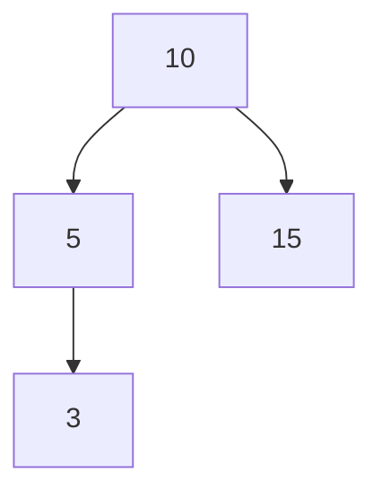

## 들어가며 (Situation)

[3편]()의 `List`는 순서가 있고 중복을 허용했습니다. 이번 `b_collection.b_set` 실습의 `Set`은 정반대로 **순서를 유지하지 않고 중복을 허용하지 않습니다.** 방문자 아이디에서 같은 사람을 한 번만 세는 것처럼 "중복 제거"가 필요할 때 쓰는 자료구조입니다.

> 실제 서비스에서 겪은 문제가 아니라, 개념 학습 중 정리한 내용입니다. 실행 결과는 JDK 21에서 직접 확인했습니다.

## 문제 상황 (Task)

- `Set`에 같은 값을 두 번 넣으면 에러가 날까요, 조용히 무시될까요?
- 순서가 없다면 `List`처럼 `get(0)`으로 꺼낼 수 없을 텐데, 어떻게 다룰까요?
- `HashSet`과 `TreeSet`은 둘 다 `Set`인데 무엇이 다를까요? 수업은 `TreeSet`으로 "로또 추첨기"를 만듭니다.

## 해결 과정 (Action)

### 1. HashSet: 중복 제거와 순서 없음

```java
Set<String> hset = new HashSet<>();
hset.add("java");
hset.add("db");
hset.add("servlet");
hset.add("spring");
hset.add("jpa");
hset.add("jpa");   // 중복
System.out.println("hset = " + hset);
```

```text
hset = [spring, java, servlet, jpa, db]
```

`jpa`는 한 번만 출력됐고, 입력 순서(java → db → servlet → ...)와 출력 순서가 달랐습니다. 중복 `add`가 에러인지는 수업 주석에 "false를 반환할 뿐"이라고 돼 있어서 직접 확인했습니다. (예시 코드)

```java
Set<String> s = new HashSet<>();
System.out.println(s.add("jpa"));
System.out.println(s.add("jpa"));
System.out.println(s.size());
```

```text
true
false
1
```

예외 없이 `false`를 돌려주고 크기도 늘지 않았습니다. 새로 들어갔는지 알아야 할 때 이 반환값을 쓸 수 있습니다.

`List`처럼 인덱스로 꺼내려 하면 어떨까요? (예시 코드)

```text
s.get(0);
→ error: cannot find symbol
    symbol:   method get(int)
    location: variable s of type Set<String>
```

`Set`에는 `get(index)` 자체가 없습니다. 값을 꺼낼 때는 향상된 for문으로 순회하거나 `contains`로 존재 여부를 확인합니다.

### 2. 시행착오 1: "순서가 없다"는 말의 정확한 의미

숫자를 넣으면 정렬돼 나올 것 같아서 `Integer`로도 실험했습니다. (예시 코드)

```java
// 입력 순서: 45, 3, 17, 100, 8, 26, 1000
```

| 구현체 | 출력 |
|--------|------|
| `HashSet<Integer>` | `[17, 3, 100, 8, 1000, 26, 45]` |
| `HashSet<String>` (java, db, servlet, spring, jpa) | `[spring, java, servlet, jpa, db]` |
| `LinkedHashSet<String>` (같은 입력) | `[java, db, servlet, spring, jpa]` |

숫자라고 해서 정렬되지 않았습니다. `HashSet`은 해시 값으로 저장 위치를 정하므로 검색/추가가 빠른 대신 순서를 보장하지 않습니다. 입력 순서를 유지하고 싶으면 `LinkedHashSet`을 씁니다. 단, 이 출력 순서는 JDK 구현에 따른 결과일 뿐 보장된 동작이 아니므로 순서에 의존하는 코드는 쓰면 안 됩니다.

### 3. 시행착오 2: 우리가 만든 클래스는 "중복"으로 인식될까?

3편의 `BookDTO`를 `Set`에 넣으면 같은 책이 걸러질까요? (예시 코드)

```java
Set<BookDTO> s = new HashSet<>();
s.add(new BookDTO(1, "a", "b", 3000));
s.add(new BookDTO(1, "a", "b", 3000));   // 필드 값이 완전히 같은 책
System.out.println(s.size());
```

```text
2
```

필드가 모두 같은데도 **2개**로 저장됐습니다. `String`, `Integer`는 `equals`/`hashCode`가 값을 기준으로 재정의돼 있지만, `BookDTO`는 재정의하지 않아 서로 다른 객체(주소)로 취급되기 때문입니다. `Set`의 "중복"은 `equals`/`hashCode`가 정의하는 동등성이라는 점을 알게 됐습니다.

### 4. TreeSet: 중복 제거 + 자동 정렬

수업의 로또 추첨기입니다.

```java
Set<Integer> lotto = new TreeSet<>();
while (lotto.size() < 7) {
    lotto.add((int)(Math.random() * 45) + 1);
}
System.out.println("lotto = " + lotto);
```

```text
lotto = [9, 12, 16, 17, 19, 31, 40]
```

몇 번을 실행해도 오름차순으로 나옵니다. `TreeSet`은 이진 검색 트리 구조로 정렬을 보장합니다.



수업 주석의 예시처럼 10, 5, 15, 3을 넣으면 "나보다 작으면 왼쪽, 크면 오른쪽" 규칙으로 위 모양이 되고, 왼쪽 → 루트 → 오른쪽 순으로 읽으면 3, 5, 10, 15로 자동 정렬됩니다.

| 항목 | `HashSet` | `TreeSet` |
|------|-----------|-----------|
| 내부 구조 | 해시 | 트리 |
| 정렬 | 보장 안 함 | 항상 정렬 |
| 속도 | 더 빠름 | 조금 느림 |
| 요소 조건 | `equals`/`hashCode` | 비교 가능해야 함 |

### 5. 로또 코드가 `for`가 아니라 `while`인 이유

`Set`은 중복 숫자를 버리므로, 7번 `add`해도 7개가 모인다는 보장이 없습니다. 그래서 "크기가 7이 될 때까지" 반복하는 `while`을 씁니다. 평균 몇 번 시도하는지 궁금해서 10만 번 돌려 봤습니다. (예시 코드)

```text
평균 시도 횟수 = 7.52 (최대 14회)
```

7개를 모으기 위해 평균 약 7.5번 `add`가 필요했습니다. 중복 때문에 평균적으로 0.5번 정도 더 돌렸다는 뜻입니다.

난수 식 `(int)(Math.random() * 45) + 1`은 `Math.random()`이 0 이상 1 미만이므로 × 45 하면 0 이상 45 미만, `(int)`로 0~44, `+ 1`로 1~45가 됩니다. 100만 번 뽑아 최솟값 1, 최댓값 45를 확인했습니다. (예시 코드)

### 6. 시행착오 3: 비교할 수 없는 객체는 TreeSet에 못 넣는다

`TreeSet<Integer>`는 되는데 `TreeSet<BookDTO>`는 어떨까요? (예시 코드)

```java
Set<BookDTO> s = new TreeSet<>();
s.add(new BookDTO(1, "a", "b", 3000));
```

```text
Exception in thread "main" java.lang.ClassCastException:
class BookDTO cannot be cast to class java.lang.Comparable
```

3편의 `Collections.sort` 에러와 뿌리가 같은데, 이번에는 **컴파일은 통과하고 런타임에** 터졌습니다. 정렬이 필요한 `TreeSet`은 요소가 `Comparable`이거나 생성 시 `Comparator`를 받아야 합니다.

## 결과 (Result)

- `Set`의 특징을 실행으로 검증했습니다. 중복 `add`는 예외 없이 `false`이고, `get(index)`는 컴파일 에러이며, `HashSet`의 출력 순서는 입력과 무관했습니다.
- `HashSet`/`LinkedHashSet`/`TreeSet`의 순서 차이를 같은 입력으로 비교표로 정리했습니다.
- 로또 7개를 모으는 데 평균 약 7.52번(10만 회 시뮬레이션) 시도하며, 최대 14회까지 필요했습니다. 따라서 `for`가 아닌 `while`이 맞다는 것을 수치로 확인했습니다.
- `BookDTO`처럼 `equals`/`hashCode`와 `Comparable`이 없는 클래스는 `Set`에서 각각 중복 판정(2건 저장)과 `ClassCastException`으로 이어진다는 점을 직접 재현했습니다.

## 더 학습하면 좋은 개념

- **`equals()`와 `hashCode()` 계약** — 3번 실험의 원인입니다. `HashSet`/`HashMap`의 동작 원리이며 두 메소드를 함께 재정의해야 하는 이유를 이해해야 합니다.
- **해시 테이블과 해시 충돌** — `HashSet`이 빠른 이유이자 순서가 보장되지 않는 이유입니다. `Map` 학습의 선수 지식입니다.
- **레드-블랙 트리 / 균형 이진 트리** — 수업에서는 이진 검색 트리라고 설명했는데, 한쪽으로 치우치면 느려지는 문제를 `TreeSet`이 어떻게 해결하는지 알아볼 만합니다. (구체적 구현은 공식 API 문서에서 확인하세요)
- **`Map` 인터페이스 (`HashMap`, `TreeMap`)** — 수업 개요에서 소개만 한 세 번째 컬렉션입니다. `Set`이 키 집합으로 구현돼 있다는 설명도 같이 이해할 수 있습니다.
- **`Comparable`과 `Comparator`** — 3편에서 언급한 대로, 정렬과 `TreeSet` 두 곳에서 반복해서 만난 개념입니다.

## 참고 자료

- [Oracle Java Tutorials - The Set Interface](https://docs.oracle.com/javase/tutorial/collections/interfaces/set.html)
- [Java SE 21 API - HashSet](https://docs.oracle.com/en/java/javase/21/docs/api/java.base/java/util/HashSet.html)
- [Java SE 21 API - TreeSet](https://docs.oracle.com/en/java/javase/21/docs/api/java.base/java/util/TreeSet.html)
- [Java SE 21 API - Object.equals / hashCode](https://docs.oracle.com/en/java/javase/21/docs/api/java.base/java/lang/Object.html)
- [Oracle Java Tutorials - Set Implementations](https://docs.oracle.com/javase/tutorial/collections/implementations/set.html)
