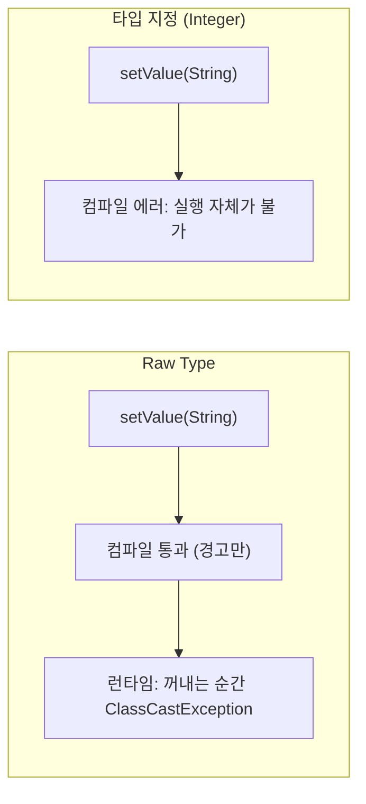

## 들어가며 (Situation)

`chap04-generic-and-collection` 실습은 크게 **제네릭(`a_generic`)** 과 **컬렉션(`b_collection`)** 두 덩어리입니다. 이 시리즈는 아래 4편으로 나눠 정리합니다.

| 편 | 주제 | 실습 패키지 |
|----|------|-------------|
| 1편 (이 글) | 제네릭 기초, Raw Type, Wrapper 클래스 | `a_generic.a_basic` |
| 2편 | 타입 제한(`extends`)과 와일드카드 | `a_generic.b_use` |
| 3편 | List / ArrayList / DTO | `b_collection.a_list` |
| 4편 | Set / HashSet / TreeSet | `b_collection.b_set` |

이 글에서는 `GenericTest<T>` 하나를 가지고 "타입을 미리 정해 두면 무엇이 달라지는가"를 직접 컴파일하고 실행해서 확인했습니다.

> 실제 서비스에서 겪은 문제가 아니라, 개념 학습 중 정리한 내용입니다. 에러 메시지는 JDK 21(`javac 21.0.12`)에서 직접 재현한 결과입니다.

## 문제 상황 (Task)

- 수업 코드의 `GenericTest`는 값을 하나 저장하고 꺼내는 클래스입니다. 왜 `Object` 대신 `T`를 쓸까요?
- `new GenericTest()`(타입 미지정)로 만들면 `1`도, `"안녕하세요"`도 들어갑니다. 편해 보이는데 왜 "실무에서는 쓰지 않는다"고 할까요?
- `GenericTest<int>`는 왜 안 되고 `GenericTest<Integer>`는 될까요?

## 해결 과정 (Action)

### 1. 제네릭 클래스의 구조

```java
public class GenericTest<T> {
    private T value;

    public T getValue() { return value; }
    public void setValue(T value) { this.value = value; }
}
```

클래스 선언부의 `<T>`는 **타입 변수**입니다. 수업 주석은 "나중에 정해질 타입의 이름표"라고 설명했고, 객체를 만들 때 `GenericTest<String>`이라고 쓰면 클래스 안의 `T`가 `String`으로 치환된다고 이해하면 쉽다고 했습니다. 관례 이름은 다음과 같습니다.

| 이름 | 의미 |
|------|------|
| `T` | Type |
| `E` | Element (컬렉션의 요소) |
| `K` / `V` | Key / Value |
| `N` | Number |

### 2. Raw Type으로 실행해 보기

타입을 지정하지 않고 만든 객체를 **Raw Type**이라고 부릅니다.

```java
GenericTest gt = new GenericTest();
gt.setValue(1);
System.out.println("gt = " + gt.getValue());
gt.setValue("안녕하세요");
System.out.println("gt = " + gt.getValue());
```

```text
gt = 1
gt = 안녕하세요
```

정상 실행됩니다. 이때 `T`는 `Object`로 취급되기 때문에 무엇이든 담깁니다. 여기까지만 보면 오히려 제네릭보다 유연해 보였습니다.

### 3. 타입을 지정하면 컴파일러가 막아 준다

```java
GenericTest<String> gt2 = new GenericTest<>();
gt2.setValue("문자열");   // OK
gt2.setValue(1);          // 수업 코드에서는 주석 처리된 줄
```

주석을 풀고 컴파일하면 실행도 하기 전에 막힙니다.

```text
error: incompatible types: int cannot be converted to String
```

`GenericTest<Integer>`에 `"문자열!!"`을 넣으면 `String cannot be converted to Integer`로 같은 종류의 에러가 납니다. 우변의 `<>`(다이아몬드 연산자)는 좌변의 타입을 보고 추론되므로 비워 둬도 됩니다. (Java 7 이상)

### 4. 시행착오: Raw Type은 "편한 것"이 아니라 "검사를 포기한 것"

Raw Type이 정확히 어떤 문제를 만드는지 수업 코드 밖에서 두 가지를 더 실험했습니다. (아래 코드는 모두 **예시 코드**입니다.)

**실험 A. 꺼낼 때 타입이 사라진다**

```java
GenericTest g = new GenericTest();
g.setValue("str");
String s = g.getValue();   // 컴파일 에러
```

```text
error: incompatible types: Object cannot be converted to String
```

Raw Type의 `getValue()`는 `Object`를 돌려주므로, 쓰려면 매번 `(String)` 캐스팅이 필요합니다.

**실험 B. 잘못된 타입이 조용히 섞여 들어간다**

```java
GenericTest g = new GenericTest();
g.setValue("str");                    // 경고만 나오고 컴파일 통과
GenericTest<Integer> h = g;           // 이것도 경고만
Integer i = h.getValue();             // 여기서 터진다
```

```text
Exception in thread "main" java.lang.ClassCastException:
class java.lang.String cannot be cast to class java.lang.Integer
```

컴파일은 통과하고(`unchecked` 경고만 출력), **엉뚱한 줄에서 런타임에 예외**가 났습니다. 잘못 넣은 곳(`setValue`)이 아니라 꺼내 쓰는 곳에서 터지기 때문에 원인 추적도 어렵습니다. 이것이 수업에서 말한 "꺼낼 때 '이게 뭐였더라?' 하고 헷갈려서 실행 중에 오류가 날 수 있다"의 실체였습니다.



| 항목 | Raw Type | 제네릭 지정 |
|------|----------|-------------|
| 담을 수 있는 타입 | 무엇이든 (`Object`) | 지정한 타입만 |
| 꺼낼 때 | 캐스팅 필요 | 캐스팅 불필요 |
| 잘못된 타입을 넣으면 | 경고만, 런타임 예외 | **컴파일 에러** |
| 에러 발견 시점 | 실행 중 (운이 나쁘면 운영 중) | 코딩/컴파일 중 |

### 5. 기본 자료형은 왜 안 되는가: Wrapper 클래스

```java
GenericTest<int> gt3 = new GenericTest<int>();
```

```text
error: unexpected type
  required: reference
  found:    int
```

`required: reference`라는 메시지가 이유를 그대로 말해 줍니다. 타입 변수 자리에는 **참조 자료형만** 올 수 있습니다. 그래서 기본 자료형 대신 Wrapper 클래스를 씁니다.

| 기본형 | Wrapper | 기본형 | Wrapper |
|--------|---------|--------|---------|
| `int` | `Integer` | `float` | `Float` |
| `byte` | `Byte` | `double` | `Double` |
| `short` | `Short` | `boolean` | `Boolean` |
| `long` | `Long` | `char` | `Character` |

```java
GenericTest<Integer> gt3 = new GenericTest<>();
gt3.setValue(1);   // int 1이 자동으로 Integer로 변환되어 저장
```

이 자동 변환을 **오토박싱**(Auto-boxing), 반대 방향을 **언박싱**(Auto-unboxing)이라고 합니다.

### 6. `toString()` 오버라이딩

`GenericTest`는 `toString()`을 재정의해 `GenericTest{value=...}` 형태로 출력합니다. 재정의하지 않으면 `클래스명@해시값` 형태의 주소 비슷한 문자열이 나옵니다. 컬렉션을 출력했을 때 값이 보이는 것(3편)도 같은 원리입니다.

## 결과 (Result)

- 제네릭의 효과를 "**에러 발견 시점을 런타임에서 컴파일 타임으로 당기는 것**"이라고 한 문장으로 정리했습니다.
- 직접 재현한 에러는 다음과 같이 시점이 갈립니다.

| 코드 | 에러 | 시점 |
|------|------|------|
| `GenericTest<String>`에 `setValue(1)` | `incompatible types` | 컴파일 |
| `GenericTest<int>` | `unexpected type` | 컴파일 |
| Raw Type 값을 `String`에 대입 | `Object cannot be converted to String` | 컴파일 |
| Raw Type을 `GenericTest<Integer>`로 받고 `getValue()` | `ClassCastException` | **런타임** |

- 정량 지표는 해당 사항이 없습니다.

## 더 학습하면 좋은 개념

- **타입 소거(Type Erasure)** — 제네릭 정보는 컴파일 후 사라지고 컴파일러가 캐스팅 코드를 삽입합니다. 실험 B에서 예외가 "꺼내는 줄"에서 난 이유가 이것이며, `new T()`가 안 되는 이유도 같습니다.
- **제네릭 메소드(`<T> T method(T t)`)** — 클래스 전체가 아니라 메소드 하나에만 타입 변수를 두는 방식입니다. 유틸리티 메소드를 만들 때 필요합니다.
- **제네릭의 불변성(Invariance)** — `Bunny`가 `Rabbit`의 자식이어도 `Box<Bunny>`는 `Box<Rabbit>`이 아닙니다. 2편의 와일드카드가 왜 필요한지 이해하는 출발점입니다.
- **오토박싱의 함정** — `null`인 `Integer`를 `int`로 언박싱하면 `NullPointerException`이 납니다. Wrapper를 쓸 때 반드시 알아야 합니다.

## 참고 자료

- [Oracle Java Tutorials - Generics (Why Use Generics?)](https://docs.oracle.com/javase/tutorial/java/generics/why.html)
- [Oracle Java Tutorials - Raw Types](https://docs.oracle.com/javase/tutorial/java/generics/rawTypes.html)
- [Oracle Java Tutorials - Type Erasure](https://docs.oracle.com/javase/tutorial/java/generics/erasure.html)
- [Oracle Java Tutorials - Autoboxing and Unboxing](https://docs.oracle.com/javase/tutorial/java/data/autoboxing.html)
