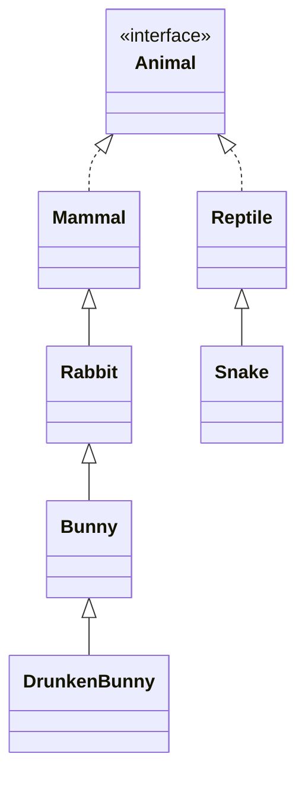
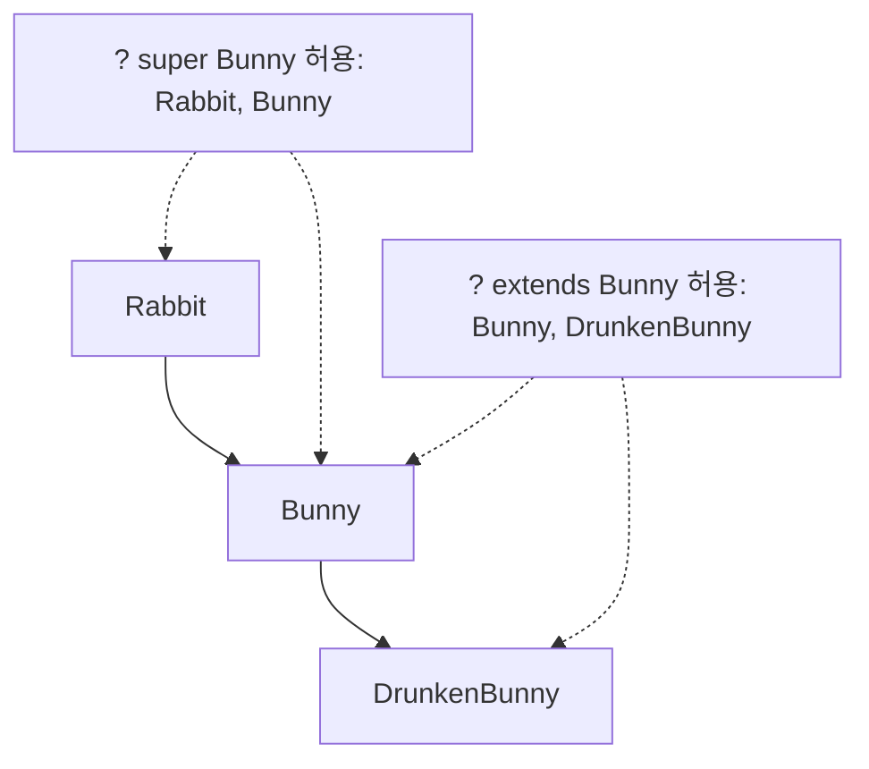

## 들어가며 (Situation)

[1편]()에서는 `<T>`로 타입을 미리 정하는 법을 다뤘습니다. 그런데 `<T>`만 쓰면 `T` 자리에 **무엇이든** 올 수 있습니다. 이번 `a_generic.b_use` 실습은 "토끼 농장"이라는 예제로 이 범위를 좁히는 두 가지 방법, **타입 제한(`T extends`)** 과 **와일드카드(`?`)** 를 다룹니다.

> 실제 서비스에서 겪은 문제가 아니라, 개념 학습 중 정리한 내용입니다. 에러 메시지는 JDK 21에서 직접 재현했습니다.

실습의 클래스 계층은 다음과 같습니다.



`Rabbit`, `Bunny`, `DrunkenBunny`는 각각 `cry()`를 오버라이딩해서 울음소리가 다릅니다.

## 문제 상황 (Task)

- 농장 클래스 `RabbitFarm<T>`가 있을 때, `RabbitFarm<Snake>`나 `RabbitFarm<String>`까지 만들어지면 곤란합니다.
- 농장 안에서 `animal.cry()`를 호출하고 싶은데, `T`가 무엇인지 모르면 컴파일러가 `cry()` 존재를 보장할 수 없습니다.
- `RabbitFarm<Bunny>`를 매개변수로 받는 메소드에 `RabbitFarm<DrunkenBunny>`도 넘기고 싶은데 가능할까요?

## 해결 과정 (Action)

### 1. 타입 제한: `T extends Rabbit`

```java
public class RabbitFarm<T extends Rabbit> {
    private T animal;
    public T getAnimal() { return animal; }
    public void setAnimal(T animal) { this.animal = animal; }
    public RabbitFarm() {}
    public RabbitFarm(T animal) { this.animal = animal; }
}
```

`extends Rabbit`는 "`Rabbit`이거나 `Rabbit`의 자손만 입장 가능"이라는 **입장 조건**(Bounded Type)입니다. 제네릭에서 `extends`는 클래스/인터페이스를 구분하지 않고 쓰입니다.

수업 코드에서 주석 처리돼 있던 `RabbitFarm<Mammal>`을 직접 컴파일해 봤습니다.

```text
error: type argument Mammal is not within bounds of type-variable T
  where T is a type-variable:
    T extends Rabbit declared in class RabbitFarm
```

`Snake`도 같은 에러입니다. `Mammal`은 `Animal`이긴 해도 `Rabbit` 계통이 아니고, `Snake`는 아예 다른 가지(`Reptile`)이기 때문입니다.

| 코드 | 결과 |
|------|------|
| `RabbitFarm<Rabbit>` | O |
| `RabbitFarm<Bunny>` | O |
| `RabbitFarm<DrunkenBunny>` | O |
| `RabbitFarm<Mammal>` | 컴파일 에러 (부모라서 범위 밖) |
| `RabbitFarm<Snake>` | 컴파일 에러 (다른 가지) |

제한 덕분에 `RabbitFarm` 내부에서 `T`가 최소 `Rabbit`임이 보장되고, 그래서 `getAnimal().cry()`를 안전하게 호출할 수 있습니다.

### 2. 부모 객체를 자식 농장에 넣을 수 없다

```java
RabbitFarm<Bunny> farm2 = new RabbitFarm<>();
farm2.setAnimal(new Rabbit());   // 주석 처리돼 있던 줄
```

```text
error: incompatible types: Rabbit cannot be converted to Bunny
```

`Bunny` 농장 입장에서 `Rabbit`은 "더 일반적인" 타입이라 받을 수 없습니다. 반대로 `DrunkenBunny`는 `Bunny`의 자식이라 들어갑니다.

```java
farm2.setAnimal(new DrunkenBunny());
farm2.getAnimal().cry();
```

```text
ㅂ아ㅏ니ㅏㅂ아ㅣ니ㅣ 당근..근당근
```

변수 타입은 `Bunny`이지만 실제 객체가 `DrunkenBunny`라서 `DrunkenBunny.cry()`가 실행됩니다. 이 부분은 이전에 정리한 다형성(동적 바인딩) 그대로입니다.

### 3. 시행착오: "Bunny는 Rabbit인데 `RabbitFarm<Bunny>`는 `RabbitFarm<Rabbit>`이 아니다?"

처음에는 `Bunny`가 `Rabbit`의 자식이니 농장도 대입이 될 거라고 생각했습니다. 직접 해 보니 아니었습니다. (예시 코드)

```java
RabbitFarm<Bunny> g = new RabbitFarm<>();
RabbitFarm<Rabbit> x = g;
```

```text
error: incompatible types: RabbitFarm<Bunny> cannot be converted to RabbitFarm<Rabbit>
```

제네릭 타입은 타입 인자 사이에 상속 관계가 있어도 **서로 대입되지 않습니다**(불변성). 그렇다면 "`Bunny` 이하 농장이면 아무거나 받는 메소드"는 어떻게 만들까요? 이때 쓰는 것이 와일드카드입니다.

### 4. 와일드카드 3종

`WildcardFarm`은 매개변수로 농장을 받는 메소드 세 개를 가집니다.

```java
public void anyType(RabbitFarm<?> farm)              { farm.getAnimal().cry(); }
public void extendsType(RabbitFarm<? extends Bunny> farm) { farm.getAnimal().cry(); }
public void superType(RabbitFarm<? super Bunny> farm)     { farm.getAnimal().cry(); }
```

| 표기 | 이름 | 허용 범위 | 외우는 법 |
|------|------|-----------|-----------|
| `<?>` | 제한 없음 | 모든 타입 (여기서는 `T extends Rabbit` 덕에 Rabbit 계통) | - |
| `<? extends Bunny>` | 상한 제한 | `Bunny`, `DrunkenBunny` | "~까지 **내려간다**" |
| `<? super Bunny>` | 하한 제한 | `Bunny`, `Rabbit` | "~까지 **올라간다**" |

실제 실행 결과는 수업 설명과 일치했습니다.

```text
===== anyType: Rabbit / Bunny / DrunkenBunny 모두 통과 =====
토끼가 울부짖습니다. 끾끾!
바니바니 당근당근
ㅂ아ㅏ니ㅏㅂ아ㅣ니ㅣ 당근..근당근
===== extendsType: Bunny / DrunkenBunny =====
바니바니 당근당근
ㅂ아ㅏ니ㅏㅂ아ㅣ니ㅣ 당근..근당근
===== superType: Rabbit / Bunny =====
토끼가 울부짖습니다. 끾끾!
바니바니 당근당근
```

(구분선은 보기 좋게 줄였고, 출력 내용은 실제 실행 결과 그대로입니다.)

범위를 벗어난 호출은 모두 컴파일 에러였습니다.

```text
extendsType(new RabbitFarm<Rabbit>(...))
→ RabbitFarm<Rabbit> cannot be converted to RabbitFarm<? extends Bunny>

superType(new RabbitFarm<DrunkenBunny>(...))
→ RabbitFarm<DrunkenBunny> cannot be converted to RabbitFarm<? super Bunny>
```



### 5. 시행착오 2: 와일드카드를 받으면 "넣기"가 막힌다

수업 코드는 와일드카드 매개변수에서 `getAnimal()`(꺼내기)만 호출합니다. 넣기(`setAnimal`)는 어떨까 궁금해서 시도해 봤습니다. (예시 코드)

```java
static void f(RabbitFarm<? extends Bunny> farm) {
    farm.setAnimal(new Bunny());
}
```

```text
error: incompatible types: Bunny cannot be converted to CAP#1
  where CAP#1 is a fresh type-variable:
    CAP#1 extends Bunny from capture of ? extends Bunny
```

`? extends Bunny`의 실제 타입이 `Bunny`인지 `DrunkenBunny`인지 컴파일러는 모릅니다. `DrunkenBunny` 농장에 `Bunny`를 넣을 수는 없으니 **아무것도 넣을 수 없게** 막은 것입니다. 반대로 `? super Bunny`는 어떨까요?

| 시도 (`RabbitFarm<? super Bunny> farm`) | 결과 |
|------|------|
| `farm.setAnimal(new Bunny())` | O (실제 타입이 `Bunny` 이상이므로 `Bunny`는 항상 들어감) |
| `farm.setAnimal(new Rabbit())` | **컴파일 에러** (`Rabbit cannot be converted to CAP#1`) |
| `Bunny b = farm.getAnimal()` | **컴파일 에러** (`CAP#1 cannot be converted to Bunny`) |
| `farm.getAnimal().cry()` | O (`T extends Rabbit` 제한 덕에 최소 `Rabbit`) |

마지막 줄이 `WildcardFarm.superType()`이 컴파일되는 이유입니다. 에러 메시지의 `CAP#1 extends Rabbit super: Bunny`가 "클래스 선언의 상한(`Rabbit`)과 와일드카드의 하한(`Bunny`)이 함께 적용된 타입"임을 보여 줬습니다. 수업 주석("T는 원래 Rabbit 이상으로 제한되어 있다")을 컴파일러 메시지로 확인한 셈입니다.

정리하면 `extends`는 **꺼내기 전용**, `super`는 **넣기 위주**로 쓰는 것이 자연스럽습니다.

## 결과 (Result)

- `<T>` → `<T extends Rabbit>` → `<?>`/`<? extends>`/`<? super>`로 "받을 수 있는 범위"를 단계적으로 좁히는 도구를 비교표로 정리했습니다.
- 수업 코드에서 주석 처리돼 있던 에러 4건(`RabbitFarm<Mammal>`, `setAnimal(Rabbit)`, `extendsType(Rabbit 농장)`, `superType(DrunkenBunny 농장)`)을 모두 직접 재현하고 메시지를 확인했습니다.
- 수업 범위 밖이지만 제네릭 불변성(`RabbitFarm<Bunny>` ≠ `RabbitFarm<Rabbit>`)과 와일드카드의 읽기/쓰기 제약을 실험으로 확인했습니다.
- 정량 지표는 해당 사항이 없습니다.

## 더 학습하면 좋은 개념

- **PECS 원칙 (Producer Extends, Consumer Super)** — 이번 실험의 읽기/쓰기 제약을 한 줄로 요약한 규칙입니다. 값을 꺼내 쓰면 `extends`, 넣으면 `super`입니다. `Collections.copy` 같은 JDK 메소드 시그니처가 읽힙니다.
- **캡처 변환(Capture Conversion)** — 에러 메시지의 `CAP#1`이 무엇인지 설명해 주는 개념입니다. 와일드카드 에러를 읽을 수 있게 됩니다.
- **다중 경계(`T extends A & B`)** — 클래스와 인터페이스를 동시에 요구할 때 씁니다. 타입 제한의 다음 단계입니다.
- **제네릭 메소드의 타입 추론** — `<T extends Comparable<T>> T max(T a, T b)` 같은 형태입니다. 4편에서 `TreeSet`이 `Comparable`을 요구하는 이유와도 이어집니다.

## 참고 자료

- [Oracle Java Tutorials - Bounded Type Parameters](https://docs.oracle.com/javase/tutorial/java/generics/bounded.html)
- [Oracle Java Tutorials - Generics, Inheritance, and Subtypes](https://docs.oracle.com/javase/tutorial/java/generics/inheritance.html)
- [Oracle Java Tutorials - Wildcards](https://docs.oracle.com/javase/tutorial/java/generics/wildcards.html)
- [Oracle Java Tutorials - Upper Bounded Wildcards](https://docs.oracle.com/javase/tutorial/java/generics/upperBounded.html)
- [Oracle Java Tutorials - Lower Bounded Wildcards](https://docs.oracle.com/javase/tutorial/java/generics/lowerBounded.html)
- [Oracle Java Tutorials - Wildcard Capture](https://docs.oracle.com/javase/tutorial/java/generics/capture.html)
