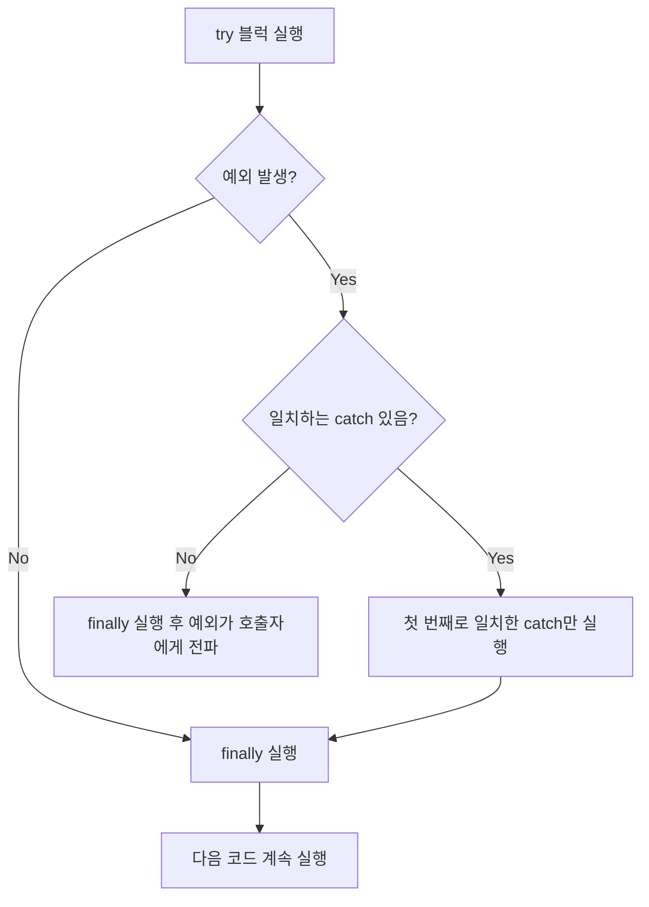
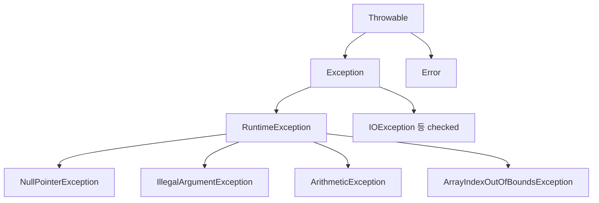

## 들어가며 (Situation)

5챕터는 예외(Exception)와 파일 입출력입니다. 이번 글은 `a_exception`의 `a_basic`과 `b_solved` 실습을 다룹니다. 예외를 처리하지 않으면 프로그램이 어떻게 끝나는지 먼저 보고, `try-catch-finally`와 `throw`로 그 흐름을 바꿔 봅니다.

> 실제 서비스에서 겪은 문제가 아니라, 개념 학습 중 정리한 내용입니다. 에러 메시지와 출력은 JDK 21에서 직접 재현했습니다.

## 문제 상황 (Task)

- 수업 주석은 컴파일 오류와 런타임 오류를 구분합니다. 둘은 언제, 어떻게 다르게 드러날까요?
- `a_basic`의 마지막 줄 `"프로그램 종료..."`는 왜 출력되지 않을까요?
- `catch`를 여러 개 쓸 때 순서가 중요하다는데, 틀리면 어떻게 될까요?
- `throw`와 `throws`는 이름이 비슷한데 무엇이 다를까요?

## 해결 과정 (Action)

### 1. 처리하지 않은 예외: 그 줄에서 프로그램이 끝난다

`a_basic`의 핵심 부분입니다.

```java
System.out.println("프로그램 시작...");
int[] iarr = new int[5];
System.out.println("6번째 인덱스 출력 : " + iarr[6]);   // 예외 발생
// ... 이후 코드
System.out.println("프로그램 종료...");
```

```text
프로그램 시작...
Exception in thread "main" java.lang.ArrayIndexOutOfBoundsException: Index 6 out of bounds for length 5
	at C.main(C.java:4)
```

`"프로그램 종료..."`는 출력되지 않았습니다. 예외가 발생한 줄에서 `main`이 중단되고, 콘솔에는 예외 종류와 발생 위치(스택 트레이스)가 남습니다. 수업 코드 그대로는 `iarr[6]`에서 끝나기 때문에, 그 아래 `NullPointerException` 예제는 실행조차 되지 않는다는 점도 알게 됐습니다.

| 구분 | 컴파일 오류 | 런타임 오류 |
|------|-------------|-------------|
| 발견 시점 | 실행 전 (IDE 빨간 줄) | 실행 중 |
| `.class` 생성 | 안 됨 | 됨 |
| 예 | 없는 변수 참조, 타입 불일치 | 배열 범위 초과, `null` 접근, 0으로 나누기 |

### 2. try-catch-finally

```java
try {
    String str = null;
    str.length();
} catch (ArithmeticException e) {
    System.out.println("예외 메세지 = " + e.getMessage());
} catch (NullPointerException e) {
    System.out.println("예외 메세지 = " + e.getMessage());
} finally {
    System.out.println("예외 발생 여부와 관계 없이 실행됨..");
}
```

실행 흐름은 이렇습니다.



예외가 나면 `try` 안의 **그 줄 아래 코드는 건너뛰고** 타입이 맞는 `catch`로 이동합니다. 이번 예제는 `NullPointerException`이므로 두 번째 `catch`가 실행되고, 프로그램은 비정상 종료되지 않고 이어집니다. 이것이 `a_basic`과의 차이입니다.

### 3. 시행착오 1: `getMessage()`가 가리키는 이름

`NullPointerException`의 메시지를 직접 찍어 봤습니다.

```text
Cannot invoke "String.length()" because "<local8>" is null
```

변수 이름 대신 `<local8>`이 나왔습니다. 제가 명령줄 `javac`로 컴파일해서 변수 이름 정보(디버그 정보)가 클래스에 없었기 때문입니다. 이름을 보고 싶으면 `javac -g`로 컴파일해야 합니다. IDE는 보통 이 정보를 포함해 빌드하는 것으로 알고 있지만 환경마다 다를 수 있으니, IDE에서 실행한 결과가 다르다면 설정을 확인해 보세요.

### 4. 시행착오 2: catch 순서를 거꾸로 쓰면

수업 주석은 "부모 타입은 자식보다 아래에 써야 한다"고 합니다. 일부러 반대로 써 봤습니다. (예시 코드)

```java
try {
    String s = null; s.length();
} catch (Exception e) {
} catch (NullPointerException e) {
}
```

```text
error: exception NullPointerException has already been caught
```

실행 중 문제가 아니라 **컴파일 에러**입니다. 위의 `Exception`이 이미 모든 예외를 잡으므로 아래 `catch`는 도달할 수 없기 때문입니다. 순서를 바로잡는 것만으로 해결됩니다.

### 5. 시행착오 3: finally는 정말 "항상" 실행될까?

`return`이 있어도 실행되는지 궁금해서 확인했습니다. (예시 코드)

```java
static int f() {
    try { return 1; }
    finally { System.out.println("finally"); }
}
```

```text
finally
1
```

`try`에서 `return`을 만나도 `finally`가 먼저 실행된 뒤 값이 반환됩니다. 그래서 파일/DB 연결 해제 같은 "반드시 해야 하는 마무리"를 여기에 둡니다. 다만 `finally` 안에서 `return`을 쓰면 `try`의 반환값이나 예외를 덮어쓸 수 있으므로 피하는 것이 좋습니다. (이 부분은 직접 실험하지 않았으니 [Java 언어 명세](https://docs.oracle.com/javase/specs/jls/se21/html/jls-14.html#jls-14.20.2)에서 확인해 보세요.)

### 6. throw와 throws, 그리고 호출자에게 넘기기

`b_solved`의 `checkAge`는 예외를 **직접 만들어 던집니다**.

```java
public static void checkAge(int age) {
    if (age < 0) {
        throw new IllegalArgumentException("나이는 음수일 수 없습니다!");
    }
    System.out.println("전달 받은 " + age + " 는 유효한 나이입니다!");
}
```

```java
try {
    checkAge(-10);
} catch (IllegalArgumentException e) {
    System.out.println("e.getMessage() = " + e.getMessage());
}
```

```text
e.getMessage() = 나이는 음수일 수 없습니다!
```

| 키워드 | 위치 | 역할 |
|--------|------|------|
| `throw` | 메소드 **안** | 예외 객체를 만들어 실제로 던진다 |
| `throws` | 메소드 **선언부** | 이 메소드가 던질 수 있는 예외를 알린다 |

던져진 순간 `checkAge`는 즉시 중단되므로 `"유효한 나이입니다!"` 줄은 실행되지 않습니다. 처리 책임은 호출한 쪽(`main`)으로 넘어갑니다.

### 7. 시행착오 4: checked와 unchecked

`IllegalArgumentException`은 `throws`를 쓰지 않아도 컴파일됐는데, 수업 주석은 `RuntimeException`의 자식(unchecked)이기 때문이라고 설명합니다. 반대로 `Exception`을 직접 상속한 예외(checked)는 어떻게 될까요? (예시 코드)

```java
static class N extends Exception { N(String m) { super(m); } }
static void f() throws N { throw new N("x"); }
public static void main(String[] a) { f(); }
```

```text
error: unreported exception N; must be caught or declared to be thrown
```



| 구분 | 상속 | 컴파일러의 처리 강제 | 예 |
|------|------|----------------------|-----|
| checked | `Exception` (RuntimeException 제외) | 강제 (`try-catch` 또는 `throws`) | `IOException` |
| unchecked | `RuntimeException` | 강제 안 함 | `NullPointerException` |

또, 던져질 수 없는 checked 예외를 `catch`에 쓰는 것도 막혔습니다. (예시 코드)

```text
error: exception N is never thrown in body of corresponding try statement
```

## 결과 (Result)

- 처리하지 않은 예외는 그 줄에서 프로그램을 종료시키고, 이후 코드(`"프로그램 종료..."`)는 실행되지 않음을 직접 확인했습니다.
- `try-catch-finally`의 흐름(첫 번째로 일치하는 `catch`만 실행, `finally`는 항상 실행)을 다이어그램으로 정리했습니다.
- `catch` 순서 오류(`has already been caught`), 처리 누락(`unreported exception`), 던져지지 않는 checked 예외(`is never thrown`)를 세 가지 **컴파일 에러**로 재현해 각각의 원인을 구분했습니다.
- `throw`(던지기)와 `throws`(선언)의 위치 차이, checked/unchecked의 강제 여부 차이를 표로 정리했습니다.

## 더 학습하면 좋은 개념

- **스택 트레이스 읽는 법** — 예외가 어느 호출 경로를 거쳐 발생했는지 위에서 아래로 읽는 법을 익히면 디버깅이 빨라집니다.
- **`try-with-resources`와 `AutoCloseable`** — `finally`에서 `close()`를 직접 부르는 방식의 단점을 보완합니다. 다음 File IO 편에서 이어집니다.
- **예외 연쇄(Exception Chaining, `cause`)** — 예외를 감싸 다시 던질 때 원인을 잃지 않는 방법입니다.
- **`Error`와 `Exception`의 차이** — `OutOfMemoryError` 같은 `Error`는 왜 보통 잡지 않는지 이해하면 처리 범위 판단이 쉬워집니다.
- **예외 처리 전략(빠르게 실패하기, 예외로 흐름 제어 지양)** — 어디서 잡고 어디서 넘길지 설계하는 기준이 됩니다.

## 참고 자료

- [Oracle Java Tutorials - Exceptions](https://docs.oracle.com/javase/tutorial/essential/exceptions/index.html)
- [Oracle Java Tutorials - The try Block / The finally Block](https://docs.oracle.com/javase/tutorial/essential/exceptions/finally.html)
- [Oracle Java Tutorials - Unchecked Exceptions: The Controversy](https://docs.oracle.com/javase/tutorial/essential/exceptions/runtime.html)
- [Java SE 21 API - Throwable](https://docs.oracle.com/en/java/javase/21/docs/api/java.base/java/lang/Throwable.html)
- [Java Language Specification 21 - Chapter 11. Exceptions](https://docs.oracle.com/javase/specs/jls/se21/html/jls-11.html)
