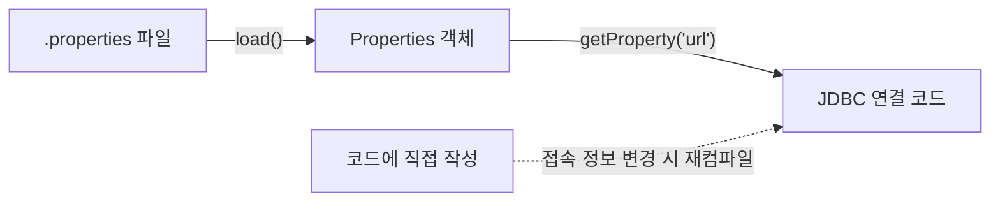

## 들어가며 (Situation)

[Set 편]()에서 "중복 없는 모음"을 다뤘다면, 이번 `b_collection.c_map` 실습의 `Map`은 **키-값(Key-Value) 한 쌍**으로 데이터를 저장합니다. 번호(인덱스)가 아니라 이름(키)으로 값을 바로 찾고 싶을 때 쓰는 자료구조입니다.

> 실제 서비스에서 겪은 문제가 아니라, 개념 학습 중 정리한 내용입니다. 실행 결과는 JDK 21에서 직접 확인했습니다.

## 문제 상황 (Task)

- 수업 주석에 "Key는 내부적으로 Set 방식"이라고 돼 있습니다. 같은 키를 두 번 `put`하면 에러일까요, 덮어쓸까요?
- 제네릭 없이 `Map`을 쓰면(Raw Type) 무엇이 위험할까요?
- `Properties`는 `Map`과 무엇이 같고 무엇이 다를까요? 왜 DB 접속 정보를 여기에 담을까요?

## 해결 과정 (Action)

### 1. HashMap 기본 동작

수업 코드의 제네릭 버전입니다.

```java
Map<String, String> map2 = new HashMap<>();
map2.put("one", "java");
map2.put("two", "javascript");
map2.put("three", "python");
map2.remove("three");
```

`Map`은 인터페이스라 `new Map()`은 안 되고, 대표 구현체인 `HashMap`으로 만듭니다. 뒤쪽 `<>`(다이아몬드 연산자)는 앞쪽 선언을 보고 타입을 추론합니다.

### 2. 같은 키를 두 번 넣으면? (직접 확인)

수업은 `put(12, "apple")` 뒤에 `put(12, "banana")`를 넣고 `get(12)`가 `banana`라는 것까지만 보여 줍니다. `put`의 반환값이 궁금해서 추가로 실험했습니다. (예시 코드)

```java
System.out.println(m.put("one", "kotlin"));   // 이미 있는 키
System.out.println(m.put("four", "c"));       // 새 키
System.out.println(m.get("zzz"));             // 없는 키
System.out.println(m.remove("three"));        // 있는 키 삭제
System.out.println(m.remove("nokey"));        // 없는 키 삭제
```

```text
java
null
null
python
null
```

| 호출 | 동작 | 반환값 |
|------|------|--------|
| `put` (기존 키) | 값을 **덮어씀**, 예외 없음 | 이전 값 (`java`) |
| `put` (새 키) | 새로 추가 | `null` |
| `get` (없는 키) | 아무 일도 없음 | `null` |
| `remove` (있는 키) | 키-값 쌍 삭제 | 삭제된 값 |
| `remove` (없는 키) | 아무 일도 없음 | `null` |

`put`이 이전 값을 돌려주므로 "덮어썼는지"를 알 수 있습니다. 다만 `get`이 `null`을 반환했을 때 "키가 없다"와 "값이 `null`이다"를 구분할 수 없으니, 존재 확인은 `containsKey`를 쓰는 것이 정확합니다. 기본값이 필요하면 `getOrDefault("zzz", "기본")`이 `null` 검사를 줄여 줍니다.

### 3. 시행착오: 순서와 `null`, 그리고 우리가 만든 클래스

**순서.** 수업 주석은 "저장 순서가 보장되지 않는다"고 합니다. 이번 실행에서는 `{one=java, two=javascript, three=python}`로 입력 순서와 우연히 같았지만, 이는 보장된 동작이 아니라 해시 값에 따른 결과일 뿐입니다. 순서가 필요하면 구현체를 바꿉니다. (예시 코드)

| 구현체 | 특징 | 출력 예 |
|--------|------|---------|
| `HashMap` | 순서 보장 안 함, 가장 일반적 | - |
| `LinkedHashMap` | 입력 순서 유지 | `{z=1, a=2}` |
| `TreeMap` | 키 기준 정렬 | `{four=c, one=kotlin, two=javascript}` |

**`null`.** `HashMap`은 `null` 키와 `null` 값을 허용했습니다.

```java
n.put(null, "v");
n.put("k", null);
System.out.println(n);   // {null=v, k=null}
```

하지만 `TreeMap`은 정렬을 위해 키를 비교하므로 `null` 키에서 예외가 났습니다.

```text
java.lang.NullPointerException: Cannot invoke "java.lang.Comparable.compareTo(Object)" because "k1" is null
```

**우리가 만든 클래스를 키로 쓰면.** Set 편의 `equals`/`hashCode` 문제가 `Map`에서도 똑같이 나타납니다. (예시 코드)

```java
Map<Book, String> bm = new HashMap<>();
bm.put(new Book(1), "a");
bm.put(new Book(1), "b");   // 필드 값은 같은 책
System.out.println(bm.size());
```

```text
2
```

`equals`/`hashCode`를 재정의하지 않은 클래스는 값이 같아도 서로 다른 키가 됩니다. "Key는 Set 방식"이라는 설명이 바로 이 의미입니다. 키로 쓸 클래스는 `String`, `Integer`처럼 값 기준 동등성을 갖춰야 합니다.

### 4. 시행착오: Raw Type의 위험

수업의 첫 예제는 제네릭 없는 `Map`입니다. 키로 `"one"`도, `12`도 넣을 수 있는 대신 꺼낼 때 형변환이 필요합니다. 값을 잘못 짐작하면 이렇게 됩니다. (예시 코드)

```java
Map r2 = new HashMap();
r2.put(1, "x");
Integer i = (Integer) r2.get(1);
```

```text
class java.lang.String cannot be cast to class java.lang.Integer
```

컴파일러는 통과시키고 **실행 중에** `ClassCastException`이 납니다. 제네릭을 지정하면(`Map<Integer, String>`) 같은 실수가 컴파일 단계에서 걸립니다. [제네릭 기초 편]()에서 본 내용이 `Map`에서도 그대로 적용됩니다.

### 5. 키-값 순회

`Set`처럼 `Map`에도 `get(index)`가 없으니 순회는 `entrySet()`을 씁니다. (예시 코드)

```java
for (Map.Entry<String, String> e : m.entrySet()) {
    System.out.println(e.getKey() + "=" + e.getValue());
}
```

### 6. Properties: 문자열 전용 Map

`Properties`는 `Hashtable`을 상속하므로 `Map` 계열이지만, 키와 값이 모두 `String`인 설정값 전용입니다. 수업은 JDBC 접속 정보를 예로 듭니다.

```java
Properties prop = new Properties();
prop.setProperty("driver", "cj.jdbc.driver.mysql");
prop.setProperty("url", "jdbc:mysql://localhost/menudb");
prop.setProperty("username", "wanted");
prop.setProperty("password", "wanted");
```



설정을 파일로 분리하면 접속 정보가 바뀌어도 코드를 고치고 다시 컴파일하지 않아도 됩니다. 다만 수업의 `password`처럼 실제 비밀번호를 저장소에 올려서는 안 되니, 이런 파일은 `.gitignore`에 넣는 습관이 필요하다고 느꼈습니다.

`Properties`만의 메소드도 확인했습니다. (예시 코드)

```java
p.getProperty("url");              // jdbc:x
p.getProperty("nokey");            // null
p.getProperty("nokey", "dflt");    // dflt (기본값)
p.put("num", 1);                   // Map 의 put 은 문자열이 아니어도 컴파일됨
p.getProperty("num");              // null !
```

마지막 줄이 함정이었습니다. `Properties`가 `Map`이라 `put(key, 정수)`는 컴파일되지만, `getProperty`는 문자열 값만 반환하므로 `null`이 나옵니다. 설정값은 `setProperty`/`getProperty` 쌍으로 쓰는 것이 안전합니다.

## 결과 (Result)

- 같은 키를 `put`하면 예외 없이 덮어쓰고 이전 값을 반환한다는 것, 없는 키 `get`/`remove`는 `null`이라는 것을 실행으로 확인했습니다.
- `HashMap`/`LinkedHashMap`/`TreeMap`을 순서와 `null` 허용 여부로 비교했습니다. (`TreeMap`의 `null` 키는 `NullPointerException`)
- `equals`/`hashCode`가 없는 클래스를 키로 쓰면 같은 값의 키 2개가 저장됨(`size() == 2`)을 재현했습니다.
- Raw Type의 위험이 컴파일 에러가 아닌 런타임 `ClassCastException`으로 나타나는 것을 확인했습니다.
- `Properties`에 `put`으로 넣은 비문자열 값은 `getProperty`로 읽히지 않는다는 점을 알게 됐습니다.

## 더 학습하면 좋은 개념

- **해시 테이블과 해시 충돌** — `HashMap`이 빠른 이유이자 순서를 보장하지 않는 이유입니다. 같은 해시 값을 가진 키가 만나면 어떻게 처리하는지 알면 `hashCode` 재정의의 의미가 분명해집니다.
- **`equals()`와 `hashCode()` 계약** — 3번 실험의 원인입니다. 키로 쓰는 클래스에 반드시 필요한 개념입니다.
- **`ConcurrentHashMap`** — `HashMap`은 여러 스레드가 동시에 수정하면 안전하지 않습니다. 멀티스레드 환경의 선택지입니다.
- **`try-with-resources`와 `Properties.load()`** — 설정 파일을 실제로 읽어 오는 방법입니다. 이어지는 File IO 편과 연결됩니다.
- **환경변수와 설정 분리(12-Factor App)** — 접속 정보를 코드 밖으로 빼는 이유를 일반 원칙으로 확장해 볼 수 있습니다.

## 참고 자료

- [Oracle Java Tutorials - The Map Interface](https://docs.oracle.com/javase/tutorial/collections/interfaces/map.html)
- [Java SE 21 API - Map](https://docs.oracle.com/en/java/javase/21/docs/api/java.base/java/util/Map.html)
- [Java SE 21 API - HashMap](https://docs.oracle.com/en/java/javase/21/docs/api/java.base/java/util/HashMap.html)
- [Java SE 21 API - TreeMap](https://docs.oracle.com/en/java/javase/21/docs/api/java.base/java/util/TreeMap.html)
- [Java SE 21 API - Properties](https://docs.oracle.com/en/java/javase/21/docs/api/java.base/java/util/Properties.html)
