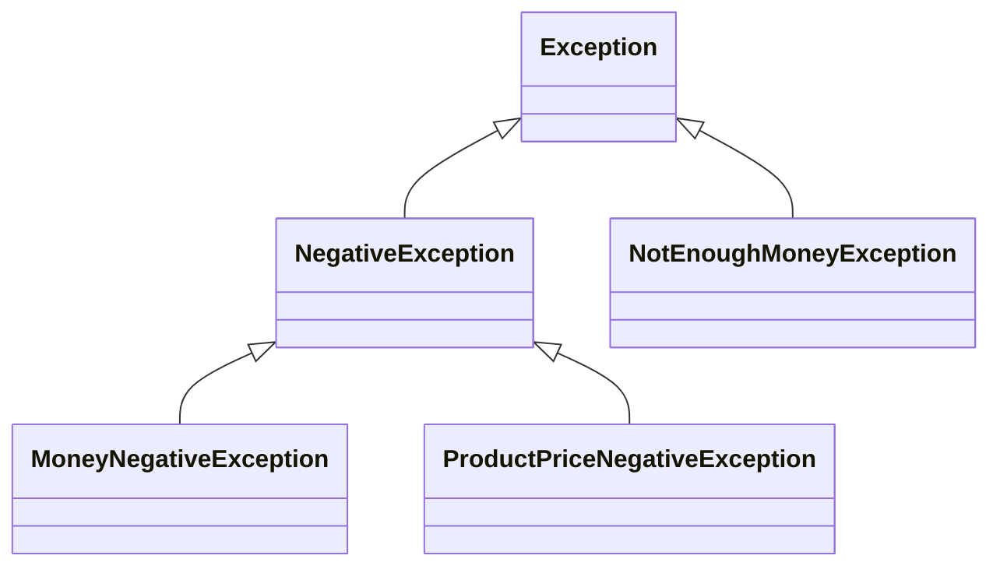
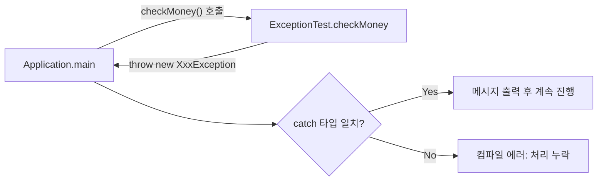

## 들어가며 (Situation)

[앞 글]()에서는 JDK가 제공하는 예외를 `try-catch`로 처리했습니다. 이번 `a_exception.c_userexception` 실습은 **직접 예외 클래스를 만드는** 방법입니다. 상품 가격과 가진 돈을 받아 구매 가능 여부를 검사하는 작은 프로그램입니다.

> 실제 서비스에서 겪은 문제가 아니라, 개념 학습 중 정리한 내용입니다. 출력은 수업 클래스를 그대로 컴파일해 JDK 21에서 확인했습니다.

## 문제 상황 (Task)

수업 프로그램의 검사 조건은 세 가지입니다.

1. 상품 가격이 음수
2. 가진 돈이 음수
3. 가진 돈이 상품 가격보다 부족

- 셋 다 `IllegalArgumentException("...")`으로 던져도 동작은 합니다. 그런데 왜 굳이 클래스를 3~4개나 만들까요?
- `NegativeException`이라는 부모를 따로 둔 이유는 무엇일까요?

## 해결 과정 (Action)

### 1. 대안 비교: 기존 예외 재사용 vs 사용자 정의

| 항목 | `IllegalArgumentException` 재사용 | 사용자 정의 예외 |
|------|-----------------------------------|------------------|
| 클래스 작성 | 필요 없음 | 필요 |
| 원인 구분 | 메시지 문자열을 파싱해야 함 | **타입**으로 구분 |
| `catch` 분기 | 한 덩어리로 잡힘 | 상황별로 다른 처리 가능 |
| 처리 강제 | 없음 (unchecked) | `Exception` 상속 시 강제 (checked) |
| 이름의 의미 | 일반적 | 도메인 의미를 담음 |

수업 주석의 표현으로는 JDK 예외는 "현실 세계의 수많은 예외를 처리하기에는 너무 추상적이고 제한적"입니다. 메시지 문자열로 원인을 구분하면 오타 하나로 분기가 깨지지만, 타입은 컴파일러가 검사해 줍니다.

### 2. 예외 클래스 만들기

모든 예외의 기본 형태는 메시지를 받아 부모 생성자로 넘기는 것입니다.

```java
public class NegativeException extends Exception {
    public NegativeException(String message) {
        super(message);
    }
}
```

`super(message)`로 넘긴 문자열은 `Exception`이 보관하고, 나중에 `getMessage()`로 꺼냅니다. 이 부모를 두 자식이 상속합니다.

```java
public class MoneyNegativeException extends NegativeException { ... }
public class ProductPriceNegativeException extends NegativeException { ... }
public class NotEnoughMoneyException extends Exception { ... }   // 별도 계열
```



"음수 입력"은 잘못된 입력이고 "돈 부족"은 정상 입력에서의 업무 규칙 위반이라 성격이 다르다고 보고, `NotEnoughMoneyException`은 `NegativeException` 계열에 넣지 않았습니다. 이 분류 기준이 예외 설계의 핵심이라고 느꼈습니다.

### 3. 던지는 쪽: throws로 선언하기

```java
public void checkMoney(int productPrice, int money)
        throws ProductPriceNegativeException, MoneyNegativeException, NotEnoughMoneyException {

    if (productPrice < 0) throw new ProductPriceNegativeException("상품의 가격은 음수일 수 없습니다!!!");
    if (money < 0)        throw new MoneyNegativeException("가진 돈이 음수일 수 없습니다!!");
    if (money < productPrice) throw new NotEnoughMoneyException("가진 돈 보다 상품의 가격이 더 비싸요..");

    System.out.println("가진 돈이 충분합니다.~~ 즐거운 쇼핑 하세요~~");
}
```

검사 순서가 의미를 가집니다. **잘못된 입력(음수)을 먼저** 걸러야, 돈 비교가 음수 때문에 엉뚱한 결과를 내지 않습니다. `throw`가 실행되면 메소드가 즉시 끝나므로 `else` 없이도 아래 검사로 내려가지 않습니다.

### 4. 받는 쪽: 네 가지 입력으로 실행

수업은 `checkMoney(50000, 30000)` 한 가지만 호출합니다. 나머지 경로도 궁금해서 네 입력을 모두 돌렸습니다. (예시 코드)

| 입력 (가격, 가진 돈) | 결과 |
|---------------------|------|
| `50000, 30000` | `NotEnoughMoneyException`: 가진 돈 보다 상품의 가격이 더 비싸요.. |
| `-1, 100` | `ProductPriceNegativeException`: 상품의 가격은 음수일 수 없습니다!!! |
| `100, -1` | `MoneyNegativeException`: 가진 돈이 음수일 수 없습니다!! |
| `100, 500` | 예외 없음: 가진 돈이 충분합니다.~~ |

### 5. 시행착오 1: 부모 타입으로 한 번에 잡기

수업 주석의 힌트대로, 두 음수 예외의 처리 방식이 같다면 부모 하나로 묶을 수 있습니다. (예시 코드)

```java
try {
    new ExceptionTest().checkMoney(c[0], c[1]);
} catch (NegativeException e) {          // 두 음수 예외를 한 번에
    System.out.println(e.getClass().getSimpleName() + " / " + e.getMessage());
} catch (NotEnoughMoneyException e) {
    System.out.println(e.getMessage());
}
```

```text
ProductPriceNegativeException / 상품의 가격은 음수일 수 없습니다!!!
MoneyNegativeException / 가진 돈이 음수일 수 없습니다!!
```

`catch (NegativeException e)` 하나로 두 예외가 모두 잡혔고, `getClass()`로 실제 타입도 구분할 수 있었습니다. 공통 부모를 만든 이유가 여기서 드러납니다. 반대로 부모 `catch`를 먼저 쓰고 그 **아래에** 자식 `catch`를 쓰면 이렇게 됩니다.

```java
catch (NegativeException e) { }
catch (ProductPriceNegativeException e) { }
```

```text
error: exception ProductPriceNegativeException has already been caught
```

앞 글에서 본 순서 규칙(자식이 먼저, 부모가 나중)이 사용자 정의 예외에도 똑같이 적용됩니다.

### 6. 시행착오 2: checked로 만든 대가

세 예외는 모두 `Exception`을 상속한 checked 예외입니다. 그래서 `checkMoney`를 부르는 모든 곳에서 `try-catch`나 `throws`가 **강제**됩니다. 처리를 빼먹을 수 없다는 장점이 있지만, 호출 경로가 깊어지면 `throws`가 계속 번지는 부담이 생깁니다. 반대로 `RuntimeException`을 상속하면 강제는 사라지는 대신 처리를 잊기 쉽습니다.



어느 쪽이 더 낫다고 단정하기는 어렵습니다. "호출자가 복구할 수 있는 상황"이면 checked, "프로그래밍 실수"면 unchecked로 나누는 것이 [Oracle 튜토리얼](https://docs.oracle.com/javase/tutorial/essential/exceptions/runtime.html)의 일반적 지침으로 알고 있으니 공식 문서에서 직접 확인해 보세요.

## 결과 (Result)

- 예외 클래스 4개를 두 계열(`NegativeException` 계열 2개, `NotEnoughMoneyException`)로 설계하고, 4가지 입력(예외 3 + 정상 1)이 각각 의도한 경로로 가는 것을 실행으로 확인했습니다.
- 공통 부모를 두면 `catch (NegativeException e)` 한 줄로 두 예외를 묶으면서도 `getClass()`로 구분할 수 있음을 확인했습니다.
- 부모 `catch`를 자식보다 먼저 쓰면 컴파일 에러(`has already been caught`)가 난다는 점을 사용자 정의 예외로도 재현했습니다.
- 예외를 타입으로 구분하면 메시지 문자열 비교 없이 상황별 처리를 할 수 있고, checked 예외는 처리 누락을 컴파일러가 막아 준다는 것을 정리했습니다.

## 더 학습하면 좋은 개념

- **예외 연쇄(`cause`)와 `super(message, cause)`** — 사용자 정의 예외에서 원본 예외를 잃지 않고 감싸 던지는 표준 방법입니다.
- **checked vs unchecked 논쟁** — 현업 프레임워크(예: Spring)가 왜 unchecked 위주인지 이해하면 설계 기준이 생깁니다.
- **도메인 예외와 예외 계층 설계** — 계층을 너무 잘게 나누면 오히려 복잡해집니다. 어디까지 나눌지 판단하는 기준이 필요합니다.
- **`@Override`와 `Throwable` 메소드(`getMessage`, `printStackTrace`, `getCause`)** — 사용자 정의 예외에서 메시지를 가공할 때 필요합니다.
- **전역 예외 처리(예: `@ControllerAdvice`)** — 사용자 정의 예외가 웹 애플리케이션에서 응답으로 변환되는 방식입니다. 이후 Spring 학습과 연결됩니다.

## 참고 자료

- [Oracle Java Tutorials - How to Throw Exceptions](https://docs.oracle.com/javase/tutorial/essential/exceptions/throwing.html)
- [Oracle Java Tutorials - Unchecked Exceptions: The Controversy](https://docs.oracle.com/javase/tutorial/essential/exceptions/runtime.html)
- [Java SE 21 API - Exception](https://docs.oracle.com/en/java/javase/21/docs/api/java.base/java/lang/Exception.html)
- [Java Language Specification 21 - 11.1 The Kinds and Causes of Exceptions](https://docs.oracle.com/javase/specs/jls/se21/html/jls-11.html#jls-11.1)
